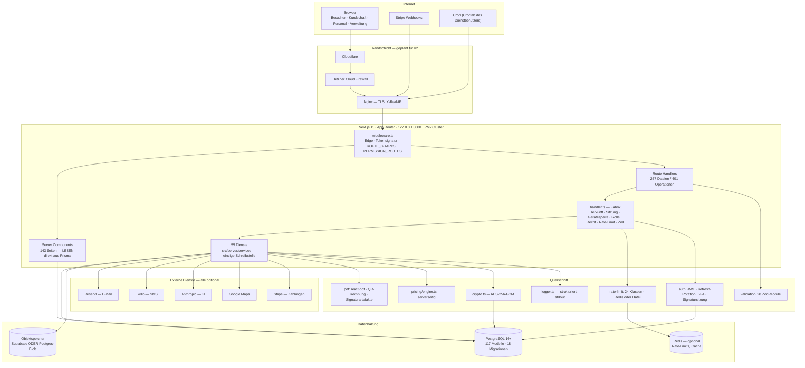
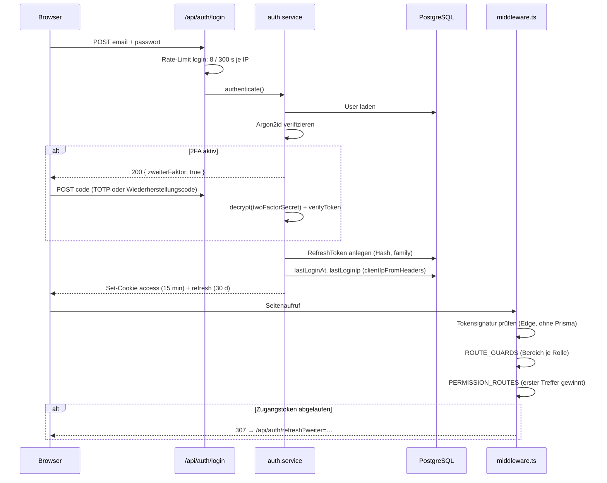
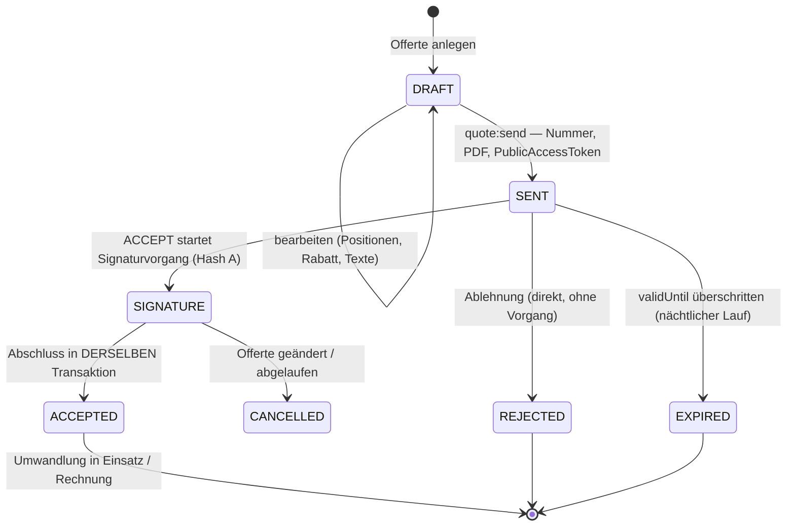
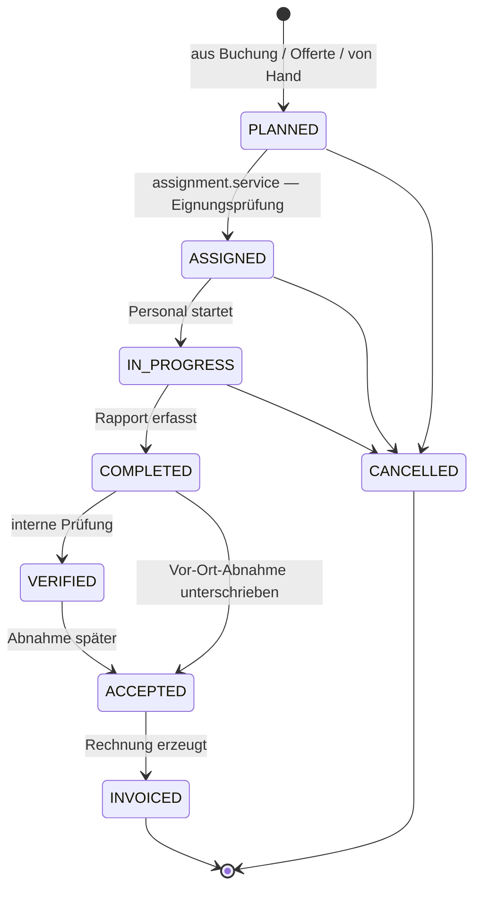
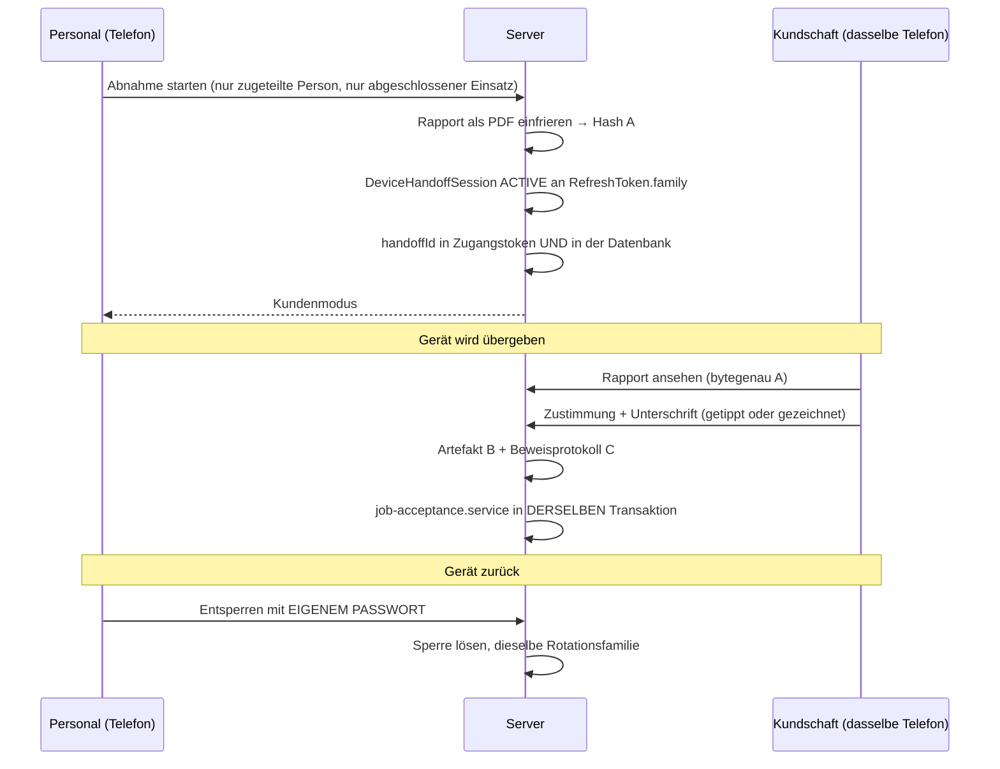
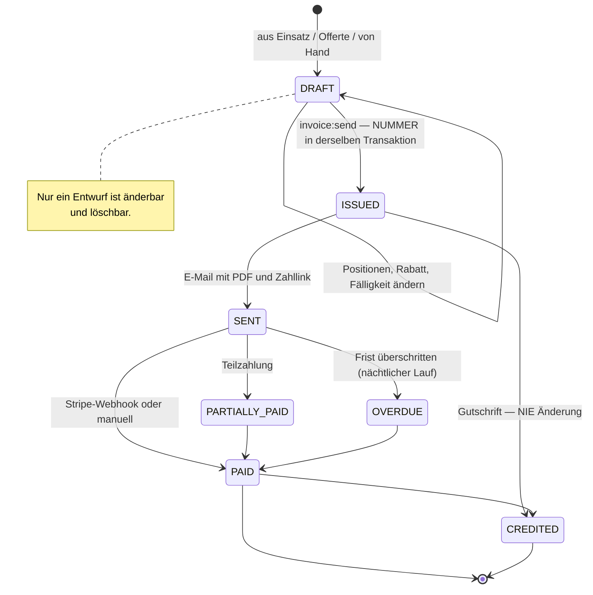

# Clenaris — Enterprise System Report

**Erhebungsdatum:** 2026-09-21
**Grundlage:** Arbeitsbaum auf Zweig `ci/production-v2-github-haertung`, Basis `main` = `7ec5d74b2de47b431c452b7e82a49384f5c6bd0d`.
Der Anwendungscode ist gegenüber `main` unverändert; die drei Commits des Zweigs betreffen ausschliesslich CI, Tests und Dokumentation.
**Methode:** Quellcode zuerst. Jede Zahl in diesem Bericht ist maschinell aus dem Repository erhoben, nicht aus Dokumentation übernommen.

---

## Vorbemerkung zur Beweisführung

Dieser Bericht folgt einer Regel: **Code schlägt Dokumentation.** Wo beide auseinandergehen, steht der Code, und der Widerspruch wird benannt.

Die Zahlen wurden über Analyseskripte gegen den Arbeitsbaum erhoben — Abzählen von `page.tsx`/`route.ts`, Parsen von `prisma/schema.prisma`, Laufzeitauswertung des Rechtekatalogs, Auszählen der Testdateien, Parsen der erzeugten OpenAPI-Spezifikation. Die Skripte liegen ausserhalb des Repositorys im Arbeitsverzeichnis dieser Sitzung.

**Zwei Fehlschläge im eigenen Prüfstand, die den Bericht geprägt haben:**

1. Ein erster Modell-Erreichbarkeitstest prüfte nur `prisma.<modell>`. Er hielt `QuoteItem` und `SalaryRecord` für toten Code. Beide werden über *verschachtelte* Schreibvorgänge (`items: { create: … }`) benutzt und sind vollständig implementiert. Der Test wurde um verschachtelte Schreibzugriffe, Einbindungen und Typbezüge erweitert.
2. Ein Musterabgleich mit eingebettetem Anführungszeichen wurde beim Übergang von PowerShell an `git.exe` lautlos zerstört und meldete „keine Treffer". Jeder Negativbefund in diesem Bericht ist seither gegen einen Kontrollfall abgesichert, der treffen *muss*.

Beide Fälle stehen hier, weil sie die Lesart des Berichts bestimmen: Ein „nicht vorhanden" ist nur so viel wert wie der Nachweis, dass der Suchvorgang überhaupt funktioniert.

**Was dieser Bericht nicht leistet.** Er bewertet den Stand des Repositorys. Er trifft keine Aussage über den Zustand irgendeines Servers, über frühere Vorfälle oder über Daten in einer Produktionsdatenbank. Kein externes System wurde kontaktiert.

---

# TEIL 1 — EXECUTIVE SUMMARY

## Was ist Clenaris?

Clenaris ist das **Betriebssystem eines Schweizer Reinigungs- und Gebäudedienstleisters** — kein Website-Baukasten mit Buchungsformular, sondern eine durchgehende Fachanwendung, die den Betrieb von der ersten Anfrage bis zur bezahlten Rechnung und bis zur Führungskennzahl abbildet.

Der fachliche Zuschnitt ist ausdrücklich schweizerisch und nicht dekorativ: 8,1 % Mehrwertsteuer, QR-Rechnung nach SIX-Norm (`src/lib/pdf/swiss-qr.ts`), lückenlose Belegnummerierung als Entwurfsziel (`src/server/services/numbering.service.ts`, Einordnung in TEIL 32), AHV-Nummern als besonders schützenswerte Personendaten mit Feldverschlüsselung (`src/lib/crypto.ts`), Kanton Bern als Standardgebiet. Die gesamte Oberfläche und sämtliche Fehlermeldungen sind deutsch.

> **Zur Sprache dieses Berichts.** Wo er Schweizer Rechtsgrundlagen nennt, beschreibt er die **Absicht des Codes**, nicht eine geprüfte Rechtslage. Aussagen wie „nach Art. 957a OR", „rechtsgültig" oder „DSG-konform" sind hier keine Rechtsauskunft. Vier solche Überzeichnungen wurden am 2026-09-21 im Rahmen von Wave 0 zurückgenommen; sie sind an Ort und Stelle als **Korrektur** gekennzeichnet.

## Welches Problem löst es?

Ein Reinigungsbetrieb dieser Grössenordnung arbeitet typischerweise mit fünf bis acht unverbundenen Werkzeugen: Website, Excel für die Disposition, ein Buchhaltungsprogramm, WhatsApp für das Personal, Papier für den Rapport. Clenaris ersetzt diese Kette durch **ein Datenmodell mit 117 Entitäten**, in dem eine Anfrage zur Kundschaft, zur Offerte, zum Einsatz, zum Rapport, zur unterschriebenen Abnahme und zur Rechnung wird, ohne dass die Angaben je neu erfasst werden.

## Abgedeckte Unternehmensbereiche

| Bereich | Abdeckung im Code |
|---|---|
| Aussenauftritt | Öffentliche Website, CMS, SEO, Blog, Galerie, Bewertungen, Stellenangebote |
| Vertrieb | Leads, Offerten mit PDF und elektronischer Annahme, Preisrechner, Gutscheine |
| Kundenbeziehung | Kundenakte, Objekte, Adressen, Aktivitäten, Aufgaben, Nachrichten, Kundenportal |
| Auftragsabwicklung | Buchungen, Einsätze, Disposition, Kalender, Zuteilung, Rapport, Vor-Ort-Abnahme |
| Personal | Personalakte, Lohnhistorie, Zeiterfassung, Abwesenheiten, Bewerbungen, Mitarbeiterportal |
| Finanzen | Rechnungen, Gutschriften, Zahlungen, Ausgaben, Lieferanten, Buchhaltungsexport |
| Unternehmensführung | Cockpit, Kennzahlen, Ziele/OKR, Budget, Investitionen, Szenarien, Risiken, Compliance, Massnahmen, Dokumente, Wissen, Markt, Sitzungen, Berichte, KI-Assistent |
| Plattform | Rechte, Prüfprotokoll, Dateien, Signaturen, Automatisierung, Datenbereinigung, Papierkorb |

## Zielgruppen

Fünf reale Rollen plus eine Pseudorolle für nicht angemeldete Besucher (`src/lib/auth/rbac.ts`):

| Rolle | Anzeigename | Rechte | Anteil am Katalog |
|---|---|---|---|
| `SUPER_ADMIN` | Systemverantwortung | 215 | 100 % |
| `ADMIN` | Administration | 211 | 98 % |
| `MANAGER` | Betriebsleitung | 110 | 51 % |
| `EMPLOYEE` | Mitarbeitende | 24 | 11 % |
| `CUSTOMER` | Kundschaft | 18 | 8 % |
| `GUEST` | Ohne Anmeldung | 0 | 0 % |

## Aktueller Entwicklungsstand — die harten Zahlen

| Grösse | Wert | Erhebung |
|---|---|---|
| Seiten (`page.tsx`) | **143** | Dateiabzählung unter `src/app` |
| davon Anwendungsbereich | 101 | Gruppe `(app)` |
| davon öffentliche Website | 29 | Gruppe `(public)` |
| davon Anmeldung | 7 | Gruppe `(auth)` |
| davon Unterzeichnung / Abnahme | 6 | Gruppen `(signieren)`, `(abnahme)` |
| Route-Dateien (`route.ts`) | **267** | Dateiabzählung unter `src/app/api` |
| API-Operationen | **401** | `docs/openapi.json`, erzeugt und gegen die Routen geprüft |
| davon sitzungsgeschützt | 362 | `security: sessionCookie` |
| davon öffentlich | 37 | ohne `security` |
| davon Cron | 2 | `security: cronSecret` |
| Dienste (`src/server/services`) | **55** (26 975 Zeilen) | Dateiabzählung |
| Validierungsmodule (`src/lib/validation`) | **28** | Dateiabzählung |
| Prisma-Modelle | **117** | Schema-Parser |
| Aufzählungstypen | **80** (468 Werte) | Schema-Parser |
| Felder gesamt | **2 150** | Schema-Parser |
| Relationsfelder | 458 | Schema-Parser |
| `@@index` / `@@unique` | 150 / 48 | Schema-Parser |
| Migrationen | **18** | Verzeichnisabzählung |
| Berechtigungen | **215** in 10 Gruppen | Laufzeitauswertung |
| Testdateien | **41** (37 HTTP/Rechenkern, 4 Browser) | Dateiabzählung |
| Ausgeführte Prüfungen | **863** HTTP + **20** Browser | Testlauf am 2026-09-21 |
| Navigationsziele | 59, **alle mit vorhandener Seite** | Abgleich Navigation ↔ Seitenbaum |

**Widerspruch zur Dokumentation.** `README.md` nennt 134 Seiten, 244 Route-Dateien, 374 Endpunkte, 111 Modelle, 47 Dienste, 20 Testdateien. `docs/NEXT_DEVELOPMENT_AUDIT.md` (Stand 2026-09-19) nennt 12 Migrationen. Alle diese Zahlen sind **zu niedrig** — das System ist seit der letzten Zählung gewachsen. Die Zahlen oben gelten.

## Wichtigste fertiggestellte Bereiche

Nur Bereiche mit Test- oder Browser-Beleg:

1. **Elektronische Unterzeichnung** (Gates 4A–4D) — Signaturkern, Offertannahme, Vor-Ort-Abnahme mit Gerätesperre. 60 HTTP-Prüfungen, 14 Browser-Prüfungen, vier Datenbank-Trigger gegen Manipulation, drei partielle Eindeutigkeitsindizes gegen Rennzustände.
2. **Rechte- und Rollensystem** — 215 Berechtigungen, serverseitig in der Handler-Fabrik durchgesetzt, 25 Prüfungen über alle fünf Rollen plus eine eigene Eigentümer-Prüfreihe.
3. **Öffentliche Zugriffstokens** — 256 Bit aus dem CSPRNG, Einweg-Hashing, Zweck- und Ressourcenbindung, 40 Prüfungen über drei Dateien.
4. **Dateisicherheit** — Byteprüfung beim Upload, Abschlussgrenze, Prüfsummen, Zugriffsbindung. 24 Prüfungen.
5. **Öffentliche Website und CMS** — 29 Seiten, Redaktion direkt in der Vorschau, Entwurf/Veröffentlichung/Revisionen.
6. **Unternehmensführung** — 65 Route-Dateien, 109 Operationen, gespeicherte Kennzahlhistorie, nächtlicher Lauf.

## Wichtigste unfertige Bereiche

1. **Lohnabrechnung** — Berechtigung `payslip:create` existiert, ein Modell existiert, aber es gibt **keine Seite, keinen Dienst und keinen Endpunkt**, der eine Lohnabrechnung erzeugt. Die Mitarbeitenden-Seite `/portal/lohn` zeigt, was nie entstehen kann.
2. **Zahlungen** — Stripe-Webhook und Checkout sind implementiert; TWINT läuft als Stripe-Zahlungsmethode. **Datatrans** steht in `.env.example`, hat aber **keine einzige Codestelle**.
3. **Mitarbeiterfähigkeiten und Arbeitszeiten** — `EmployeeSkill` wird gelesen und in die KI-Disposition gegeben, aber **nie geschrieben**. `Availability` bekommt beim Anlegen eine Standardwoche und wird in der Eignungsprüfung gelesen — es gibt **keine Oberfläche, sie zu ändern**.
4. **Verträge / wiederkehrende Leistungen** — Serienbuchungen laufen im nächtlichen Lauf; ein eigenständiges Vertragsmodell mit Laufzeit, Verlängerung und Kündigung gibt es nicht.
5. **Beobachtbarkeit** — kein Sentry, kein Prometheus, kein OpenTelemetry. Ein eigener strukturierter Logger und ein Health-Endpunkt, sonst nichts.
6. **Mehrsprachigkeit** — `Locale`-Aufzählung mit DE/EN/FR/IT im Schema, aber keine Übersetzungsbibliothek und keine Übersetzungsdateien. Die Oberfläche ist fest deutsch.

## Wichtigste technische Stärken

- **Eine Schreibtür.** Jede Mutation läuft über einen Route-Handler, jeder Route-Handler über eine Fabrik, die Sitzung, Gerätesperre, Rolle, Berechtigung, Rate-Limit, Herkunftsprüfung und Validierung erzwingt (`src/lib/api/handler.ts`). 265 von 267 Route-Dateien nutzen sie; die zwei Ausnahmen sind begründet und eigenständig abgesichert.
- **Null Platzhalter.** Über den gesamten Quellbaum: **0 `TODO`, 0 `FIXME`, 0 `HACK`, 0 `@deprecated`, 0 „nicht implementiert", 0 `mock`**. Das ist in einem Projekt dieser Grösse ungewöhnlich und bedeutet: Was da ist, ist gemeint.
- **Additive Migrationshistorie.** 18 Migrationen, **kein einziges `DROP`**, keine datenverlustträchtige Änderung. Ein Rücksprung auf die vorige Programmfassung ist schemaseitig jederzeit möglich.
- **Prüfungen über echtes HTTP.** Keine Dienst-Unit-Tests, sondern 863 Prüfungen gegen die laufende Anwendung, dazu 20 Browser-Prüfungen im echten Chromium. Was grün ist, ist im Produkt grün.
- **Kommentardichte mit Begründung.** Der Code erklärt durchgehend die *verworfene Alternative* und den Fehler, den sie verursacht hätte. Das ist für die Wartbarkeit mehr wert als jede externe Dokumentation.

## Wichtigste technische Schulden

| Schuld | Wirkung |
|---|---|
| Keine Schlüsselrotation in `src/lib/crypto.ts` | `ENCRYPTION_KEY` ist einmalig wählbar; danach ist ein Wechsel ein eigenes Vorhaben (S-08) |
| Keine Beobachtbarkeit ausser Logdatei | Ein Fehler in Produktion fällt auf, wenn jemand anruft |
| 101 von 267 Route-Stämmen ohne Erwähnung in `tests/` | Grosse Teile von Unternehmensführung, Marketing und Stammdaten sind ungeprüft |
| `Locale`-Modell ohne i18n-Umsetzung | Vier Sprachen im Schema, eine in der Oberfläche |
| Vier Modelle ohne jede Codeberührung | `LandingPage`, `Building`, `AutomationRun`, `EmployeeSkill` (schreibend) |
| Dokumentationszahlen veraltet | README und Audit unterschätzen das System um 10–20 % |

## Wichtigste Production-Blocker

Getrennt nach Art, ausführlich in TEIL 80:

- **Keine Code-Blocker.** Typecheck, Lint, 863 HTTP-Prüfungen, 20 Browser-Prüfungen und der Produktionsbau laufen am 2026-09-21 vollständig grün.
- **GitHub/CI:** Das Repository ist öffentlich, `main` ist ungeschützt, der Default-Branch zeigt auf einen Feature-Zweig mit einer älteren, unsicheren Workflow-Fassung. Die Pipeline war **noch nie grün** — sechs Läufe, null Erfolge, null Deployments.
- **Infrastruktur:** Es existiert kein Production-V2-Server.
- **Betrieb:** Keine Lohnabrechnung, keine Beobachtbarkeit, kein geprobter Wiederherstellungslauf gegen Produktionsdaten.

## Fortschritt in Zahlen

Eine Gesamtprozentzahl wird **nicht** vergeben — sie wäre eine Erfindung. Stattdessen die Ableitung aus der Feature-Matrix (TEIL 76, vollständig in `CLENARIS_FEATURE_MATRIX.md`, 175 einzeln eingestufte Merkmale):

| Einstufung | Merkmale | Anteil |
|---|---|---|
| COMPLETE + VERIFIED | **80** | 46 % |
| COMPLETE | **60** | 34 % |
| PARTIAL | **19** | 11 % |
| BACKEND ONLY | 2 | 1 % |
| FRONTEND ONLY | 1 | 1 % |
| SCHEMA ONLY | 4 | 2 % |
| NOT IMPLEMENTED | 9 | 5 % |
| **Summe** | **175** | **100 %** |

Lesart: **80 % der erfassten Merkmale sind technisch nutzbar** (COMPLETE oder besser), **46 % sind zusätzlich durch eine benannte Testdatei belegt**.

**Drei Vorbehalte, ohne die diese Zahl irreführt:**

1. Die Zählung bezieht sich auf **Merkmale**, nicht auf Codezeilen, nicht auf Aufwand und nicht auf Geschäftswert. Ein fehlendes Merkmal (Lohnabrechnung) kann mehr Arbeit sein als zwanzig fertige.
2. Die Merkmalsliste ist die dieses Berichts. Ein anderer Zuschnitt ergibt andere Prozentwerte.
3. `COMPLETE` heisst **technisch nutzbar**, nicht **produktionserprobt**. Zahlungen sind `PARTIAL`, weil sie nie gegen echtes Stripe liefen — nicht, weil Code fehlt.

---

# TEIL 2 — SYSTEMLANDSCHAFT

## Architekturübersicht



## Schichten im Einzelnen

| Schicht | Umsetzung | Beleg |
|---|---|---|
| **Frontend** | React 19 Server & Client Components, Tailwind, lucide-react | `src/app`, `src/features`, `src/components` |
| **Backend** | Next.js Route Handlers im selben Baum — kein getrennter Serverprozess | `src/app/api` |
| **API** | 401 Operationen, OpenAPI 3 erzeugt und gegen den Routenbaum geprüft | `scripts/generate-openapi.ts`, `docs/openapi.json` |
| **Services** | 55 Module, 26 975 Zeilen, einzige Stelle mit Schreibzugriff | `src/server/services` |
| **Database** | PostgreSQL ≥ 16, Prisma 6, `directUrl` für Migrationen | `prisma/schema.prisma` |
| **Authentication** | Eigene signierte Tokens (jose), Refresh-Rotation, 2FA (TOTP) | `src/lib/auth/` |
| **Authorization** | 215 Berechtigungen, statisch je Rolle, vier Durchsetzungsebenen | `src/lib/auth/rbac.ts` |
| **Storage** | Supabase-Treiber mit Rückfall auf Postgres-Blob | `src/lib/storage/` (6 Module) |
| **PDF** | react-pdf; Offerte, Rechnung, Rapport, Bericht, Signaturartefakte, Swiss QR | `src/lib/pdf/` (6 Module, 2 453 Zeilen) |
| **Email** | Resend, mit Dateipostausgang im Testbetrieb | `src/lib/email/client.ts` |
| **SMS** | Twilio | `src/lib/sms/client.ts` |
| **Payments** | Stripe Checkout + Webhook; TWINT als Stripe-Methode | `src/lib/payments/stripe.ts` |
| **AI** | Anthropic SDK, 10 Anwendungsfälle, ausschliesslich Entwurfsfunktion | `src/lib/ai/` |
| **Maps** | Google Maps, getrennte Server- und Clientschlüssel | `src/lib/maps/google.ts` |
| **Cron** | Zwei Endpunkte mit `CRON_SECRET`, Zeitsteuerung durch die Crontab | `src/app/api/cron/` |
| **Queues/Jobs** | **Nicht vorhanden.** Hintergrundarbeit läuft im Cron-Request | — |
| **Caching** | Redis-Cache mit Prozessrückfall; `unstable_cache` für Katalogdaten | `src/lib/redis.ts` |
| **Rate Limiting** | 24 benannte Klassen, Redis oder dateibasiert | `src/lib/rate-limit.ts` |
| **Logging** | Eigener strukturierter Logger nach stdout, PM2 schreibt in Dateien | `src/lib/logger.ts` |
| **Monitoring** | **Nicht vorhanden** ausser `GET /api/health` | `src/app/api/health/route.ts` |
| **CI/CD** | Ein GitHub-Workflow: Qualitätstor + Auslieferung | `.github/workflows/deploy.yml` |
| **Deployment** | SSH → `scripts/deploy.sh` → PM2 Cluster, Rücksprung bei Fehler | `scripts/deploy.sh`, `ecosystem.config.js` |
| **Backups** | `pg_dump` vor jeder Migration, fail-closed, vierfach geprüft | `scripts/db-backup.ts`, `scripts/db-restore-verify.ts` |

---

# TEIL 3 — TECHNOLOGY STACK

| Technologie | Version | Zweck | Beleg |
|---|---|---|---|
| Next.js | 15.5.25 | App Router, Server Components, Route Handlers | `package.json` |
| React | 19.0.0 | Oberfläche | `package.json` |
| TypeScript | ^5.7.3 | Sprache, `tsc --noEmit` als Prüfung | `package.json`, `tsconfig.json` |
| Node.js | ≥ 20.11.0 | Laufzeit | `package.json#engines`, `.nvmrc` = `20` |
| Tailwind CSS | (über `tailwind.config.ts`) | Gestaltung, eigene Typoskala und Schatten | `tailwind.config.ts`, `src/app/globals.css` |
| lucide-react | ^0.469.0 | Symbole — ausdrücklich keine Emoji | `package.json`, `CLAUDE.md` |
| Prisma | ^6.2.1 (Client 6.19.3 zur Laufzeit) | ORM, Migrationen | `package.json`, `prisma/schema.prisma` |
| PostgreSQL | ≥ 16 (örtlich 18) | Datenbank | `docs/DEPLOYMENT.md`, Messung am Arbeitsplatz |
| Zod | (über `src/lib/validation`) | Validierung, Typableitung, OpenAPI-Quelle | 28 Module |
| jose / eigene JWT | — | Zugangs- und Erneuerungstokens | `src/lib/auth/jwt.ts` |
| @node-rs/argon2 | ^2.0.2 | Passwort-Hashing | `package.json`, `src/lib/auth/password.ts` |
| react-pdf | — | PDF-Erzeugung | `src/lib/pdf/render.ts` |
| pdf.js | (Assets kopiert) | PDF-Betrachter im Browser, eigener Ursprung | `scripts/copy-pdfjs-assets.ts` |
| node:test + tsx | ^4.19.2 | Prüfreihe über echtes HTTP | `package.json#scripts.test` |
| Playwright | 1.63.0 | Browser-Prüfreihe, `channel: 'chromium'` | `playwright.config.ts` |
| ESLint | — | Linter über `src scripts tests prisma` | `package.json#scripts.lint` |
| Prettier | — | Formatierung | `package.json#scripts.format` |
| npm | — | Paketverwaltung, `npm ci` in CI und Auslieferung | `package-lock.json` |
| PM2 | (global auf dem Server) | Prozessverwaltung, Cluster, Reload ohne Ausfallzeit | `ecosystem.config.js` |
| Nginx | (auf dem Server) | Reverse Proxy, TLS | `docs/DEPLOYMENT.md` 13.5 |
| GitHub Actions | — | Prüfung und Auslieferung | `.github/workflows/deploy.yml` |
| ioredis | ^5.4.2 | Redis-Anbindung (optional) | `src/lib/redis.ts` |
| @supabase/supabase-js | ^2.47.10 | Objektspeicher (optional) | `src/lib/storage/supabase.ts` |
| stripe | ^17.5.0 | Zahlungen (optional) | `src/lib/payments/stripe.ts` |
| resend | ^4.0.1 | E-Mail (optional) | `src/lib/email/client.ts` |
| twilio | ^5.4.0 | SMS (optional) | `src/lib/sms/client.ts` |
| @anthropic-ai/sdk | ^0.123.0 | KI (optional) | `src/lib/ai/client.ts` |
| @fullcalendar/react | ^6.1.15 | Einsatzkalender | `package.json` |
| next-themes | ^0.4.4 | Hell/Dunkel | `package.json` |

**Nicht vorhanden, obwohl man es erwarten könnte:** keine i18n-Bibliothek, kein Sentry/OpenTelemetry/Prometheus, kein Queue-System (BullMQ o. ä.), kein State-Management ausser React Query, kein Storybook, kein axe/Accessibility-Prüfwerkzeug.

---

# TEIL 4 — FRONTEND INVENTORY

143 Seiten. Verteilung nach Routengruppe:

| Gruppe | Seiten | Zweck |
|---|---|---|
| `(app)` | 101 | Angemeldete Bereiche: admin 79, konto 11, portal 11 |
| `(public)` | 29 | Öffentliche Website |
| `(auth)` | 7 | Anmeldung und Kontowege |
| `(signieren)` | 4 | Unterzeichnung über Link, ohne App-Rahmen |
| `(abnahme)` | 2 | Vor-Ort-Abnahme auf übergebenem Gerät |

Dazu: 9 Layouts, 4 Fehlergrenzen (`error.tsx`), 1 `not-found.tsx`, 55 `loading.tsx`.

## 4.1 Öffentliche Seiten (29)

| Route | Zweck | Rolle | Hauptfunktionen | Backend | Status |
|---|---|---|---|---|---|
| `/` | Startseite | GUEST | Hero, Leistungen, Bewertungen, CTA | CMS + DB | COMPLETE |
| `/leistungen` | Leistungsübersicht | GUEST | Katalog aus DB | `service` | COMPLETE |
| `/leistungen/[slug]` | Leistungsdetail | GUEST | Beschreibung, Preis, Buchen | `service` | COMPLETE |
| `/preise` | Preisübersicht | GUEST | Preistabelle, Rechner | `pricing` | COMPLETE |
| `/buchen` | Buchungsstrecke | GUEST | Mehrstufiges Formular, Preisvorschau, Termin | `/api/public/bookings` | COMPLETE + VERIFIED |
| `/buchen/bestaetigt` | Buchungsbestätigung | GUEST | Bestätigungsseite | — | COMPLETE |
| `/buchung/[token]` | Gastbuchung ansehen | Token | Buchung über Zugriffstoken | `PublicAccessToken` | PARTIAL |
| `/offerte` | Offertanfrage | GUEST | Formular | `/api/public/quote-request` | COMPLETE |
| `/offerte/[token]` | Offerte ansehen/annehmen | Token | PDF, Annahme, Ablehnung | Signaturkern | COMPLETE + VERIFIED |
| `/rechnung/[token]` | Rechnung ansehen | Token | PDF, Online-Zahlung | Stripe | PARTIAL |
| `/rechnung/[token]/danke` | Zahlungsdank | Token | — | — | COMPLETE |
| `/zahlung/abschluss` | Stripe-Rückkehr | GUEST | Statusanzeige | Stripe | COMPLETE + VERIFIED |
| `/zahlung/abgebrochen` | Stripe-Abbruch | GUEST | — | — | COMPLETE |
| `/kontakt` | Kontakt | GUEST | Formular, Rate-Limit | `contactForm` | COMPLETE |
| `/ueber-uns` | Über uns | GUEST | Team mit Fähigkeiten | `Employee`, `EmployeeSkill` | COMPLETE |
| `/galerie` | Referenzbilder | GUEST | Galerie aus DB | `GalleryItem` | COMPLETE |
| `/bewertungen` | Kundenstimmen | GUEST | Bewertungen | `Review` | COMPLETE |
| `/blog` · `/blog/[slug]` | Blog | GUEST | Beiträge, Kategorien | `BlogPost` | COMPLETE |
| `/karriere` · `/karriere/[slug]` | Stellen | GUEST | Ausschreibung, Bewerbung | `JobPosting`, `JobApplication` | PARTIAL |
| `/einsatzgebiet` | Einsatzgebiet | GUEST | PLZ-Liste, Anfahrt | `ServiceArea` | COMPLETE |
| `/faq` | Häufige Fragen | GUEST | FAQ aus DB | `Faq` | COMPLETE |
| `/legal/impressum` · `/datenschutz` · `/agb` · `/cookies` | Rechtstexte | GUEST | Aus DB, redaktionell pflegbar | `LegalPage` | COMPLETE |
| `/newsletter/bestaetigen` · `/abmelden` | Newsletter | GUEST | Double-Opt-in | `NewsletterSubscriber` | COMPLETE |

Alle 29 Seiten wurden am 2026-09-21 gegen die laufende Anwendung geprüft: **HTTP 200**, Inhalt vorhanden.

## 4.2 Anmeldeseiten (7)

`/auth/anmelden`, `/auth/registrieren`, `/auth/passwort-vergessen`, `/auth/passwort-neu`, `/auth/verifizieren`, `/auth/bestaetigen`, `/auth/einladung` — alle COMPLETE, die Anmeldung zusätzlich VERIFIED (`tests/api/two-factor.test.ts`, `session-refresh.test.ts`).

## 4.3 Verwaltungsseiten (79)

Übersicht nach Navigationsgruppe; Detailseiten in Klammern.

| Gruppe | Seiten | Status-Schwerpunkt |
|---|---|---|
| **Auftragsabwicklung** | `/admin`, `/admin/kalender`, `/admin/buchungen` (+ `[id]`, `[id]/bearbeiten`), `/admin/einsaetze` (+ `[id]`), `/admin/offerten` (+ `[id]`, `[id]/bearbeiten`, `neu`) | COMPLETE + VERIFIED |
| **Kundschaft** | `/admin/leads` (+ `[id]`, `[id]/bearbeiten`, `neu`), `/admin/kunden` (+ `[id]`, `neu`), `/admin/nachrichten`, `/admin/objekte`, `/admin/aufgaben` | COMPLETE, teils VERIFIED |
| **Finanzen** | `/admin/rechnungen` (+ `[id]`, `neu`), `/admin/zahlungen`, `/admin/ausgaben`, `/admin/auswertungen` | COMPLETE / PARTIAL |
| **Unternehmensführung** | 14 Hauptseiten + 12 Detailseiten + `/admin/fuehrung/assistent` | COMPLETE / PARTIAL |
| **Website** | `/admin/inhalte`, `/admin/website`, `/admin/cta`, `/admin/medien`, `/admin/seo`, `/admin/blog`, `/admin/bewertungen` | COMPLETE + VERIFIED |
| **Marketing** | `/admin/marketing`, `/admin/ki` | PARTIAL |
| **Betrieb** | `/admin/personal` (+ `[id]`, `neu`, `bewerbungen`) | COMPLETE + VERIFIED |
| **System** | `/admin/einstellungen` (+ `gebiet`, `leistungen`), `/admin/benutzer`, `/admin/rollen`, `/admin/protokoll`, `/admin/papierkorb`, `/admin/datenbereinigung`, `/admin/profil` | COMPLETE + VERIFIED |

Alle 33 stichprobenhaft angefahrenen Verwaltungsseiten antworteten am 2026-09-21 mit HTTP 200 und korrektem Seitentitel.

## 4.4 Mitarbeiterportal (11)

`/portal` (Heute), `/portal/einsaetze` (+ `[id]`), `/portal/kalender`, `/portal/ziele`, `/portal/wissen` (+ `[slug]`), `/portal/zeiterfassung`, `/portal/abwesenheiten`, `/portal/lohn`, `/portal/profil`.

`/portal/lohn` ist **FRONTEND ONLY** — siehe TEIL 21.

## 4.5 Kundenkonto (11)

`/konto`, `/konto/buchungen` (+ `[id]`), `/konto/offerten` (+ `[id]`), `/konto/rechnungen` (+ `[id]`), `/konto/objekte`, `/konto/nachrichten`, `/konto/bewertungen`, `/konto/profil`.

## 4.6 Unterzeichnung und Abnahme (6)

| Route | Zweck | Rahmen |
|---|---|---|
| `/signieren` | Einstieg über Fragment-Token | Bare, kein App-Rahmen |
| `/signieren/s/[publicId]` | Unterzeichnungsseite | Bare |
| `/signieren/ergebnis` · `/ergebnis/[publicId]` | Ergebnis | Bare |
| `(abnahme)` — 2 Seiten | Vor-Ort-Abnahme und Entsperrbildschirm | Bare |

Alle COMPLETE + VERIFIED (60 HTTP-Prüfungen, 14 Browser-Prüfungen).

---

# TEIL 5 — NAVIGATION & INFORMATION ARCHITECTURE

## Verwaltung — 8 Gruppen, 44 Einträge

| Gruppe | Einträge | Berechtigung je Eintrag |
|---|---|---|
| Auftragsabwicklung | Übersicht, Einsatzkalender, Buchungen, Einsätze, Offerten | `dashboard:view`, `job:read`, `booking:read`, `job:read`, `quote:read` |
| Kundschaft | Leads, Kunden, Nachrichten, Objekte, Aufgaben | `lead:read`, `customer:read`, `message:read`, `property:read`, `task:read` |
| Finanzen | Rechnungen, Zahlungen, Ausgaben, Auswertungen | `invoice:read`, `payment:read`, `expense:read`, `report:read` |
| Unternehmensführung | Cockpit, Kennzahlen, Ziele, Budget, Investitionen, Szenarien, Risiken, Qualität, Massnahmen, Dokumente, Wissen, Markt, Sitzungen, Berichte | je eigene `*:read` |
| Website | Website-Texte, Fragen/Galerie/Menü, Handlungsaufrufe, Mediathek, Suchmaschinen | `content:update`, `faq:read`, `cta:read`, `media:read`, `seo:update` |
| Marketing | Blog, Bewertungen, Kampagnen, KI-Werkzeuge | `blog:read`, `review:read`, `newsletter:read`, `ai:use` |
| Betrieb | Mitarbeitende | `employee:read` |
| System | Einstellungen, Benutzerkonten, Rollen und Rechte, Prüfprotokoll, Papierkorb, Datenbereinigung | `settings:read`, `user:read`, `role:read`, `audit:read`, `booking:delete`, `data:purge` |

**Jeder Navigationseintrag trägt eine Berechtigung**, und `filterNavigation` (`src/lib/auth/navigation.ts`) entfernt, was die Rolle nicht hat. Das ist **Anzeigefilterung, keine Autorisierung** — die echte Sperre steht in Middleware, Seite und Endpunkt (TEIL 8).

## Mitarbeiterportal — 1 Gruppe, 8 Einträge

Heute, Meine Einsätze, Kalender, Meine Ziele, Wissen, Zeiterfassung, Abwesenheiten, Lohnabrechnungen. **Ohne Berechtigungsfilter** — der Bereich ist über `ROUTE_GUARDS` auf `EMPLOYEE` aufwärts beschränkt, und alle Einträge gehören zu dem, was ein Mitarbeitender ohnehin darf.

## Kundenkonto — 2 Gruppen, 7 Einträge

*Dokumente*: Meine Termine, Offerten, Rechnungen. *Verwaltung*: Meine Objekte, Nachrichten, Bewertungen. Dazu die Übersicht. Ebenfalls ohne Berechtigungsfilter.

## Abgleich Navigation ↔ Seitenbaum

**59 Navigationsziele, 59 vorhandene Seiten, 0 tote Verweise.** Maschinell geprüft.
42 weitere Seiten sind Detail-, Neu- und Bearbeitungsseiten, die planmässig nur über Listen erreichbar sind.

## Was fehlt

- **Kein Breadcrumb.** Keine Datei enthält eine Breadcrumb-Komponente.
- **Keine globale Suche.** Es gibt Listenfilter je Modul, aber keine modulübergreifende Suche und keine Kommandopalette.
- **Mobile Navigation** ist über den App-Rahmen (`src/components/app/app-shell.tsx`) vorhanden; die Vor-Ort-Abnahme ist eigens auf Smartphone-Bildschirme geprüft (`tests/e2e/gate4d-abnahme.spec.ts`, Fall „Auf dem Telefon").

---

# TEIL 6 — PUBLIC WEBSITE

## Inhaltsherkunft

| Inhalt | Herkunft | Redaktionell änderbar |
|---|---|---|
| Überschriften, Fliesstexte, Listen | **CMS-Registry mit Vorgabewert** (`src/lib/cms/registry.ts`) | ja, `/admin/inhalte` |
| Leistungen, Preise, Zusätze | Datenbank (`Service`, `PriceRule`, `ServiceExtra`) | ja, `/admin/einstellungen/leistungen` |
| Galerie, Blog, FAQ, Bewertungen | Datenbank | ja, je eigene Maske |
| Rechtstexte | Datenbank (`LegalPage`) | ja, `/admin/website` |
| Einsatzgebiet | Datenbank (`ServiceArea`) | ja, `/admin/einstellungen/gebiet` |
| Team | Datenbank (`Employee` + `EmployeeSkill`) | teilweise — Fähigkeiten nicht |
| Suchmaschinenangaben | Datenbank (`SeoSetting`) | ja, `/admin/seo` |
| Handlungsaufrufe | Datenbank (`CallToAction`) mit Terminierung | ja, `/admin/cta` |

## Der entscheidende Architekturzug des CMS

Der Vorgabewert **ist** der ausgelieferte Text. Ein neuer Block ändert nichts, bis jemand ihn bearbeitet. Ausserhalb des Vorschaumodus erzeugen `cms.text`/`cms.attrs`/`cms.asset` **keinerlei Markierung im HTML** — Besucher bekommen byteidentische Ausgabe. Beleg: `src/lib/cms/editable.tsx`, geprüft in `tests/api/cms.test.ts` (16 Prüfungen).

Bearbeitet wird **in der echten Seite**: `/admin/inhalte` lädt die Website in einem `iframe` im Entwurfsmodus; Textblöcke werden `contentEditable`, die Brücke (`src/components/cms/preview-bridge.tsx`) meldet den Wortlaut zurück. Texte folgen Entwurf → Veröffentlichung → Revisionen; **Bilder nicht** — die gehören zu Datensätzen und laufen über `PATCH /api/content/asset` gegen eine Allowlist (`src/lib/cms/assets.ts`).

## SEO und Metadaten

- `sitemap.xml` und `robots.txt` als Routen, geprüft (HTTP 200, 3 977 bzw. 392 Byte).
- Metadaten je Seite über `export const metadata`.
- **Widerspruch/Schuld:** `src/app/layout.tsx` setzt `alternates.languages` auf `/en`, `/fr`, `/it` — diese Routen existieren nicht (im Audit als B-02 geführt, weiterhin offen).
- Strukturierte Daten: vorhanden für Organisation und Leistungen; nicht durchgängig geprüft. Status **PARTIAL**.

## Analyse, Cookies, Zustimmung

`NEXT_PUBLIC_GA_MEASUREMENT_ID`, `NEXT_PUBLIC_GTM_ID`, `NEXT_PUBLIC_FACEBOOK_PIXEL_ID` sind vorgesehen und optional. Eine Cookie-Seite existiert (`/legal/cookies`). Ein **Consent-Banner mit Wirkung auf das Laden der Zähler** liess sich im Code nicht belegen — Status **UNKNOWN**, das gehört vor dem Produktivgang geprüft.

## Barrierefreiheit und Reaktionsfähigkeit

Siehe TEIL 57 und 58. Kurz: semantisch sauber, Tastaturbedienung in den Signaturwegen ausdrücklich geprüft, **kein automatisiertes Prüfwerkzeug** im Projekt.

---

# TEIL 7 — AUTHENTICATION

## Vollständiger Anmelde-Lebenszyklus



## Bausteine

| Baustein | Umsetzung | Beleg |
|---|---|---|
| Passwort-Hashing | **Argon2id** (`@node-rs/argon2`) | `src/lib/auth/password.ts` |
| Passwortstärke | eigene Prüfung | `src/lib/auth/password-strength.ts` |
| Zugangstoken | JWT, **15 min** (`JWT_ACCESS_TTL`) | `src/lib/auth/jwt.ts` |
| Erneuerungstoken | **30 Tage** absolut (`JWT_REFRESH_TTL`), rotierend, als Hash gespeichert | `RefreshToken.tokenHash` |
| Leerlauffenster | **15 min** (`SESSION_IDLE_TTL`), serverseitig erzwungen | `src/lib/auth/session.ts` |
| Stille Erneuerung | Middleware-Umleitung + `SessionKeepalive` im App-Rahmen + einmaliger Wiederholversuch im API-Client | `src/lib/api/client.ts` |
| Sofortiger Widerruf | `User.sessionsRevokedAt` als Epoche | Migration `…_session_revocation_epoch` |
| Cookies | `HttpOnly`, `Secure` in Produktion, `SameSite=Lax`; Signaturcookie zusätzlich pfadgebunden | `src/lib/auth/session.ts`, `signature-session.ts` |
| CSRF | `SameSite=Lax` **plus** Herkunftsprüfung für jede unsichere Methode | `assertTrustedOrigin` in `handler.ts` |
| Brute Force | `User.failedLoginCount`, `lockedUntil` + Rate-Limit `login` | `auth.service.ts` |
| 2FA | TOTP mit verschlüsseltem Geheimnis, Wiederherstellungscodes | `src/lib/auth/totp.ts`, `two-factor.service.ts` |
| Passwortzwang | `mustChangePassword` leitet auf die Profilseite der Rolle | `rbac.ts#profileRouteFor` |
| Offene Weiterleitung | `safeReturnPath` prüft jedes Rücksprungziel | `src/lib/auth/safe-redirect.ts` |
| Magic Links | **keine klassischen Magic Links**; stattdessen `PublicAccessToken` mit Zweckbindung | TEIL 53 |

**Status: COMPLETE + VERIFIED** — `tests/api/two-factor.test.ts` (28 Prüfungen), `tests/api/session-refresh.test.ts` (5), `tests/api/rate-limit.test.ts` (4), `tests/api/rbac.test.ts` (25).

**Eine bewusste Schwäche, dokumentiert:** Die Middleware prüft nur die *Signatur*, nicht den Kontostatus — sie läuft auf Edge ohne Prisma. Ein gesperrtes Konto überlebt bis zu 15 Minuten auf einem gültigen Token. Das ist ein erklärter Kompromiss, keine Lücke: Jeder Endpunkt und jede Server Component prüfen erneut.

---

# TEIL 8 — USERS, ROLES & RBAC

## Vier Durchsetzungsebenen

Eine Berechtigung wirkt erst, wenn alle vier zusammenpassen:

1. **`src/middleware.ts`** — Edge, prüft Tokensignatur, `ROUTE_GUARDS` (Bereich je Rolle), dann `PERMISSION_ROUTES` (erster Treffer gewinnt). Vorfilter, **keine** Autorisierung.
2. **Layout** — baut die Navigation und filtert sie mit `filterNavigation`. Reine Anzeige.
3. **Seite** — `requirePermission()` (wirft, Fehlergrenze zeigt es) oder `requirePagePermission()` (antwortet 404, damit die Existenz verborgen bleibt).
4. **Endpunkt** — `defineRoute({ permissions, roles })`. **Das ist die verbindliche Prüfung.**

Zusätzlich, und davon zu unterscheiden: **Eigentümerfilter in der Prisma-Abfrage.** `booking:read_own` sagt „darf diese Art Daten sehen"; welche Zeilen, entscheidet die `where`-Klausel im Dienst. `tests/api/ownership.test.ts` (9 Prüfungen) hält das fest.

## Rechtekatalog

215 Berechtigungen in 10 Gruppen (`src/lib/auth/permissions.ts`):

| Gruppe | Anzahl |
|---|---|
| Übersicht | 4 |
| Website | 34 |
| Katalog und Preise | 10 |
| Kundenbeziehung | 20 |
| Betrieb | 24 |
| Finanzen | 21 |
| **Unternehmensführung** | **52** |
| Personal | 20 |
| Kommunikation | 10 |
| System | 20 |

Der Katalog ist ein `as const`-Tupel; `PERMISSION_META` ist ein `Record<Permission, …>`. Ein Tippfehler in einer Route **bricht den Build** statt lautlos alle Benutzer auszuschliessen.

## Rolle × Aktion — Matrix der Kernbereiche

`✓` = vorhanden · `○` = nur eigene Datensätze (`scoped`) · `–` = nicht vorhanden

| Ressource | Aktion | SUPER | ADMIN | MANAGER | EMPLOYEE | CUSTOMER | GUEST |
|---|---|---|---|---|---|---|---|
| customer | create/read/update/delete | ✓✓✓✓ | ✓✓✓✓ | ✓✓✓– | –✓–– | –○○– | – |
| property | create/read/update/delete | ✓✓✓✓ | ✓✓✓✓ | ✓✓✓✓ | –✓–– | ✓✓✓– | – |
| booking | create/read/update/delete | ✓✓✓✓ | ✓✓✓✓ | ✓✓✓✓ | –––– | ○○○– | – |
| quote | create/read/update/send/convert | ✓✓✓✓✓ | ✓✓✓✓✓ | ✓✓✓✓✓ | ––––– | –○–○– | – |
| job | create/read/update/assign/dispatch | ✓✓✓✓✓ | ✓✓✓✓✓ | ✓✓✓✓✓ | –○––– | ––––– | – |
| invoice | create/read/update/send/pay | ✓✓✓✓– | ✓✓✓✓– | ✓✓✓✓– | ––––– | –○––○ | – |
| payment | read/create/delete | ✓✓✓ | ✓✓✓ | ✓✓– | ––– | ––– | – |
| employee | create/read/update/delete | ✓✓✓✓ | ✓✓✓✓ | –✓✓– | –○–– | –––– | – |
| timetracking | own/read_all/approve | ✓✓✓ | ✓✓✓ | –✓✓ | ○–– | ––– | – |
| absence | request/read_all/approve | ✓✓✓ | ✓✓✓ | –✓✓ | ○–– | ––– | – |
| payslip | read_own/create | ✓✓ | ✓✓ | –– | ○– | –– | – |
| service | read/create/update/delete | ✓✓✓✓ | ✓✓✓✓ | ✓––– | ✓––– | ✓––– | – |
| pricing | read/update | ✓✓ | ✓✓ | ✓– | –– | –– | – |
| content | read/update | ✓✓ | ✓✓ | ✓– | –– | –– | – |
| budget | read/create/update/delete/approve | ✓✓✓✓✓ | ✓✓✓✓✓ | ––––– | ––––– | ––––– | – |
| risk | read/create/update/delete | ✓✓✓✓ | ✓✓✓✓ | –––– | –––– | –––– | – |
| objective | read/create/update/delete/checkin | ✓✓✓✓✓ | ✓✓✓✓✓ | ✓–✓–✓ | ○–––✓ | ––––– | – |
| document | read/read_own/create/update/delete | ✓✓✓✓✓ | ✓✓✓✓✓ | ––––– | –○––– | ––––– | – |
| signature | read/create/cancel | ✓✓✓ | ✓✓✓ | ✓✓– | ––– | ––– | – |
| message | read/create/read_own/write_own | ✓✓✓✓ | ✓✓✓✓ | ✓✓–– | ––○○ | ––○○ | – |
| user | read/create/update/delete/impersonate | ✓✓✓✓✓ | ✓✓✓✓– | ––––– | ––––– | ––––– | – |
| role | read/assign | ✓✓ | ✓– | –– | –– | –– | – |
| audit | read | ✓ | – | – | – | – | – |
| data | purge | ✓ | – | – | – | – | – |

**Nur `SUPER_ADMIN`:** `role:assign`, `audit:read`, `user:impersonate`, `data:purge`. Vier Rechte, jedes mit Begründung im Code. `ADMIN` hat die übrigen 211.

**`ADMIN` minus `MANAGER` = 101 Rechte.** Die Trennlinie ist bewusst: Die Betriebsleitung führt das Tagesgeschäft, gestaltet aber nicht Preise, Leistungsumfang, Website, Budget, Risikoregister und Dokumentenablage.

**Status: COMPLETE + VERIFIED** — `tests/api/rbac.test.ts` prüft die Matrix über alle fünf Rollen, `ownership.test.ts` die Eigentümergrenzen.

---

# TEIL 9 — MULTI-TENANCY / ORGANIZATION

## Umsetzung

Das System läuft **single-tenant mit mandantenfähigem Schema**. `getOrganizationId()` löst den Mandanten über einen festen Slug auf (`ORGANIZATION_SLUG`, Vorgabe `clenaris`), mit Rückfall auf die erste Organisation.

**65 von 117 Modellen tragen `organizationId`** — das sind alle Aggregatwurzeln. Die übrigen 52 hängen über eine Relation an einer Wurzel (z. B. `QuoteItem` an `Quote`) und werden über diese mitgeschützt.

Der Mandant kommt in die `where`-Klausel, nicht in eine nachgelagerte Prüfung: Ein fremder Datensatz wird **nicht gefunden**, statt gefunden und abgelehnt. Das ist der Unterschied zwischen 404 und einem Orakel.

## Prüfung auf Lücken

Gezielt gesucht wurde nach Dienstfunktionen, die auf ein Modell mit `organizationId` zugreifen, ohne es zu filtern. Die Dienste enthalten **insgesamt über 1 400 Erwähnungen von `organizationId`** — eine vollständige Einzelprüfung aller 55 Dienste war im Rahmen dieser Erhebung nicht leistbar.

**Belegt:** `tests/api/dispatch.test.ts` prüft Mandanten- und Eigentümergrenzen an `GET`/`POST /api/jobs` ausdrücklich. `tests/api/ownership.test.ts` prüft Objekte, Nachrichten und Herkunft je Rolle.

**Status: COMPLETE, Vollprüfung offen.** Für eine Mehrmandantenschaltung wäre eine systematische Prüfung jeder Abfrage nötig; solange genau eine Organisation existiert, ist das Risiko ein Auslassungsfehler in einer künftigen Erweiterung, kein heutiger Datenabfluss.

---

# TEIL 10 — CUSTOMER MANAGEMENT / CRM

## Umfang

| Baustein | Modell | Endpunkte | Seite | Status |
|---|---|---|---|---|
| Kundenakte | `Customer` | `/api/customers` (6 Dateien, 12 Ops) | `/admin/kunden`, `[id]`, `neu` | COMPLETE + VERIFIED |
| Adressen | `CustomerAddress` | über Kunde und Konto | `/admin/kunden/[id]`, `/konto/profil` | COMPLETE + VERIFIED (`tests/api/addresses.test.ts`, 28 Prüfungen) |
| Kontakte | `Contact` | über Kunde | Kundendetail | COMPLETE |
| Leads | `Lead` | `/api/leads` (4 Dateien, 6 Ops) | `/admin/leads` (+3) | COMPLETE |
| Aktivitäten | `Activity` | `/api/activities` | Kundendetail, Leaddetail | COMPLETE |
| Aufgaben | `Task` | `/api/tasks` (2 Dateien, 4 Ops) | `/admin/aufgaben` | COMPLETE |
| Nachrichten | `MessageThread`, `Message` | `/api/messages` (2 Dateien, 4 Ops) | `/admin/nachrichten`, `/konto/nachrichten` | COMPLETE + VERIFIED |
| Objekte | `Property` | `/api/properties` (3 Dateien, 6 Ops) | `/admin/objekte`, `/konto/objekte` | COMPLETE + VERIFIED |
| Kundenportal | — | `/api/account` (3 Ops) | `/konto` (11 Seiten) | COMPLETE |
| Schlagworte | `Tag`, `LeadTag` | über Lead/Kunde verschachtelt | Leadmaske | COMPLETE |

## Verknüpfung

Die Kundenakte verbindet: Adressen, Kontakte, Objekte, Buchungen, Offerten, Rechnungen, Zahlungen, Nachrichtenverläufe, Aktivitäten, Aufgaben, Dateien und Bewertungen. Das ist im Schema über Relationen ausgedrückt und in `/admin/kunden/[id]` sichtbar zusammengeführt.

**Soft Delete:** `Customer` trägt `deletedAt` und ist über `/admin/papierkorb` wiederherstellbar (`trash.service.ts`).

**Belegt durch** `tests/api/flows.test.ts` (34 Prüfungen: Anfrage → Kundschaft → Offerte → Rechnung → Dokument), `addresses.test.ts` (28), `ownership.test.ts` (9).

---

# TEIL 11 — PROPERTY / OBJECT MANAGEMENT

| Aspekt | Umsetzung | Status |
|---|---|---|
| Objekt anlegen/ändern/löschen | `/api/properties`, `[id]` | COMPLETE |
| Adresse, Fläche, Zimmer, Etage | Felder auf `Property` | COMPLETE |
| **Alarmcode** | **AES-256-GCM verschlüsselt**, AAD `property.alarmCode` | COMPLETE + VERIFIED |
| Schlüsselablage, Zugangshinweis | Freitextfelder | COMPLETE |
| Reinigungshinweise | Freitext | COMPLETE |
| Kundenzuordnung | Pflichtrelation auf `Customer` | COMPLETE |
| Einsatzbezug | `Job.propertyId` | COMPLETE |
| Wiederkehrende Arbeit | über Serienbuchung, nicht am Objekt | PARTIAL |
| `Building` (Liegenschaft mit Etagen, Abwart, Lift) | **Modell vorhanden, nirgends im Code benutzt** | **SCHEMA ONLY** |

## Die wichtigste Sicherheitsregel hier

Zugangsdaten am Objekt — Alarmcode und Schlüsselhinweis — erscheinen **nie in der Liste und nie in der allgemeinen Schnittstelle**, sondern ausschliesslich auf dem Rapport der *zugeteilten* Person. Belegt in `tests/api/dispatch.test.ts`: „Zugangsdaten am Objekt (nie in Liste oder Schnittstelle, nur auf dem Rapport der zugeteilten Person)".

Entschlüsselt wird an genau einer Stelle: `job.service.ts:1863`.

---

# TEIL 12 — BOOKING SYSTEM

## Ende-zu-Ende-Prozess

```mermaid
flowchart LR
    A["Website /buchen"] --> B["Schrittformular<br/>Leistung · Fläche · Zusätze · Termin · Kontakt"]
    B -->|jede Änderung| C["POST /api/public/pricing/estimate<br/>Rate-Limit 90/min"]
    C --> D["pricing/engine.ts<br/>SERVERSEITIG"]
    D --> B
    B --> E["POST /api/public/bookings<br/>Rate-Limit 12/h"]
    E --> F["Zod-Validierung"]
    F --> G["booking.service<br/>Preis NEU rechnen"]
    G --> H{"Kundschaft<br/>vorhanden?"}
    H -->|nein| I["Customer anlegen"]
    H -->|ja| J["zuordnen"]
    I --> K["Booking + priceBreakdown"]
    J --> K
    K --> L["Nummer aus NumberSequence<br/>in derselben Transaktion"]
    L --> M["Bestätigungs-E-Mail + PDF"]
    M --> N["/admin/buchungen"]
    N --> O["Einsatz erzeugen"]
    O --> P["Zuteilung — assignment.service"]
    P --> Q["Erinnerungen 24 h / 2 h — Cron stündlich"]
```



## Bausteine

| Schritt | Umsetzung | Status |
|---|---|---|
| Formular | `src/features/booking/steps.tsx` | COMPLETE |
| Verfügbarkeit | `GET /api/public/availability?serviceId&date` → `availability.service` | COMPLETE |
| Preisvorschau | `POST /api/public/pricing/estimate` | COMPLETE + VERIFIED |
| Validierung | Zod, Fehler als **422** | COMPLETE |
| Kundenabgleich/-anlage | im Dienst, E-Mail als Schlüssel | COMPLETE + VERIFIED |
| Preis endgültig | **im Dienst neu gerechnet**, `priceBreakdown` gespeichert | COMPLETE |
| Nummernvergabe | `NumberSequence` in derselben Transaktion | COMPLETE |
| Bestätigung | E-Mail mit PDF | COMPLETE |
| Erfassung im Büro | `POST /api/bookings`, Personal muss Kundschaft angeben | COMPLETE + VERIFIED |
| Einsatz erzeugen | aus Buchung, **keine Doppel** (geprüft) | COMPLETE + VERIFIED |
| Stornierung | Statuswechsel, Kundenkonto darf eigene stornieren | COMPLETE |
| Serienbuchung | `generateRecurringBookings` im nächtlichen Lauf | COMPLETE |

**Statuslebenszyklus:** `BookingStatus` als Aufzählung im Schema, Übergänge im Dienst.

**Belegt durch** `tests/api/flows.test.ts` (Online-Buchung, Personal- und Kundenkontofall), `tests/api/dispatch.test.ts` (Büroerfassung, serverseitiger Preis, fremde Kundschaft, keine Doppeleinsätze), `tests/api/catalog.test.ts` (Katalogänderung erreicht Preisberechnung).

---

# TEIL 13 — QUOTES / OFFERTEN

## Lebenszyklus



## Bausteine

| Aspekt | Umsetzung | Status |
|---|---|---|
| Anlegen, Positionen | `QuoteItem` über verschachtelte Anlage | COMPLETE |
| **Serverseitige Rechnung** | Positionstotale, Rabatt, MwSt. im Dienst; Client schickt nur Menge und Ansatz | COMPLETE |
| Optionale Positionen | zählen nicht zum verbindlichen Total, stehen im PDF | COMPLETE |
| Rabatt | Prozent oder Betrag, `DiscountType` | COMPLETE |
| Steuer | `vatRate` je Position, Vorgabe **8,1 %** | COMPLETE |
| Nummerierung | bei `send`, aus `NumberSequence` | COMPLETE |
| PDF | `src/lib/pdf/documents.tsx` | COMPLETE + VERIFIED |
| Versand | E-Mail mit `PublicAccessToken`, Zweck `QUOTE_RESPOND` | COMPLETE + VERIFIED |
| Öffentlicher Zugang | Fragment-Token, Tausch im Körper | COMPLETE + VERIFIED |
| **Annahme** | über Signaturkern, Hash A eingefroren | COMPLETE + VERIFIED |
| Ablehnung | direkt, terminal | COMPLETE + VERIFIED |
| Ablauf | `validUntil`, nächtlicher Lauf | COMPLETE |
| Umwandlung | `quote:convert` → Einsatz/Rechnung | COMPLETE |
| Prüfprotokoll | jede Statusänderung | COMPLETE |
| Versionierung | Änderung bricht offenen Vorgang ab, alter Schnappschuss bleibt bytegenau | COMPLETE + VERIFIED |
| Unveränderlichkeit | angenommene Offerte nicht mehr änderbar | COMPLETE + VERIFIED |

## Die tragende Invariante

**`Quote ACCEPTED ⇔ abgeschlossener Annahmevorgang`** — in beide Richtungen. Der Signaturabschluss ruft `quote-acceptance.service.ts` **innerhalb derselben Transaktion**, die den Vorgang auf `COMPLETED` setzt. Ist die Offerte nicht mehr annehmbar, endet der Vorgang `CANCELLED` mit Grund. Es gibt kein „unterschrieben, aber nichts passiert".

Nebenläufigkeit steht nicht in der Oberfläche, sondern in einem **partiellen Eindeutigkeitsindex** (`signature_requests_offene_annahme_je_offerte`): vier gleichzeitige Annahmestarts ergeben genau einen Vorgang, vier gleichzeitige Abschlüsse nehmen genau einmal an. Geprüft.

**Belegt durch** `tests/api/offertannahme.test.ts` (16 Prüfungen, vom tatsächlich versendeten Link aus dem Postausgang), `tests/e2e/gate4c-offertannahme.spec.ts` (3 Browser-Prüfungen, getippt und gezeichnet), `tests/api/oeffentliche-links.test.ts`, `oeffentlicher-zugang.test.ts`.

---

# TEIL 14 — CONTRACTS & RECURRING SERVICES

| Aspekt | Befund | Status |
|---|---|---|
| Eigenständiges Vertragsmodell (`Contract`) | **existiert nicht** im Schema | **NOT IMPLEMENTED** |
| Wiederkehrende Buchungen | `generateRecurringBookings(organizationId)` im nächtlichen Lauf | COMPLETE |
| Rhythmus / Intervall | Felder auf `Booking` (Serienkennzeichen) | COMPLETE |
| Kundenbezug | über die Buchung | COMPLETE |
| Preis | je erzeugter Buchung neu gerechnet | COMPLETE |
| Beginn / Ende | über das Serienkennzeichen | PARTIAL |
| Verlängerung | keine Automatik, keine Kündigungsfrist | NOT IMPLEMENTED |
| Einsatzerzeugung | aus der erzeugten Buchung wie sonst | COMPLETE |
| Kündigung | nur durch Abschalten der Serie | PARTIAL |

**Bewertung:** Was „Vertrag" heisst, ist heute eine **Serienbuchung**. Für Unterhaltsreinigung mit monatlicher Abrechnung, Laufzeit, Indexierung und Kündigungsfrist fehlt ein eigenes Modell. Das ist die grösste fachliche Lücke im Kernbetrieb.

---

# TEIL 15 — JOBS / AUFTRÄGE

## Zustandsmaschine



**Wichtige Unterscheidung, die der Code ausdrücklich zieht:** `VERIFIED` ist die *interne* Prüfung. **`VERIFIED` ist nicht die Kundenabnahme.** Die Kundenabnahme ist `customerAcceptedAt` und entsteht nur über einen abgeschlossenen Abnahmevorgang (Migration `…_vor_ort_abnahme`).

## Bausteine

| Aspekt | Umsetzung | Status |
|---|---|---|
| Anlegen | aus Buchung, Offerte oder von Hand | COMPLETE + VERIFIED |
| Nummer | `NumberSequence` | COMPLETE |
| Bezüge | Kundschaft, Objekt, Buchung, Offerte | COMPLETE |
| **Zuteilung** | `assignment.service.ts` — **die einzige Entscheidungsstelle**, in der Transaktion | COMPLETE + VERIFIED |
| Team mit Rollen | mehrere Personen je Einsatz | COMPLETE + VERIFIED |
| Status | `JobStatus` | COMPLETE |
| Termin, Dauer | `scheduledStart`/`End` | COMPLETE |
| Priorität | Feld | COMPLETE |
| Anweisungen, Checkliste | Felder / Relation | COMPLETE |
| Dokumente, Fotos | `FileAsset` | COMPLETE + VERIFIED |
| Zeit | `TimeEntry` je Einsatz | COMPLETE |
| Materialverbrauch | als Materialaufwand verbucht | COMPLETE + VERIFIED |
| Lohnkosten | aus Team und Plan hergeleitet | COMPLETE + VERIFIED |
| Rapport | eingefroren beim Abnahmestart (Hash A) | COMPLETE + VERIFIED |
| Abnahme | Signaturkern, Gerätesperre | COMPLETE + VERIFIED |
| Rechnungsumwandlung | `invoice.service` | COMPLETE |
| Soft Delete | `deletedAt`, Papierkorb | COMPLETE + VERIFIED |

**Belegt durch** `tests/api/jobs.test.ts` (6), `dispatch.test.ts` (22), `vor-ort-abnahme.test.ts` (19), `tests/e2e/gate4d-*.spec.ts` (11).

---

# TEIL 16 — DISPATCH & EINSATZPLANUNG

## Eignungsprüfung — die Regel steht an genau einer Stelle

`src/server/services/assignment.service.ts` entscheidet, **in der Transaktion**, und kennt vier Befunde:

| Befund | Wirkung | Begründung im Code |
|---|---|---|
| `ABSENCE_APPROVED` | **blockiert** | Bewilligte Abwesenheit |
| `ABSENCE_REQUESTED` | **warnt** | Beantragt ist nicht bewilligt |
| `ASSIGNMENT_OVERLAP` | **blockiert** | „Niemand ist an zwei Orten" |
| `OUTSIDE_AVAILABILITY` | **warnt** | „`Availability` ist eine Planungshilfe, keine Zusage" |

Dazu: inaktives Personal blockiert. Die eigene bestehende Zuteilung zählt **nicht** als Überschneidung — sonst verböte sich jede Änderung an einem bereits zugeteilten Einsatz.

| Aspekt | Umsetzung | Status |
|---|---|---|
| Kalender | FullCalendar, `/admin/kalender` | COMPLETE |
| Ziehen und Ablegen | `moveJob` mit voller Eignungsprüfung | COMPLETE + VERIFIED |
| Zuteilung | `job:assign` | COMPLETE + VERIFIED |
| Verfügbarkeit | `Availability` gelesen, warnt | PARTIAL — **keine Oberfläche zur Pflege** |
| Konflikte | Überschneidung blockiert | COMPLETE + VERIFIED |
| Abwesenheiten | bewilligt blockiert, beantragt warnt | COMPLETE + VERIFIED |
| Fähigkeiten | `EmployeeSkill` **gelesen**, fliesst in die KI-Disposition — **nie gepflegt** | PARTIAL |
| Auslastung | in Auswertungen und Kennzahlen | PARTIAL |
| Umteilung | über dieselbe Prüfung | COMPLETE |
| Benachrichtigung | `sendCrewReminders` stündlich | COMPLETE |

**Kernbefund:** Die Disposition ist fachlich sauber gebaut und geprüft — aber zwei ihrer Eingangsgrössen (Arbeitszeiten, Fähigkeiten) lassen sich in der Oberfläche **nicht bearbeiten**. `Availability` bekommt beim Anlegen eine Standardwoche Mo–Fr 07:00–17:00 (`employee.service.ts`) und bleibt danach unveränderlich.

---

# TEIL 17 — ONSITE / RAPPORT

Das technisch anspruchsvollste Teilsystem. Gate 4D.

## Ablauf



## Die Gerätesperre

| Eigenschaft | Umsetzung |
|---|---|
| Wo durchgesetzt | `defineRoute` (Vorgabe **deny**, Ausnahme über `allowDuringHandoff`), `requireSession()`, Umleitung in den drei `(app)`-Layouts |
| Ausnahmen | genau zwei: `/api/handoff`, `/api/handoff/unlock` |
| Antwort im gesperrten Zustand | **HTTP 423** |
| Bindung | `RefreshToken.family` — **ein Browser**, nicht die Person |
| Zweitgerät | bleibt benutzbar (geprüft) |
| Token gelöscht/erneuert | Sperre bleibt — sie steht in der Datenbank, nicht nur im Token |
| Entsperren | **nur mit dem eigenen Passwort**. Nicht durch die Unterschrift, nicht durch Ablauf, nicht durch Abmelden |
| Nebenläufigkeit | partieller Index `device_handoff_sessions_eine_aktive_je_familie` |

## Was der Beweis behauptet — und was nicht

`ceremonyMode = IN_PERSON_HANDOFF` sagt: *jemand vom Betrieb hat das Gerät übergeben*. Es sagt **nicht**: geprüfte Identität, gesehener Ausweis, Vollmacht. Das Personal erscheint im Beweis ausschliesslich als „Gerät bereitgestellt durch", **nie als Unterzeichner**. Kein Text behauptet QES oder ZertES. Geprüft.

**Status: COMPLETE + VERIFIED** — `tests/api/vor-ort-abnahme.test.ts` (19), `tests/e2e/gate4d-abnahme.spec.ts` (3), `tests/e2e/gate4d-sperre.spec.ts` (8).

---

# TEIL 18 — EMPLOYEE MANAGEMENT

Ausdrücklich getrennt nach tatsächlichem Stand:

| Funktion | Status | Beleg |
|---|---|---|
| Anlegen (inkl. Lohn und AHV) | COMPLETE + VERIFIED | `employees.test.ts` |
| Profil bearbeiten, `null` für geleerte Felder | COMPLETE + VERIFIED | `employees.test.ts` |
| Foto | COMPLETE + VERIFIED | Konto-Handlungen |
| E-Mail, Telefon, Adresse | COMPLETE | Schema + Maske |
| Anstellung (Eintritt, Pensum, Art) | COMPLETE | Migration `…_personal_stammdaten_lohnhistorie` |
| **Lohn** (Ansatz/Monatslohn) | COMPLETE + VERIFIED | Für `MANAGER` **gesperrt, lesend und schreibend** |
| **Lohnhistorie** (`SalaryRecord`) | COMPLETE + VERIFIED | Erster Eintrag bei Eintritt, jede Änderung eine Zeile |
| **AHV-Nummer** | COMPLETE + VERIFIED | AES-256-GCM, Rundlauf geprüft |
| Kontoanlage / Zugangslink | COMPLETE + VERIFIED | Konto-Handlungen |
| Passwortzwang, Sperre | COMPLETE + VERIFIED | — |
| Rolle über die Personalakte | COMPLETE + VERIFIED | `ownership.test.ts` |
| Status / Stilllegen | COMPLETE + VERIFIED | — |
| Personalnummer (eindeutig) | COMPLETE + VERIFIED | — |
| **Fähigkeiten** (`EmployeeSkill`) | **PARTIAL — nur lesend** | Angezeigt auf `/ueber-uns`, gelesen in `employee.service.ts:383`, an die KI-Disposition gegeben. **Kein Schreibpfad.** |
| **Arbeitszeiten** (`Availability`) | **PARTIAL — Vorgabe, nicht änderbar** | Standardwoche bei Anlage, gelesen in `assignment.service.ts:162` |
| Dokumente | COMPLETE | `ManagedDocument` mit `EMPLOYEE_PRIVATE` |
| Ferien / Abwesenheit | COMPLETE | TEIL 20 |
| Zeiterfassung | COMPLETE | TEIL 19 |
| Zuteilungen | COMPLETE + VERIFIED | TEIL 16 |
| Kommunikation E-Mail | COMPLETE | Resend |
| Kommunikation SMS | COMPLETE (ungetestet) | Twilio |

---

# TEIL 19 — TIME TRACKING

| Aspekt | Umsetzung | Status |
|---|---|---|
| Stempeln | `/api/time` (2 Dateien, 2 Ops), `timetracking:own` | COMPLETE |
| Manuelle Erfassung | über dieselbe Maske | COMPLETE |
| Bezug zum Einsatz | `TimeEntry.jobId` | COMPLETE |
| Pausen | Feld | COMPLETE |
| Korrekturen | `timetracking:approve` | COMPLETE |
| Freigabe | `timetracking:approve` (ADMIN, MANAGER) | COMPLETE |
| Ansicht Mitarbeitende | `/portal/zeiterfassung` | COMPLETE |
| Ansicht Verwaltung | `timetracking:read_all` | COMPLETE |
| **Bezug zur Lohnabrechnung** | **fehlt** — keine Abrechnung vorhanden | NOT IMPLEMENTED |
| Prüfprotokoll | über den allgemeinen Audit-Pfad | COMPLETE |

**Keine eigene Testdatei.** Zeiterfassung erscheint in `tests/pages/smoke.test.ts` als erreichbare Seite, sonst nicht. Status insgesamt: **COMPLETE, ungetestet.**

---

# TEIL 20 — ABSENCE & VACATION

| Aspekt | Umsetzung | Status |
|---|---|---|
| Antrag | `absence:request`, `/api/absences` (3 Dateien, 4 Ops) | COMPLETE + VERIFIED |
| Arten | `AbsenceType` (Ferien, Krankheit, …) | COMPLETE |
| Bewilligung | `absence:approve` | COMPLETE + VERIFIED |
| Zurückziehen des eigenen Antrags | geprüft, samt Fremdzugriffsschutz | COMPLETE + VERIFIED |
| Kalenderansicht | `/portal/abwesenheiten` | COMPLETE |
| **Wirkung auf die Disposition** | bewilligt **blockiert**, beantragt **warnt** | COMPLETE + VERIFIED |
| Ferienguthaben / Saldo | **nicht gefunden** | NOT IMPLEMENTED |

**Belegt durch** `tests/api/crud-audit.test.ts`, `tests/api/dispatch.test.ts`.

---

# TEIL 21 — PAYROLL

**Der deutlichste Befund des gesamten Berichts.**

| Aspekt | Befund | Status |
|---|---|---|
| Lohn am Mitarbeitenden | Felder vorhanden. **Nicht verschlüsselt** — siehe Korrektur unten | COMPLETE |
| Stundenansatz / Monatslohn | vorhanden | COMPLETE |
| Lohnänderungen | `SalaryRecord`-Historie, automatisch bei jeder Änderung | COMPLETE + VERIFIED |
| Berechtigung `payslip:create` | im Katalog vorhanden | — |
| Berechtigung `payslip:read_own` | im Katalog vorhanden, `EMPLOYEE` hat sie | — |
| Seite `/portal/lohn` | **existiert** | FRONTEND ONLY |
| **Abrechnungsperiode** | **kein Modell, kein Dienst, kein Endpunkt** | **NOT IMPLEMENTED** |
| **Berechnung (AHV/ALV/BVG/UVG)** | **nicht vorhanden** | **NOT IMPLEMENTED** |
| **Abzüge** | nicht vorhanden | NOT IMPLEMENTED |
| **Lohnabrechnung als PDF** | nicht vorhanden (`src/lib/pdf` kennt Offerte, Rechnung, Rapport, Bericht, Signaturartefakte — **keine Lohnabrechnung**) | NOT IMPLEMENTED |
| Buchhaltungsexport | `accounting:export` vorhanden, Lohn nicht enthalten | PARTIAL |

> **Korrektur vom 2026-09-21 (Wave 0).** Eine frühere Fassung dieses Berichts bezeichnete die Lohnfelder als „verschlüsselt geführt". **Das ist falsch.**
>
> `src/lib/crypto.ts` verschlüsselt genau drei Felder (`CRYPTO_CONTEXT`): `user.twoFactorSecret`, `employee.ahvNumber`, `property.alarmCode`. `employee.service.ts` schreibt `hourlyRate` und `monthlySalary` **im Klartext** (Zeilen 104–105, 140–141, 252–253); nur `ahvNumber` läuft durch `encryptNullable` (Zeilen 108, 255, 431).
>
> Der Schutz der Lohnfelder ist damit **ausschliesslich Zugriffskontrolle** (`MANAGER` ist lesend und schreibend gesperrt), **nicht Verschlüsselung**. Gegen einen Datenbankabzug sind Löhne und Bankverbindungen ungeschützt — anders als AHV-Nummer, Alarmcode und TOTP-Geheimnis.
>
> Das ist ein Befund, keine Formulierungsfrage: Lohndaten sind nach DSG besonders schützenswert, und ein Bericht, der sie fälschlich als verschlüsselt führt, verhindert genau die Massnahme, die nötig wäre. Aufgenommen als **SEC-021** in die Feature-Matrix und in Wave 4 (Schlüsselverwaltung).

**Zusammengefasst:** Es gibt eine Berechtigung, eine Seite und eine Lohnhistorie — aber **nichts, was eine Lohnabrechnung erzeugt**. Die Seite `/portal/lohn` zeigt eine Liste, die dauerhaft leer bleibt. `CLAUDE.md` nennt „AHV/ALV/BVG/UVG payroll" unter den Schweizer Spezifika; das ist im Code **nicht umgesetzt**.

Dies ist der grösste Einzelabstand zwischen beschriebenem und tatsächlichem Funktionsumfang.

---

# TEIL 22 — INVOICING

## Lebenszyklus



| Aspekt | Umsetzung | Status |
|---|---|---|
| Anlegen | aus Einsatz, Offerte oder von Hand | COMPLETE + VERIFIED |
| Positionen | `InvoiceItem` | COMPLETE |
| **Nummernkreis** | bei *Ausstellung*, in derselben Transaktion — Rücksprung lässt keine Lücke | COMPLETE |
| MwSt. | je Position, Vorgabe 8,1 % | COMPLETE |
| Rabatt | Prozent oder Betrag | COMPLETE |
| Fälligkeit | Feld, Mahnlauf nachts | COMPLETE |
| **PDF mit Swiss QR** | `src/lib/pdf/swiss-qr.ts`, QR-IBAN-Prüfung | COMPLETE + VERIFIED |
| Versand | E-Mail + `PublicAccessToken` (`INVOICE_VIEW` / `INVOICE_PAY`) | COMPLETE + VERIFIED |
| Mahnung | `processOverdueInvoices` nachts | COMPLETE |
| Zahlungsstatus | Webhook oder manuell | COMPLETE |
| **Unveränderlichkeit** | ausgestellte Rechnung wird **nie** geändert oder gelöscht | COMPLETE |
| Gutschrift | `CreditNote` als einzige Korrektur | COMPLETE |
| Prüfprotokoll | jede Statusänderung | COMPLETE |
| Bezüge | Buchung, Einsatz, Offerte | COMPLETE |

**Belegt durch** `tests/api/flows.test.ts`, `pdf-auslieferung.test.ts` (15), `oeffentlicher-zugang.test.ts` (18).

---

# TEIL 23 — PAYMENTS

| Anbieter | Umsetzung | Beleg | Status |
|---|---|---|---|
| **Stripe** | Checkout-Sitzung + Webhook, Signaturprüfung gegen Rohtext, idempotent über eindeutige `providerPaymentId` | `src/lib/payments/stripe.ts`, `src/app/api/webhooks/stripe/route.ts` | **COMPLETE, ungeprüft gegen echtes Stripe** |
| **TWINT** | als Stripe-Zahlungsmethode, `TWINT_ENABLED` | `src/lib/env.ts`, Webhook-Metadaten | COMPLETE (dito) |
| **Manuelle Zahlung** | `payment:create`, `/api/payments` | `invoice.service#recordPayment` | COMPLETE |
| **Datatrans** | `DATATRANS_MERCHANT_ID`, `_PASSWORD`, `_ENV` in `.env.example` — **null Codestellen** | Suche über den gesamten Quellbaum | **NOT IMPLEMENTED** |

## Sicherheitsmerkmale des Zahlungswegs

- **Der Webhook bucht, nicht die Rückkehradresse.** Der Zahlungseingang wird auch erfasst, wenn die Person den Tab schliesst.
- **Signaturprüfung gegen den Rohkörper** — `request.text()`, nicht `json()`.
- **Idempotenz** über die Eindeutigkeit von `providerPaymentId`; Stripe stellt mehrfach zu.
- **Fehler ergeben 500**, damit Stripe wiederholt. Ein 200 auf einen Fehler verlöre die Zahlung.
- **Die Rückkehradressen tragen keinen Clenaris-Token** — geprüft in `tests/api/stripe-rueckkehr.test.ts` (4 Prüfungen). Die Erfolgsadresse nutzt Stripes eigene Sitzungskennung, die Abbruchadresse gar keine.

**Offen:** Ein vollständiger Durchlauf gegen einen Stripe-Doppelgänger (unbekannte Sitzung, falscher Zweck, fremde Rechnung, API-Fehler) steht aus. Rückerstattungen sind im Ereignisschalter vorgesehen (`charge.refunded`), aber nicht geprüft.

---

# TEIL 24 — DOCUMENTS & FILES

| Aspekt | Umsetzung | Status |
|---|---|---|
| Upload | `/api/files` mit Ticket, Profilgrenzen | COMPLETE + VERIFIED |
| **Byteprüfung** | PNG/JPEG/WebP/PDF angenommen; **HTML als PDF, JPEG als PDF, PDF als JPEG, GIF als PNG und Zufallsbytes abgelehnt** | COMPLETE + VERIFIED |
| Prüfsumme | SHA-256 über die Bytes | COMPLETE + VERIFIED |
| **Abschlussgrenze** | ohne Abschluss kein Asset und kein Abruf; wiederholbar; drei gleichzeitige Aufrufe ergeben **genau ein** Asset | COMPLETE + VERIFIED |
| Speicher | Supabase **oder** Postgres-Blob | COMPLETE |
| Signierte Adressen | Supabase-Treiber | COMPLETE (ungeprüft gegen echten Speicher) |
| Zugriffsrecht | je Rolle; **die Ablagekennung allein öffnet nichts** | COMPLETE + VERIFIED |
| Mandant/Eigentum | in der Abfrage | COMPLETE + VERIFIED |
| Öffentliche Assets | Galerie, Teambild — mit langem Zwischenspeicher | COMPLETE + VERIFIED |
| Private Assets | nie `public`/`immutable` | COMPLETE + VERIFIED |
| Löschen | `file:delete` | COMPLETE |
| Versionen | `DocumentVersion` für die Führungsablage | COMPLETE |
| **Virenprüfung** | **nicht vorhanden** | NOT IMPLEMENTED |
| Kopfzeilen | `nosniff`, Content-Disposition, kein Einschleusen über den Dateinamen | COMPLETE + VERIFIED |

**Der Client kann weder Pfad noch Typ noch Grösse noch `isPublic` behaupten** — ausdrücklich geprüft.

**Belegt durch** `tests/api/datei-integritaet.test.ts` (13), `datei-zugriff.test.ts` (11).

---

# TEIL 25 — PDF SYSTEM

| Modul | Zeilen | Zweck |
|---|---|---|
| `documents.tsx` | 1 183 | Offerte, Rechnung, Rapport, Buchungsbestätigung |
| `render.ts` | 641 | Erzeugung, Kopfzeilen, Auslieferung |
| `signature-artifacts.ts` | 227 | Schnappschuss A, signiertes Artefakt B, Beweisprotokoll C |
| `swiss-qr.ts` | 164 | QR-Rechnung nach SIX v2.3 |
| `bi-report.tsx` | 143 | Führungsberichte |
| `viewer-math.ts` | 95 | Zoomstufen, „an Breite", „ganze Seite" |

| Aspekt | Status |
|---|---|
| Offerte, Rechnung, Rapport, Bericht, Buchungsbestätigung | COMPLETE + VERIFIED |
| **Lohnabrechnung** | **NOT IMPLEMENTED** |
| Sicherer Betrachter | COMPLETE + VERIFIED |
| pdf.js aus **eigenem Ursprung** (Worker und wasm) | COMPLETE + VERIFIED |
| **Eingebettetes JavaScript wird nicht ausgeführt** | COMPLETE + VERIFIED |
| Downloadrechte | COMPLETE + VERIFIED |
| Öffentlicher Zugang über Token | COMPLETE + VERIFIED |
| Bedienung: blättern, Seite eingeben, zoomen, anpassen, Vollbild, Tastatur | COMPLETE + VERIFIED |
| Zugängliche Namen und Tastaturfokus für jedes Bedienelement | COMPLETE + VERIFIED |

**Eine im Code festgehaltene Lehre:** `Content-Disposition` wird **nur an Navigationen** gesendet. Vorher bekam `fetch()` in Chromium ein leeres 204 — 812 HTTP-Prüfungen blieben grün, während der Betrachter in jedem echten Chrome kaputt war. Deshalb gibt es die Browser-Prüfreihe.

**Belegt durch** `tests/api/pdf-auslieferung.test.ts` (15), `pdf-viewer-mathematik.test.ts` (15), `tests/e2e/gate3-pdf-viewer.spec.ts` (6).

---

# TEIL 26 — DIGITAL SIGNATURES

Das am dichtesten geprüfte Teilsystem. Entwurfsbegründung in `docs/SIGNATUR_GATE4A.md`.

## Die drei Artefakte

| Artefakt | Entstehung | Eigenschaft |
|---|---|---|
| **A — Schnappschuss** | beim Start des Vorgangs | unveränderliches PDF, SHA-256 eingefroren. **Nie neu erzeugt, nie überschrieben** |
| **B — signiertes Artefakt** | beim Abschluss | EMBEDDED (sichtbare Position, Signaturseite, B ≠ A) oder DETACHED (Original unangetastet) |
| **C — Beweisprotokoll** | beim Abschluss | nie gleich A oder B |

## Sicherheitsmerkmale

| Merkmal | Umsetzung |
|---|---|
| Bindung | an **Bytes**, nie an einen Datensatz |
| Rohtoken | ausschliesslich im **URL-Fragment** und im **Tauschkörper**. Nie in Pfad, Abfrage, HTML, Ereignis, Prüfprotokoll oder E-Mail |
| Tokenablage | nur SHA-256-Hash |
| Tausch | genau **einmal** sichtbar |
| Cookie | eng: `HttpOnly`, Pfad `/api/public/signatures` |
| Einmalcode | **kein Klartext**, Argon2, Versuche gezählt, Sperre, Einmaligkeit |
| OTP-Schlüssel | HKDF aus dem Wurzelschlüssel, eigener Kontext |
| Zustimmung | serverseitig mit Schnappschuss und Hash, versionierte Texte |
| Adresse im Beweis | über `TRUSTED_PROXY_MODE`; **gefälschte `CF-Connecting-IP` und `X-Forwarded-For` landen nirgends** |
| Manipulierte Originalbytes | **422 `INTEGRITY_FAILED`** |
| Nebenläufigkeit | vier gleichzeitige Abschlüsse ergeben **genau einen** |
| Ereignisse | in der Datenbank **weder änderbar noch löschbar** — vier Trigger in `…_signatur_kern` |
| Abbruch | widerruft Sitzungen sofort |
| Ablehnung | terminal |
| Bereinigung | mit Beweisen **gesperrt** |
| Wortlaut | **ohne QES/ZertES-Behauptung** — geprüft |

**Status: COMPLETE + VERIFIED** — `tests/api/signatur.test.ts` (25), `signatur-rechenkerne.test.ts` (15), `offertannahme.test.ts` (16), `vor-ort-abnahme.test.ts` (19), dazu 14 Browser-Prüfungen.

---

# TEIL 27 — COMMUNICATION

| Kanal | Umsetzung | Status |
|---|---|---|
| E-Mail | Resend; **Dateipostausgang** im Testbetrieb (`CLENARIS_TEST_CACHE_DIR`) | COMPLETE + VERIFIED |
| SMS | Twilio, `SmsLog` | COMPLETE, **ungetestet** |
| Vorlagen | `MessageTemplate`, `/api/templates` (3 Ops), `template:read/update` | COMPLETE |
| Interne Nachrichten | `MessageThread` + `Message`, `/admin/nachrichten`, `/konto/nachrichten` | COMPLETE + VERIFIED |
| Benachrichtigungen | TEIL 28 | COMPLETE |
| Erinnerungen | stündlich (Termin 24 h/2 h, Crew), täglich (Aufgaben) | COMPLETE |
| Newsletter | Double-Opt-in, `/api/newsletter` | COMPLETE |
| **Fehlschläge / Wiederholung** | `Promise.allSettled` im Cron meldet je Aufgabe; **keine Wiederholungswarteschlange** | PARTIAL |

**Der Postausgang als Prüfwerkzeug:** Die Datenbank speichert nur Hashes; ein *gesendeter* Rohtoken ist nur über den simulierten Postausgang erreichbar. `tests/helpers/mail.ts` liest ihn, und `offertannahme.test.ts` arbeitet mit dem tatsächlich versendeten Link statt mit einem untergeschobenen Token.

---

# TEIL 28 — NOTIFICATION CENTER

| Aspekt | Umsetzung | Status |
|---|---|---|
| Modell | `Notification` | COMPLETE |
| Erzeugung | in den Diensten bei Ereignissen | COMPLETE |
| Endpunkte | `/api/notifications` — 4 Dateien, 4 Operationen | COMPLETE |
| Oberfläche | Glocke im App-Rahmen, Zähler | COMPLETE |
| Gelesen/ungelesen | Feld + Endpunkt | COMPLETE |
| Rollenfilter | `notification:read_own` — **scoped** | COMPLETE |
| Hydration | Zähler bricht die Hydration nicht mehr (Commit `ef31559`) | COMPLETE |
| Aktualisierung | **Abfrage über React Query**, kein Websocket, kein SSE | COMPLETE |
| Bezug zu E-Mail/SMS | getrennte Wege, keine gemeinsame Zustellschicht | PARTIAL |
| **Rate-Limit** | **alle vier Notification-Routen ohne `rateLimit`** | Befund, siehe TEIL 52 |

---

# TEIL 29 — CMS

| Aspekt | Umsetzung | Status |
|---|---|---|
| Registry | `src/lib/cms/registry.ts` — Schlüssel, Art, Beschriftung, **Vorgabe = Auslieferungstext** | COMPLETE |
| Bearbeitung in der Seite | `iframe` im Entwurfsmodus, `contentEditable`, Brücke | COMPLETE + VERIFIED |
| Blöcke ohne Seitenverwendung | Dialog über den Blockwähler | COMPLETE |
| Entwurf → Veröffentlichung → Revisionen | `ContentBlock` + Revisionstabelle | COMPLETE + VERIFIED |
| Bilder | **nicht** über den Entwurfsweg; `PATCH /api/content/asset` gegen Allowlist | COMPLETE |
| Leistungen, Preise | eigene Masken | COMPLETE + VERIFIED |
| SEO | `/admin/seo`, `seo:update` | COMPLETE + VERIFIED |
| Medien | `/admin/medien`, `media:*` | COMPLETE |
| Rechte | `content:read/update`, Seite verlangt **`content:update`** (reine Bearbeitungsmaske) | COMPLETE |
| **Ungenutzte Gruppen** | `contact`, `footer`, `legal` haben **keinen Konsumenten** — nur über den Blockwähler erreichbar | Befund |

**Belegt durch** `tests/api/cms.test.ts` (16 Prüfungen: ändern, auf der Website nachsehen, zurücksetzen).

---

# TEIL 30 — COMPANY SETTINGS

`/admin/einstellungen` (+ `gebiet`, `leistungen`), `settings:read` / `settings:update`.

| Gruppe | Ansehen | Anlegen | Ändern | Löschen | Validierung | RBAC | Prüfprotokoll |
|---|---|---|---|---|---|---|---|
| Firmendaten (`company:*`) | ✓ | – | ✓ | – | Zod | ✓ | ✓ |
| Öffnungszeiten | ✓ | ✓ | ✓ | ✓ | Zod | ✓ | ✓ |
| Feiertage | ✓ | ✓ | ✓ | ✓ | Zod | ✓ | ✓ |
| Einsatzgebiet (`ServiceArea`) | ✓ | ✓ | ✓ | ✓ | Zod | ✓ | ✓ |
| Leistungen / Kategorien / Zusätze | ✓ | ✓ | ✓ | ✓ | Zod | ✓ | ✓ |
| Preisregeln | ✓ | ✓ | ✓ | ✓ | Zod | ✓ | ✓ |
| Steuersätze | ✓ | ✓ | ✓ | ✓ | Zod | ✓ | ✓ |
| Gutscheine | ✓ | ✓ | ✓ | ✓ | Zod | ✓ | ✓ |
| Vorlagen | ✓ | – | ✓ | – | Zod | ✓ | ✓ |
| Automatisierungen | ✓ | ✓ | ✓ | ✓ | Zod | ✓ | ✓ |
| Lieferanten | ✓ | ✓ | ✓ | ✓ | Zod | ✓ | ✓ |
| Rechtstexte | ✓ | – | ✓ | – | Zod | ✓ | ✓ |
| Navigation | ✓ | ✓ | ✓ | ✓ | Zod | ✓ | ✓ |

**Status: COMPLETE + VERIFIED** — `tests/api/settings.test.ts` (17), `website-ops.test.ts` (35), `crud-audit.test.ts` (6).

---

# TEIL 31 — PRICING ENGINE

`src/lib/pricing/engine.ts` — **die Preisberechnung findet ausschliesslich serverseitig statt.**

| Baustein | Umsetzung |
|---|---|
| Leistungen | Grundpreis, Einheit, Mindestbetrag |
| Preisregeln | `PriceRule` — Zuschläge und Abschläge |
| Einheiten | m², Stunde, Pauschale |
| Mindestpreise | je Leistung |
| Zuschläge | Anfahrt aus `ServiceArea`, Dringlichkeit, Zusätze |
| Rabatte | Gutschein, Rabatt auf Offert- und Rechnungsebene |
| Steuer | `TaxRate`, Vorgabe 8,1 % |
| Buchungspreis | `/api/public/pricing/estimate` zur Vorschau — **und im Dienst erneut gerechnet** |
| Offertpreis | im Dienst, Client schickt nur Menge und Ansatz |
| Rechnungspreis | aus Positionen |
| Ablage | vollständige Herleitung als `priceBreakdown` auf der Buchung |

## Ist Client-Manipulation möglich?

**Nein — für Buchung und Offerte belegt.**

- Die Buchungsstrecke ruft die Vorschau bei jeder Änderung und **zeigt an, was der Server gerechnet hat**. Beim Absenden rechnet `booking.service` erneut; der eingesandte Betrag wird nicht übernommen.
- Beim Offertdienst steht es im Kopfkommentar ausdrücklich: „Positionstotale werden serverseitig berechnet — der Client schickt nur …".
- `tests/api/dispatch.test.ts` prüft den serverseitigen Preis bei der Büroerfassung ausdrücklich.
- `tests/api/catalog.test.ts` prüft, dass eine Katalogänderung die Preisberechnung erreicht.

**Rate-Limit** auf der Vorschau: 90 Aufrufe je Minute (`priceEstimate`) — eng genug gegen Absaugen des Preismodells, weit genug für ein tippendes Formular.

---

# TEIL 32 — NUMBER SEQUENCES

`src/server/services/numbering.service.ts`, benutzt von 9 Diensten.

| Eigenschaft | Umsetzung |
|---|---|
| Modell | `NumberSequence` je Art und Jahr |
| Vergabe | `upsert` + `increment` — **auf PostgreSQL atomar**, der UPDATE-Zweig sperrt die Zeile |
| Transaktionspflicht | **muss** innerhalb von `prisma.$transaction` aufgerufen werden |
| Verworfene Alternativen | im Code benannt: `MAX()+1` ist unter Nebenläufigkeit unsicher, `AUTOINCREMENT` erzeugt Lücken bei Rollback |
| Lückenlosigkeit | **Entwurfsziel des Projekts**, nicht wörtliche Gesetzesvorgabe (siehe Hinweis unten). Die Nummer entsteht in derselben Transaktion wie das Dokument; ein Rücksprung lässt keine Lücke |
| Abgedeckt | Offerte, Rechnung, Einsatz, Kundschaft, Buchung, Gutschrift, Lieferant |

**Status: COMPLETE.** Eine eigene Nebenläufigkeitsprüfung auf die Nummernvergabe existiert **nicht**; belegt ist die Nebenläufigkeit an anderen Stellen (Signatur, Datei, Offertannahme — je „vier gleichzeitige X ergeben genau ein Y").

> **Korrektur vom 2026-09-21 (Wave 0) — zur Berufung auf Art. 957a OR.**
>
> Dieser Bericht hat die lückenlose Belegnummerierung mehrfach als unmittelbare Vorgabe von **Art. 957a OR** dargestellt. Das ist zu stark formuliert.
>
> Art. 957a OR verlangt eine ordnungsgemässe Buchführung nach den Grundsätzen **Vollständigkeit, Wahrheit, systematische Erfassung, Klarheit, Zweckmässigkeit und Nachprüfbarkeit** sowie einen Buchungsbeleg für jeden Vorgang. Eine wörtliche Pflicht, *Rechnungsnummern fortlaufend und lückenlos* zu vergeben, steht dort **nicht**; sie ist eine in der Praxis verbreitete und gut begründbare **Ableitung** aus Nachprüfbarkeit und Vollständigkeit — und im Mehrwertsteuerumfeld zusätzlich üblich.
>
> Für dieses Projekt bleibt die Lückenlosigkeit ein **bewusstes Entwurfsziel mit gutem Grund**. Sie wird hier aber nicht mehr als zitierfähige Gesetzespflicht ausgegeben. Eine verbindliche Aussage dazu ist eine **fachliche Frage für die Treuhandstelle**, keine technische — und gehört als solche in die externe Prüfung (siehe `ENTERPRISE_COMPLETION_BASELINE.md`, Abschnitt *External Verification Required*).

> **Warnung aus der Praxis** (`memory`, bestätigt in `tests/README.md`): Identische Testrechnungen belegen Nummern im Demobestand und lassen Sortierprüfungen scheitern. Das ist ein Datenbefund, kein Codefehler — es zeigt aber, dass die Folge tatsächlich verbraucht wird.

---

# TEIL 33 — DASHBOARD

`/admin` (Übersicht), `dashboard:view`; Finanzkennzahlen zusätzlich `dashboard:financials`.

| Element | Datenherkunft | Status |
|---|---|---|
| Kennzahlkacheln | echte Abfragen | COMPLETE |
| Umsatz, Marge, Kosten | nur mit `dashboard:financials` | COMPLETE |
| Letzte Vorgänge | echte Abfragen | COMPLETE |
| Offene Aufgaben | `Task` | COMPLETE |
| Rollenabhängigkeit | `MANAGER` sieht `dashboard:financials`, **nicht** `cockpit:financials` | COMPLETE |
| Mitarbeiterstartseite | `/portal` („Heute") | COMPLETE |
| Kundenstartseite | `/konto` | COMPLETE |

**Mock-Daten:** keine gefunden. Die Suche nach `mock` über den gesamten Quellbaum ergab **0 Treffer**.

---

# TEIL 34 — BUSINESS INTELLIGENCE

Der grösste einzelne Baustein: **65 Route-Dateien, 109 Operationen** unter `/api/bi`, 26 Seiten unter `/admin/fuehrung`, 52 Berechtigungen.

| Funktion | Umsetzung | Status |
|---|---|---|
| Gesundheitswert | `src/lib/bi/math.ts`, nächtlich gespeichert | COMPLETE + VERIFIED |
| Umsatz, Marge | `KPI_CALCULATORS` in `kpi.service.ts` | COMPLETE |
| Liquidität / Cashflow | KPI-Definition | PARTIAL |
| Buchungen, Kundenwachstum | KPI-Definitionen | COMPLETE |
| Personalauslastung | KPI-Definition | PARTIAL |
| Offert-Abschlussquote | KPI-Definition | COMPLETE |
| Marketing-ROI | **nicht belegt** | UNKNOWN |
| Offene Posten | über Rechnungsstatus | COMPLETE |
| Risiken | eigenes Register | COMPLETE |
| Prognosen / Szenarien | `scenario`-Rechnung in `math.ts` | COMPLETE + VERIFIED |
| Berichte | drei Formate, Zeitpläne, nächtlicher Lauf | COMPLETE + VERIFIED |

## Das tragende Prinzip

**Kennzahlhistorie wird gespeichert, nie beim Lesen gerechnet** (`KpiSnapshot`; die laufende Periode ist `provisional`). Eine `DERIVED`-Definition ohne Rechner ist ein Konfigurationsfehler, den der nächtliche Lauf meldet. Perioden sind Zürich-lokal (`src/lib/bi/periods.ts`), `periodStart` ist ein reiner Kalendertag.

Die reine Mathematik (Gesundheitswert, Abschreibung, Budgetabweichung, Szenario, Perioden) ist gegen feste Zahlen geprüft: `tests/api/bi-rechenkerne.test.ts`, 22 Prüfungen.

**Platzhalterwerte:** keine gefunden. Nach einer frischen Datenbank ist `scripts/backfill-kpi.ts --months 24` nötig, sonst sind die Verläufe leer — das ist ein Betriebsschritt, kein Platzhalter.

---

# TEIL 35 — OKR

**Ein** `Objective`-Modell trägt OKR, Strategie und Roadmap gemeinsam.

| Aspekt | Umsetzung | Status |
|---|---|---|
| Ziele | `Objective` mit Typ, Ebene, Status | COMPLETE + VERIFIED |
| Schlüsselergebnisse | `KeyResult` | COMPLETE |
| Fortschritt | `objective:checkin` | COMPLETE + VERIFIED |
| Automatische Schlüsselergebnisse | nächtlich aus Kennzahlen synchronisiert | COMPLETE |
| Verantwortliche | `ownerId` | COMPLETE |
| Fristen | Felder | COMPLETE |
| Status | Aufzählung | COMPLETE |
| Historie | Check-ins | COMPLETE |
| Cockpit-Einbindung | ja | COMPLETE |
| Mitarbeitersicht | `objective:read_own` + `objective:checkin`, `/portal/ziele` | COMPLETE + VERIFIED |
| Roadmap-Ansicht | `/admin/fuehrung/ziele/roadmap` | COMPLETE |

**Regel:** Genehmigung friert ein, Wirksamkeit erst nach Abschluss, abgelöste Tafeln bleiben — geprüft in `tests/api/bi-fuehrung.test.ts` (26 Prüfungen).

---

# TEIL 36 — KPI / METRICS

| Aspekt | Umsetzung |
|---|---|
| Definitionen | `KpiDefinition` mit Art `DERIVED` oder manuell |
| Rechner | `KPI_CALCULATORS` in `kpi.service.ts` |
| Datenquellen | Buchungen, Rechnungen, Einsätze, Personal |
| Perioden | Zürich-lokal, `periodStart` als Kalendertag |
| Zielwerte | je Definition |
| Historie | `KpiSnapshot`, nächtlich geschrieben |
| Gewicht im Gesundheitswert | `kpi:manage` |
| Darstellung | `/admin/fuehrung/kennzahlen` (+ `[id]`) |
| Nachladen | `scripts/backfill-kpi.ts --months 24` |

**Status: COMPLETE + VERIFIED** (Rechenkerne direkt geprüft, Endpunkte über `bi-fuehrung.test.ts`).

---

# TEIL 37 — MEETINGS

| Aspekt | Umsetzung | Status |
|---|---|---|
| Sitzungen | `Meeting` (mit `deletedAt`) | COMPLETE |
| Teilnehmende | `MeetingSeat` | COMPLETE |
| Traktanden | Feld/Relation | COMPLETE |
| Protokoll | `meeting:update` | COMPLETE |
| Pendenzen | Verbindung zu `Action` | COMPLETE |
| Beschlüsse | TEIL 38 | COMPLETE |
| Dokumente | `ManagedDocument` | COMPLETE |
| Nachverfolgung | über Massnahmen | COMPLETE |
| Seiten | `/admin/fuehrung/sitzungen` (+ `[id]`, `neu`) | COMPLETE |
| Rechte | `MANAGER` darf lesen, anlegen, ändern — **nicht löschen** | COMPLETE |

---

# TEIL 38 — DECISIONS

Beschlüsse sind **kein eigenes Modell**, sondern Teil des Sitzungsprotokolls und der Massnahmen (`Action`).

| Aspekt | Befund | Status |
|---|---|---|
| Beschlussregister als eigene Liste | **nicht vorhanden** | NOT IMPLEMENTED |
| Beschluss im Protokoll | vorhanden | COMPLETE |
| Status | über `Action.status` | PARTIAL |
| Verantwortliche | `Action.ownerId` | COMPLETE |
| Sitzungsbezug | vorhanden | COMPLETE |
| Historie | Prüfprotokoll | COMPLETE |

---

# TEIL 39 — PROJECT MANAGEMENT

| Aspekt | Befund | Status |
|---|---|---|
| Eigenes `Project`-Modell | **existiert nicht** | **NOT IMPLEMENTED** |
| Aufgaben | `Task` mit Zuweisung, Frist, Status | COMPLETE |
| Initiativen | über `Objective` (Typ Initiative) | COMPLETE |
| Massnahmen | `Action` mit Wirksamkeitsbestätigung | COMPLETE |
| Bezug zu Kundschaft/Einsatz | `Task` kann verknüpft sein | PARTIAL |
| Bezug zu Sitzungen | über `Action` | COMPLETE |

**Bewertung:** Projektarbeit im engeren Sinn (Projektstrukturplan, Meilensteine, Aufwandsverfolgung) gibt es nicht. Was vorhanden ist — Ziele, Initiativen, Massnahmen, Aufgaben — deckt den Führungsbedarf, nicht den eines Projektbüros.

---

# TEIL 40 — DRAWINGS / PLANVERSAND

**Vollständige Fehlanzeige.**

Gesucht wurde nach `Drawing`, `Revision`, `IssuedRevision`, `Planversand`, `MarkIssued` sowie einer Revisionsfolge `Z → AA`.

| Element | Befund |
|---|---|
| `Drawing` | kein Modell, keine Datei, keine Route |
| `Revision` | nur als CMS-Textrevision (`ContentRevision`), fachlich unverwandt |
| `IssuedRevision`, Planversand, Empfängerliste, `MarkIssued` | nicht vorhanden |

**Status: NOT IMPLEMENTED.** Dieses Teilsystem gehört zu Planungs- und Baubetrieben; für einen Reinigungsdienstleister ist es fachlich nicht vorgesehen. Es steht hier, weil danach gefragt wurde — nicht, weil es fehlt.

---

# TEIL 41 — SEARCH

| Aspekt | Befund | Status |
|---|---|---|
| **Globale Suche** | **nicht vorhanden** — keine modulübergreifende Suche, keine Kommandopalette | NOT IMPLEMENTED |
| Modulsuche | `searchQuery` als wiederverwendbares Zod-Schema, in Listenendpunkten | COMPLETE |
| Filter | `FilterBar`-Komponente je Liste | COMPLETE |
| Sortierung | `orderByFrom(sort, order, allowed, fallback)` — **mit Whitelist** | COMPLETE + VERIFIED |
| Blättern | `paginationQuery`, `skipTake(page, pageSize)` | COMPLETE + VERIFIED |
| Volltext | `previewFeatures = ["fullTextSearchPostgres"]` im Prisma-Schema aktiviert; **Nutzung im Code nicht belegt** | UNKNOWN |
| Rechte in der Suche | über den Endpunkt und den Eigentümerfilter | COMPLETE |

**Die Whitelist in `orderByFrom` ist eine Sicherheitseigenschaft, keine Bequemlichkeit:** Ohne sie liesse sich über den `sort`-Parameter nach beliebigen Spalten sortieren — auch nach solchen, die die Rolle nicht sehen darf, was eine Sortierung zum Orakel machte.

**Belegt durch** `tests/pages/sorting.test.ts` (6 Prüfungen: „Wirkt die Sortierung — und überlebt sie das Blättern?").

---

# TEIL 42 — AUDIT LOGGING

## Modell

`AuditLog`: `organizationId`, `userId?`, `action`, `entity`, `entityId?`, `summary?`, `changes (Json)`, `ip?`, `userAgent?`, `createdAt`. Drei Indizes.

`AuditAction` kennt 12 Werte: `CREATE`, `UPDATE`, `DELETE`, `LOGIN`, `LOGIN_FAILED`, `LOGOUT`, `PASSWORD_RESET`, `PERMISSION_CHANGE`, `EXPORT`, `IMPORT`, `PAYMENT`, `ACCESS_DENIED`.

## Umsetzung

`src/lib/audit.ts` mit `recordAudit()` und dem Wrapper `audit.created/updated/deleted/exported/denied/payment`.

**Abdeckung, maschinell gezählt: 223 Aufrufstellen in 60 Dateien. 37 von 55 Diensten protokollieren.**

Zwei Entwurfsentscheide, beide im Code begründet:

1. **Ausserhalb der Geschäftstransaktion, Fehler werden geschluckt.** Ein Protokollfehler darf die Rechnung nicht scheitern lassen. Preis: Ein Protokolleintrag kann fehlen, ohne dass es auffällt.
2. **Redigierte Felder.** `password`, `passwordHash`, `twoFactorSecret`, `tokenHash`, `token`, `ahvNumber`, `alarmCode`, `iban`, `signatureDataUrl`, `apiKey`, `secret` werden nie im Klartext protokolliert — auch nicht in `diff()`.

## Was NICHT protokolliert wird

Die 18 Dienste ohne Protokollierung. Die meisten sind lesend und haben nichts zu protokollieren (`analytics`, `cockpit`, `kpi`, `health`, `insight`, `organization`, `availability`, `numbering`, `session-refresh`, `fuehrung-options`, `fuehrung`).

**Drei Lücken, die zählen:**

| Dienst | Nicht protokollierte Mutation | Warum das zählt |
|---|---|---|
| `assignment.service.ts` | **Zuteilung und Umteilung von Personal** | Wer wann auf welchen Einsatz gebucht wurde, ist arbeits- und haftungsrelevant |
| `property.service.ts` | **Änderungen am Objekt, einschliesslich Alarmcode** | Der Alarmcode ist physischer Zugang zu fremden Räumen. Dass er verschlüsselt ist, sagt nicht, wer ihn geändert hat |
| `access-token.service.ts` | **Ausstellung öffentlicher Zugriffstokens** | Ein ausgestellter Link ist eine Zugangsgewährung |

`signature-events.ts` fehlt in der Liste bewusst: Die Unterzeichnung hat ein **eigenes, per Datenbank-Trigger unveränderliches** Ereignisprotokoll, das strenger ist als der allgemeine Audit-Pfad.

**Status: COMPLETE mit drei benannten Lücken.**

---

# TEIL 43 — AUTOMATION / SCHEDULER

## Zwei Endpunkte, `CRON_SECRET` als Bearer, Vergleich in konstanter Zeit

`defineCronRoute` hasht beide Werte auf SHA-256 und vergleicht mit `timingSafeEqual` — `===` bräche beim ersten abweichenden Byte ab und wäre ein Seitenkanal. Fehlt `CRON_SECRET`, wird **jede** Anfrage abgewiesen.

## Stündlich — `/api/cron/hourly`

| Aufgabe | Funktion |
|---|---|
| Terminerinnerungen an die Kundschaft (24 h / 2 h) | `sendBookingReminders` |
| Erinnerungen an das Einsatzteam | `sendCrewReminders` |

## Täglich — `/api/cron/daily`, 10 Aufgaben

| Aufgabe | Funktion |
|---|---|
| Serienbuchungen erzeugen | `generateRecurringBookings` |
| Mahnlauf | `processOverdueInvoices` |
| Ablaufende Offerten | `processExpiringQuotes` |
| Bewertungsanfragen | `requestReviews` |
| Geburtstagsgrüsse | `sendBirthdayGreetings` |
| Folgeaufgaben | `createFollowUpTasks` |
| Aufgabenerinnerungen | `sendTaskReminders` |
| Abgelaufene Tokens bereinigen | `cleanupExpiredTokens` |
| Verwaiste Upload-Adressen | `purgeExpiredUploads` |
| Führungslauf (Snapshots, Gesundheitswert, fällige Prüfungen, ablaufende Dokumente, Berichte) | `runFuehrungNightly` |
| Signaturlauf (abgelaufene Vorgänge, hängende Abschlüsse, verbrauchte Codes) | `runSignatureNightly` |

## Eigenschaften

| Aspekt | Umsetzung | Bewertung |
|---|---|---|
| Fehlerbehandlung | `Promise.allSettled` — **eine scheiternde Aufgabe stoppt die übrigen nicht** | gut |
| Rückmeldung | je Aufgabe ein benanntes Ergebnis in der Antwort | gut |
| Idempotenz | je Aufgabe im Dienst (`db:seed` idempotent, Serienbuchung prüft Doppel) | teils belegt |
| **Warteschlange** | **keine** — alles läuft im HTTP-Request des Cron-Aufrufs | **Risiko** |
| **Wiederholung bei Fehlschlag** | **keine** — der nächste Lauf ist der nächste Tag | **Risiko** |
| Laufzeitgrenze | Berichte mit `maxDuration: 60` | dokumentiert |
| Zeitsteuerung | **Crontab des Dienstbenutzers** — `vercel.json` gilt nur auf Vercel | Betriebsschritt |

**Der grösste Betriebsfehler an dieser Stelle:** Ohne Crontab-Einträge läuft *nichts* — keine Erinnerung, kein Mahnlauf, keine Serienbuchung, kein Führungslauf — **und es gibt keine Fehlermeldung**. Das ist in `docs/DEPLOYMENT.md` 13.6 festgehalten.

`tests/api/flows.test.ts` ruft `/api/cron/daily` mit dem konfigurierten Geheimnis auf und prüft die Wirkung.

---

# TEIL 44 — AI

| Aspekt | Umsetzung |
|---|---|
| Anbieter | Anthropic, `@anthropic-ai/sdk` ^0.123.0 |
| Konfiguration | `ANTHROPIC_API_KEY`, `AI_MODEL` (Vorgabe `claude-opus-5`), `AI_MODEL_FAST` (`claude-haiku-4-5`) |
| Rechte | `ai:use` (ADMIN, MANAGER), `ai:configure` (ADMIN) |
| Endpunkte | `/api/ai` — 6 Dateien, 6 Operationen |
| Rate-Limits | `aiGenerate` 30/h, `aiChat` 60/h |
| Oberfläche | `/admin/ki`, `/admin/fuehrung/assistent` |

## Zehn belegte Anwendungsfälle (`src/lib/ai/features.ts`)

`generateQuoteDraft` · `writeEmail` · `chatSystemPrompt` · `summarize` · `generateJobReport` · `translate` · `optimizeRoute` · `suggestStaffing` · `scoreLead` · `generateBlogDraft`

## Sicherheits- und Vertrauenseigenschaften

| Regel | Umsetzung |
|---|---|
| **Die KI entscheidet nichts** | Jede Funktion erzeugt einen **Entwurf**. Kein Endpunkt schreibt ein Geschäftsobjekt ohne menschliche Bestätigung |
| Nachvollziehbarkeit | Der Führungsassistent (`/api/bi/assistant`) liefert zu jeder Antwort `reasoning`, `dataSources`, `confidence` |
| Datenschutz | „Keine personenbezogenen Daten werden gesendet" — als Regel dokumentiert. **Einschränkung:** `suggestStaffing` bekommt Mitarbeiter-IDs, Namen, Verfügbarkeiten und Fähigkeiten (`features.ts:417–449`). Das ist personenbezogen. **Der Widerspruch ist real und gehört geklärt.** |
| Rückfall | Ohne `ANTHROPIC_API_KEY` ist die Funktion abgeschaltet, nicht kaputt (`hasIntegration('ai')`) |

**Status: COMPLETE, ungetestet.** Keine Testdatei berührt die KI-Endpunkte.

---

# TEIL 45 — MAPS / GEO

| Aspekt | Umsetzung | Status |
|---|---|---|
| Anbieter | Google Maps (`src/lib/maps/google.ts`) | COMPLETE |
| **Schlüsseltrennung** | `GOOGLE_MAPS_SERVER_KEY` (Server) und `NEXT_PUBLIC_GOOGLE_MAPS_API_KEY` (Browser) sind **getrennte Variablen** | COMPLETE |
| Adressen | Felder auf Kundschaft, Objekt, Liegenschaft | COMPLETE |
| Geokodierung | in `google.ts` | COMPLETE |
| Koordinaten | `lat`/`lng` auf `Property` und `Building` | COMPLETE |
| Entfernung / Anfahrt | `ServiceArea` mit Anfahrtszeit und Pauschale | COMPLETE |
| **Routenplanung** | `optimizeRoute` als **KI-Funktion**, nicht als Maps-Routing-Aufruf | PARTIAL |
| Einsatzplanung mit Karte | nicht belegt | NOT IMPLEMENTED |

Die Schlüsseltrennung ist die wichtige Eigenschaft: Der Browser-Schlüssel steht im Bündel und ist öffentlich — deshalb muss er über Referrer-Beschränkungen beim Anbieter abgesichert werden, nicht über Geheimhaltung. Der Serverschlüssel verlässt den Server nie. Die Geheimnis-Suche verbietet zusätzlich jeden `NEXT_PUBLIC_`-Namen, der nach einem Geheimnis klingt.

---

# TEIL 46 — DATABASE

## Gesamtzahlen

| Grösse | Wert |
|---|---|
| Modelle | **117** |
| Aufzählungstypen | **80** mit 468 Werten |
| Felder | **2 150** |
| Relationsfelder | 458 |
| `@@index` | 150 |
| `@@unique` | 48 |
| Modelle mit `organizationId` | **65** |
| Modelle mit `deletedAt` (Soft Delete) | **19** |
| Modelle ohne `createdAt`+`updatedAt` | 66 (überwiegend Verbindungstabellen und Snapshots) |

## Soft-Delete-Modelle (19)

`User`, `Lead`, `Customer`, `Property`, `Booking`, `Quote`, `Job`, `Invoice`, `CallToAction`, `Objective`, `Investment`, `Scenario`, `RiskEntry`, `ControlEntry`, `ManagedDocument`, `KnowledgeArticle`, `Competitor`, `MarketInsight`, `Meeting`.

Sieben davon sind über `/admin/papierkorb` wiederherstellbar (`trash.service.ts`); **es gibt bewusst keinen „gelöscht"-Filter je Liste**.

## Modelle nach Domäne

| Domäne | Modelle (Auswahl) |
|---|---|
| **Mandant und Konten** | `Organization`, `User`, `RefreshToken`, `PublicAccessToken`, `Consent`, `AuditLog` |
| **CRM** | `Lead`, `Customer`, `Contact`, `CustomerAddress`, `Tag`, `LeadTag`, `Activity`, `Task` |
| **Objekte** | `Property`, `Building` |
| **Katalog und Preise** | `Service`, `ServiceCategory`, `ServiceExtra`, `PriceRule`, `TaxRate`, `Coupon`, `GiftCard`, `ServiceArea`, `OpeningHours`, `Holiday` |
| **Betrieb** | `Booking`, `Job`, `JobAssignment`, `TimeEntry`, `MaterialUsage` |
| **Verkauf** | `Quote`, `QuoteItem` |
| **Finanzen** | `Invoice`, `InvoiceItem`, `Payment`, `CreditNote`, `Expense`, `Supplier`, `NumberSequence` |
| **Personal** | `Employee`, `SalaryRecord`, `EmployeeSkill`, `Availability`, `Absence`, `JobPosting`, `JobApplication` |
| **Kommunikation** | `MessageThread`, `Message`, `Notification`, `MessageTemplate`, `NewsletterSubscriber`, `SmsLog` |
| **Website und CMS** | `ContentBlock`, `ContentRevision`, `SeoSetting`, `CallToAction`, `NavigationItem`, `LegalPage`, `GalleryItem`, `Faq`, `BlogPost`, `BlogCategory`, `Review`, `LandingPage` |
| **Dateien** | `FileAsset`, `StoredFile`, `UploadTicket` |
| **Unterzeichnung** | `SignatureRequest`, `SignatureParticipant`, `SignatureEvent`, `SignatureOtpChallenge`, `DeviceHandoffSession`, `DocumentVersion` |
| **Unternehmensführung** | `KpiDefinition`, `KpiSnapshot`, `Objective`, `KeyResult`, `KeyResultCheckin`, `BudgetPeriod`, `BudgetLine`, `Investment`, `Scenario`, `RiskEntry`, `ControlEntry`, `Action`, `ManagedDocument`, `KnowledgeArticle`, `Competitor`, `MarketInsight`, `Meeting`, `MeetingSeat`, `BusinessReport`, `ReportSchedule` |
| **Automatisierung** | `Automation`, `AutomationRun` |

## Erreichbarkeit im Code — maschinell geprüft

| Klasse | Anzahl | Modelle |
|---|---|---|
| Direkter Zugriff (`prisma.x`) | **108** | — |
| Nur verschachtelt geschrieben | 5 | `Tag`, `LeadTag`, `QuoteItem`, `SalaryRecord`, `Availability` |
| Nur eingebunden/gelesen | 2 | `EmployeeSkill`, `AutomationRun` |
| Nur Typbezug | 1 | `Building` |
| **Nirgends erreichbar** | **1** | **`LandingPage`** |

### Die vier Randfälle im Einzelnen

| Modell | Befund | Status |
|---|---|---|
| **`EmployeeSkill`** | Gelesen auf `/ueber-uns`, in `employee.service.ts:383`, an `suggestStaffing`. **Kein Schreibpfad.** | PARTIAL (lesend) |
| **`Availability`** | Standardwoche Mo–Fr 07:00–17:00 bei Anlage (`employee.service.ts`), gelesen in `assignment.service.ts:162` → Warnung `OUTSIDE_AVAILABILITY`. **Keine Bearbeitungsmöglichkeit.** | PARTIAL |
| **`AutomationRun`** | Nur als Ziel der Datenbereinigung (`purge.service.ts:196`). **Nie geschrieben** → Automatisierungsläufe werden nicht protokolliert. | SCHEMA ONLY |
| **`Building`** | Alle Namenstreffer sind das lucide-Symbol `Building`, nicht das Modell. | SCHEMA ONLY |
| **`LandingPage`** | Kein einziger Treffer. | SCHEMA ONLY |

## Geld und Zeit

- **Geld:** `Decimal(12,2)` durchgängig, Umwandlung mit `toNumber()` erst an der Anzeigekante.
- **Zeit:** `timestamptz(6)` in UTC; reine Kalendertage als `@db.Date` (`Absence.startDate`, `Quote.validUntil`, `SalaryRecord.validFrom`, `KpiSnapshot.periodStart`). Anzeige in Europe/Zurich.

Die Unterscheidung ist nicht kosmetisch: `assignment.service.ts` begründet ausdrücklich, warum Abwesenheiten Kalendertage sind und wie sie gegen zeitpunktgenaue Einsätze verglichen werden.

---

# TEIL 47 — MIGRATIONS

18 Migrationen. **Kein einziges `DROP`. Keine datenverlustträchtige Änderung.**

| # | Migration | Zweck | Tabellen | Typen | ALTER | Indizes | DROP | Trigger | Risiko |
|---|---|---|---|---|---|---|---|---|---|
| 1 | `20260904090000_init` | Grundschema | 77 | 39 | 141 | 134 | 0 | 0 | — |
| 2 | `20260905100000_performance_indexes` | Indizes | 0 | 0 | 0 | 7 | 0 | 0 | keins |
| 3 | `20260905140000_cms_and_super_admin` | CMS, Systemrolle | 2 | 0 | 3 | 3 | 0 | 0 | keins |
| 4 | `20260906090000_calls_to_action` | Handlungsaufrufe | 1 | 2 | 1 | 2 | 0 | 0 | keins |
| 5 | `20260906140000_navigation_and_legal` | Menü, Rechtstexte | 2 | 1 | 3 | 2 | 0 | 0 | keins |
| 6 | `20260906180000_two_factor` | 2FA-Felder | 0 | 0 | 1 | 0 | 0 | 0 | keins |
| 7 | `20260906200000_session_revocation_epoch` | Sofortiger Sitzungswiderruf | 0 | 0 | 1 | 0 | 0 | 0 | keins |
| 8 | `20260910000000_content_draft_publish_revisions` | Entwurf/Veröffentlichung | 1 | 0 | 4 | 2 | 0 | 0 | keins |
| 9 | `20260910120000_local_file_storage` | Postgres-Blob-Treiber | 1 | 0 | 1 | 2 | 0 | 0 | keins |
| 10 | `20260912100000_fuehrung_file_scopes` | Dateisichtbarkeit | 0 | 0 | 0 | 0 | 0 | 0 | keins |
| 11 | `20260912100100_fuehrung` | **Unternehmensführung** | 26 | 25 | 61 | 45 | 0 | 0 | gross, additiv |
| 12 | `20260914140000_personal_stammdaten_lohnhistorie` | Lohnhistorie | 1 | 0 | 2 | 1 | 0 | 0 | keins |
| 13 | `20260919170000_public_access_tokens` | Zugriffstokens | 1 | 1 | 1 | 4 | 0 | 0 | keins |
| 14 | `20260919190000_datei_integritaet` | Prüfsummen, Abschluss | 0 | 1 | 3 | 1 | 0 | 0 | keins |
| 15 | `20260919210000_invoice_pay_capability` | Zahlfähigkeit | 0 | 0 | 0 | 0 | 0 | 0 | keins |
| 16 | `20260920100000_signatur_kern` | **Signaturkern** | 4 | 9 | 15 | 16 | 0 | **4** | Trigger von Hand |
| 17 | `20260920160000_offert_annahme_eindeutig` | Teilindex Offertannahme | 0 | 0 | 0 | 1 | 0 | 0 | **partieller Index** |
| 18 | `20260920190000_vor_ort_abnahme` | **Vor-Ort-Abnahme** | 1 | 2 | 7 | 7 | 0 | 0 | **2 partielle Indizes** |

## SQL, das das Schema nicht ausdrücken kann

Drei Migrationen tragen handgeschriebenes SQL, das Prisma **nicht** aus `schema.prisma` erzeugen kann und bei einem späteren `migrate dev` **zum Löschen anbieten würde**:

1. **`…_signatur_kern`** — vier Trigger, die `signature_events` **append-only** machen: Ereignisse lassen sich in der Datenbank weder ändern noch löschen. Geprüft in `tests/api/signatur.test.ts`.
2. **`…_offert_annahme_eindeutig`** — partieller Eindeutigkeitsindex: höchstens **eine offene Annahme je Offerte**.
3. **`…_vor_ort_abnahme`** — zwei partielle Indizes: eine offene Abnahme je Einsatz, **eine aktive Übergabe je Browser-Rotationsfamilie**.

**Abwärtskompatibilität:** Alle 18 Migrationen sind additiv. Die Regel aus `docs/DEPLOYMENT.md` 16 — Spalte hinzufügen statt umbenennen, `NOT NULL` erst im zweiten Schritt, Spalten löschen erst eine Auslieferung später — ist bislang eingehalten. Ein Rücksprung auf die vorige Programmfassung ist schemaseitig möglich.

**Produktionsrisiko:** Migration 11 (Führung, 26 Tabellen) und 16 (Signaturkern, 4 Trigger) sind die grossen. Beide additiv. Vor jeder Migration laufen `scripts/migration-preflight.ts` (fail-closed) und `scripts/db-backup.ts` (fail-closed).

---

# TEIL 48 — API INVENTORY

## Gesamtzahlen

| Grösse | Wert | Quelle |
|---|---|---|
| Route-Dateien | **267** | Dateiabzählung |
| OpenAPI-Pfade | **267** | `docs/openapi.json` |
| **Operationen** | **401** | `docs/openapi.json` |
| Sitzungsgeschützt (`sessionCookie`) | **362** (90 %) | Sicherheitsangabe |
| Öffentlich (ohne `security`) | **37** (9 %) | — |
| Cron (`cronSecret`) | **2** (< 1 %) | — |
| Tags | 14 | — |

`npm run openapi` bricht ab, wenn eine Route undokumentiert ist **oder** wenn die Registrierung in `scripts/openapi-routes.ts` einen anderen Schutz nennt als die Route. Der Lauf am 2026-09-21 meldete: **„401 Endpunkte — Liste, Routenbaum und Schutz stimmen überein."**

## Nach Bereich

| Bereich | Dateien | Ops | geschützt | öffentlich | cron | ohne Rate-Limit |
|---|---|---|---|---|---|---|
| `bi` | 65 | **109** | 65 | 0 | 0 | 0 |
| `jobs` | 16 | 23 | 16 | 0 | 0 | 0 |
| `public` | 23 | 23 | 0 | 23 | 0 | 0 |
| `auth` | 11 | 13 | 5 | 7 | 0 | 2 |
| `customers` | 6 | 12 | 6 | 0 | 0 | 0 |
| `bookings` | 8 | 11 | 8 | 0 | 0 | 0 |
| `invoices` | 9 | 11 | 9 | 0 | 0 | 0 |
| `quotes` | 8 | 11 | 8 | 0 | 0 | 0 |
| `cta`, `users` | je 5–6 | je 8 | alle | 0 | 0 | 0 |
| `ai`, `leads`, `properties` | je 3–6 | je 6 | alle | 0 | 0 | 0 |
| 30 weitere Bereiche | je 1–4 | je 1–5 | überwiegend | — | — | — |
| `cron` | 2 | 2 | 0 | 0 | **2** | 2 (bauartbedingt) |
| `webhooks` | 1 | 0¹ | 0 | 0 | 0 | 1 |

¹ Der Stripe-Webhook exportiert `POST` als gewöhnliche Funktion, nicht über die Fabrik — deshalb zählt ihn die Fabrik-Erkennung nicht mit.

## Aufbau jedes Endpunkts

Jeder Endpunkt deklariert über die Fabrik: `permissions`, optional `roles`, `body`/`query`/`params` als Zod-Schema, `rateLimit`, optional `rateLimitKey`, optional `allowDuringHandoff`.

**265 von 267 Route-Dateien** benutzen die Fabrik. Die zwei Ausnahmen:

| Route | Warum ohne Fabrik | Schutz |
|---|---|---|
| `/api/content/preview` | braucht Nexts `draftMode()`-Cookie-Semantik | `getSession()` + `can(role, 'content:update')` + `safeReturnPath` gegen offene Weiterleitung |
| `/api/webhooks/stripe` | ein Webhook hat keine Sitzung | Signaturprüfung gegen `STRIPE_WEBHOOK_SECRET` über den **Rohtext**, Idempotenz über eindeutige `providerPaymentId` |

**Beide sind korrekt geschützt.** `CLAUDE.md` behauptet „There is no way to write a route without declaring its protection" — das ist **leicht überzeichnet**: Es gibt zwei Wege daran vorbei, beide begründet und abgesichert. Der Widerspruch ist hier vermerkt.

## Endpunkte ohne Rate-Limit — 13 Route-Dateien

| Bereich | Dateien | Bewertung |
|---|---|---|
| `notifications` | **4** | **Befund** — Leseendpunkte ohne Begrenzung |
| `auth` | 2 | vermutlich Abmeldung/Sitzungsabfrage |
| `cron` | 2 | bauartbedingt, durch `CRON_SECRET` geschützt |
| `handoff` | 2 | bauartbedingt (müssen während der Sperre erreichbar sein) |
| `content`, `files`, `webhooks` | je 1 | teils bauartbedingt |

## Geschützte Endpunkte ohne `permissions` und ohne `roles` — 9

`/api/account/profile`, `/api/auth/2fa` (+ `setup`, `confirm`, `disable`), `/api/auth/password`, `/api/files/blob/[id]`, `/api/handoff`, `/api/handoff/unlock`.

**Alle neun sind Selbstbedienungsendpunkte**: Die Autorisierung ist die Identität der Sitzung selbst („mein Profil", „mein zweiter Faktor", „mein Passwort", „meine Datei", „mein Gerät"). Eine Berechtigung wäre hier sinnlos — jeder angemeldete Benutzer muss sie haben. **Kein Befund.**

---

# TEIL 49 — SERVICE LAYER

55 Module, 26 975 Zeilen. Alle tragen `import 'server-only'`.

| Dienst | Verantwortung | Protokolliert |
|---|---|---|
| `auth.service` | Anmeldung, Sperre, Sitzungsanlage | ✓ |
| `two-factor.service` | TOTP, Wiederherstellungscodes | ✓ |
| `session-refresh.service` | Tokenrotation, Leerlauffenster | – (lesend/rotierend) |
| `user.service` | Konten, Rollen | ✓ |
| `profile.service` | eigenes Profil | – |
| `organization.service` | Mandantenauflösung | – (lesend) |
| `crm.service` | Leads, Kundschaft, Aktivitäten | ✓ |
| `address.service` | Kundenadressen | ✓ |
| `property.service` | Objekte, Alarmcode | **–** |
| `booking.service` | Buchungen, Serien | ✓ |
| `availability.service` | freie Termine | – (lesend) |
| `quote.service` | Offerten, Positionen, Totale | ✓ |
| `quote-acceptance.service` | Fachregel der Annahme | ✓ |
| `job.service` | Einsätze, Rapport, Material | ✓ |
| `assignment.service` | **Eignungsprüfung, in der Transaktion** | **–** |
| `job-acceptance.service` | Fachregel der Abnahme | ✓ |
| `device-handoff.service` | Gerätesperre | ✓ |
| `signature.service` | Signaturkern | ✓ |
| `signature-events` | append-only Ereignisse | – (eigener Trigger-Schutz) |
| `access-token.service` | öffentliche Zugriffstokens | **–** |
| `invoice.service` | Rechnungen, Zahlungen, Gutschriften | ✓ |
| `numbering.service` | Belegnummern | – (in fremder Transaktion) |
| `employee.service` | Personal, Lohnhistorie, AHV | ✓ |
| `export.service` | Buchhaltungs- und Datenexporte | ✓ |
| `file.service` | Upload, Abschluss, Prüfsumme | ✓ |
| `document.service` | Führungsablage, Sichtbarkeit | ✓ |
| `content.service`, `website.service`, `cta.service`, `navigation.service`, `media.service` | CMS und Website | ✓ |
| `catalog.service`, `company.service`, `holiday.service` | Stammdaten | ✓ |
| `notification.service` | Benachrichtigungen | – |
| `automation.service` | Automatisierungen | – |
| `kpi.service`, `cockpit.service`, `fuehrung.service`, `objective.service`, `budget.service`, `investment.service`, `scenario.service`, `governance.service`, `meeting.service`, `knowledge.service`, `insight.service`, `bi-report.service`, `bi-assistant.service`, `fuehrung-options.service` | Unternehmensführung | teils |
| `analytics.service`, `health.service` | Auswertung, Betriebszustand | – (lesend) |
| `trash.service` | Papierkorb | ✓ |
| `purge.service` | Datenbereinigung | ✓ (direkt) |
| `operations-admin.service` | Betriebsverwaltung | ✓ |

**Transaktionen:** Über alle Dienste hinweg wird `$transaction` an den Stellen benutzt, an denen es zählt — Nummernvergabe, Signaturabschluss mit Fachregel, Zuteilung, Dateiabschluss.

**Mandantendurchsetzung:** `organizationId` erscheint über 1 400-mal in den Diensten. Eine Vollprüfung jeder einzelnen Abfrage war im Rahmen dieser Erhebung nicht leistbar (TEIL 9).

---

# TEIL 50 — VALIDATION

| Aspekt | Umsetzung |
|---|---|
| Bibliothek | Zod |
| Ort | **ausschliesslich** `src/lib/validation/` — 28 Module |
| Regel | **Nie inline in einer Route.** Eine Quelle speist Laufzeitprüfung, `z.infer`-Typen und die OpenAPI-Spezifikation |
| Anfragekörper | `body`-Schema in der Fabrik |
| Abfrageparameter | `query`-Schema; wiederverwendbar: `paginationQuery`, `searchQuery`, `dateRangeQuery`, `idParam` |
| Pfadparameter | `params`-Schema |
| Antwort | **nicht validiert** — Typisierung über `z.infer`, keine Laufzeitprüfung ausgehender Daten |
| Dateien | eigener Weg: Byteprüfung und Profilgrenzen in `src/lib/storage/profiles.ts` |
| Fachliche Prüfung | in den Diensten, `BusinessRuleError` → **422** |

## Der Statuscode-Entscheid

**400** = Eingabe war missgebildet. **422** = Vorgang ist im aktuellen Zustand unmöglich. Der Unterschied entscheidet, ob ein Wiederholversuch Sinn hat. Zod-Fehler kommen als **422** zurück, nicht als 400.

> **Bekannter Widerspruch** (Audit B-05, weiterhin offen): `ValidationError` → 400 und `ZodError` → 422 tragen **beide** den Code `VALIDATION_ERROR`. Ein Client kann die beiden Fälle am Code nicht unterscheiden, nur am Status.

## Endpunkte ohne ausreichende Validierung

Systematisch gesucht: Route-Dateien, die ein `body` verarbeiten, ohne ein Schema zu deklarieren. **Keine gefunden** — die Fabrik parst den Körper nur, wenn ein Schema vorliegt, und ohne Schema erhält der Handler `undefined`. Ein Endpunkt, der Rohdaten durchreichte, müsste `request.json()` selbst aufrufen; das geschieht nur im Stripe-Webhook, und dort ausdrücklich als `request.text()` für die Signaturprüfung.

---

# TEIL 51 — ERROR HANDLING

## Typisierte Klassen (`src/lib/errors.ts`)

`AppError` (Basis, trägt `status`) und elf abgeleitete: `UnauthorizedError`, `ForbiddenError`, `DeviceHandoffLockedError`, `NotFoundError`, `ValidationError`, `ConflictError`, `RateLimitError`, `PaymentError`, `IntegrationError`, `ConfigurationError`, `BusinessRuleError`.

| Fall | Status |
|---|---|
| Nicht angemeldet | 401 |
| Fehlende Berechtigung | 403 |
| **Gerät übergeben** | **423** |
| Nicht gefunden / kein Recht auf die Ressource | 404 |
| Missgebildete Eingabe | 400 |
| Zod-Fehler | **422** |
| Fachlich unmöglich | **422** |
| Konflikt (Doppel) | 409 |
| Rate-Limit | 429 mit `Retry-After` |

## Eigenschaften

- **Eine Abbildung:** `toErrorResponse` in `src/lib/api/response.ts`, aufgerufen im `catch` jeder Fabrik.
- **Meldungen sind deutsch und für Benutzer gedacht.**
- **Interna lecken nicht.** Der Health-Endpunkt begründet es ausdrücklich: Eine Postgres-Fehlermeldung nennt Host, Benutzer und Datenbanknamen — deshalb steht der Grund im Protokoll, nicht in der Antwort.
- **Fehlergrenzen:** vier `error.tsx`, eine `not-found.tsx`.
- **403 statt 404 für Betriebsleitung** ohne Berechtigung — eine bewusste Festlegung, in `tests/README.md` festgehalten.

---

# TEIL 52 — SECURITY ARCHITECTURE

## Sicherheitskopfzeilen (`next.config.ts`)

| Kopfzeile | Wert |
|---|---|
| `Content-Security-Policy` | eigene Direktiven |
| `Strict-Transport-Security` | `max-age=63072000; includeSubDomains; preload` |
| `X-Content-Type-Options` | `nosniff` |
| `X-Frame-Options` | `SAMEORIGIN` |
| `Referrer-Policy` | `strict-origin-when-cross-origin` |
| `Permissions-Policy` | `camera=(self), microphone=(self), geolocation=(self), payment=(self)` |
| **Im Signaturbereich zusätzlich** | `Referrer-Policy: no-referrer`, `Cache-Control: no-store`, `X-Robots-Tag: noindex, nofollow` |

Der Proxy darf diese Kopfzeilen **nicht überschreiben** — ausdrücklich in `docs/DEPLOYMENT.md` 13.5.

## Bewertung je Angriffsfläche

| Fläche | Stand | Beleg |
|---|---|---|
| Authentifizierung | Argon2id, 15-min-Zugangstoken, rotierende Erneuerung, Leerlauffenster, sofortiger Widerruf | TEIL 7 |
| Autorisierung | 215 Rechte, vier Ebenen, Endpunkt verbindlich | TEIL 8 |
| Mandantentrennung | `organizationId` in der `where`-Klausel | TEIL 9 |
| **CSRF** | `SameSite=Lax` **plus** Herkunftsprüfung jeder unsicheren Methode | `assertTrustedOrigin` |
| XSS | React-Escaping, CSP | — |
| CSP | gesetzt | `next.config.ts` |
| SQL-Injection | Prisma, parametrisiert; `$queryRaw` nur mit Template-Literalen | Health, Preflight |
| Kommando-Injektion | `pg_dump` über `execFile` mit `PGHOST`/`PGUSER`/`PGPASSWORD` — **nicht über die Prozessliste** | `db-backup.ts` |
| SSRF | keine benutzergesteuerten ausgehenden Aufrufe gefunden | — |
| **Dateiupload** | Byteprüfung, Abschlussgrenze, Prüfsumme, Client darf nichts behaupten | TEIL 24 |
| Pfaddurchquerung | Speicherzugriff über Kennungen, nicht über Pfade | `src/lib/storage/` |
| **Offene Weiterleitung** | `safeReturnPath` an jeder Rücksprungstelle | `safe-redirect.ts` |
| Rate-Limiting | 24 Klassen, Redis oder Datei | TEIL 52.1 |
| Brute Force | Zähler + Sperre + Rate-Limit | `auth.service` |
| Cookies | `HttpOnly`, `Secure` in Produktion, `SameSite=Lax`, Signaturcookie pfadgebunden | — |
| JWT | eigene Signatur, kurze Laufzeit, Widerrufsepoche | `jwt.ts` |
| 2FA | TOTP, Geheimnis verschlüsselt, Wiederherstellungscodes | TEIL 7 |
| Öffentliche Fähigkeiten | Zweck- und Ressourcenbindung | TEIL 53 |
| Tokenhashing | SHA-256, nie Klartext in der Datenbank | TEIL 53 |
| Ablauf / Widerruf | je Token | TEIL 53 |
| Einmalaktionen | Tausch genau einmal sichtbar | TEIL 26 |
| Signaturen | Trigger, partielle Indizes, Byte-Bindung | TEIL 26 |
| Webhooks | Signaturprüfung, Idempotenz | TEIL 23 |
| **Geheimnisverwaltung** | keine Werte im Repository (Historie vollständig geprüft), Übertragung über stdin | TEIL 62 |
| **Verschlüsselung** | AES-256-GCM mit AAD für drei Felder | TEIL 56 |
| PII / AHV / Alarmcode | verschlüsselt, im Prüfprotokoll redigiert | TEIL 56 |

## 52.1 Rate-Limiting — 24 benannte Klassen

| Klasse | Grenze | Fenster |
|---|---|---|
| `login` | 8 | 300 s |
| `register` | 5 | 1 h |
| `passwordReset` | 4 | 1 h |
| `contactForm` | 6 | 1 h |
| `bookingCreate` | 12 | 1 h |
| `quoteRequest` | 10 | 1 h |
| `priceEstimate` | 90 | 60 s |
| `newsletter` | 5 | 1 h |
| `aiGenerate` / `aiChat` | 30 / 60 | 1 h |
| `fileUpload` / `fileTransfer` / `fileDownload` | 60 / 240 / 300 | 600 / 600 / 60 s |
| `apiRead` / `apiWrite` | 300 / 90 | 60 s |
| `webhook` | 600 | 60 s |
| `publicTokenRead` / `publicTokenAction` | 60 / 10 | 60 / 600 s |
| `otpRequest` / `otpVerify` | 5 / 8 | 900 s |
| `signatureExchange` / `signatureFinalize` | 20 / 10 | 600 s |
| `handoffUnlock` | 10 | 900 s |

**Schlüssel:** Sitzungs-ID bei geschützten, IP bei öffentlichen Endpunkten. Ohne `REDIS_URL` gilt die Grenze **je Prozess** — bei PM2 mit zwei Instanzen also zweimal. Das ist in `docs/DEPLOYMENT.md` benannt.

**Belegt durch** `tests/api/rate-limit.test.ts`: Anmeldung 8 je Adresse → der neunte 429 mit `Retry-After`; Schreibkontingent je Benutzer; Signaturtausch 20 je Adresse.

## 52.2 Befunde

| # | Befund | Schwere |
|---|---|---|
| S-1 | **Vier Notification-Endpunkte ohne Rate-Limit** | niedrig |
| S-2 | **Zuteilung nicht im Prüfprotokoll** (`assignment.service`) | mittel |
| S-3 | **Objektänderungen inkl. Alarmcode nicht im Prüfprotokoll** (`property.service`) | mittel |
| S-4 | **Ausstellung öffentlicher Zugriffstokens nicht im Prüfprotokoll** | mittel |
| S-5 | Keine Schlüsselrotation, kein Zweitschlüsselpfad (`crypto.ts`) | mittel (S-08 im Audit) |
| S-6 | Keine Virenprüfung bei Uploads | niedrig–mittel |
| S-7 | Middleware prüft den Kontostatus nicht (bis 15 min Verzug) | akzeptiert, dokumentiert |
| S-8 | `AutomationRun` wird nie geschrieben — Automatisierungsläufe sind nicht nachvollziehbar | niedrig |
| S-9 | KI-`suggestStaffing` sendet Personendaten, obwohl „keine personenbezogenen Daten" zugesagt ist | **mittel** |
| S-10 | Ohne Redis greifen Rate-Limits je Prozess | niedrig, dokumentiert |

**Keine Aussage zum Vorfall.** Dieser Bericht bewertet den Repository-Stand.

---

# TEIL 53 — PUBLIC ACCESS TOKEN SECURITY

| Eigenschaft | Umsetzung | Beleg |
|---|---|---|
| Entropie | **256 Bit aus 32 Zufallsbytes** | `zugriffstokens.test.ts` |
| CSPRNG | `randomBytes` | — |
| **Kein gemeinsamer Präfix** | über 200 Werte gemessen — der Unterschied zu cuid | `zugriffstokens.test.ts` |
| Keine Wiederholungen | gemessen | — |
| Hashing | SHA-256, stabil, einweg. **Bewusst kein Argon2**: 256 Bit lassen sich nicht erraten, und ein Salz nähme die Indexsuche | `crypto.ts` |
| Zweckbindung | `QUOTE_VIEW`, `QUOTE_RESPOND`, `INVOICE_VIEW`, `INVOICE_PAY`, … | `oeffentlicher-zugang.test.ts` |
| Ressourcenbindung | Token einer Offerte öffnet keine Rechnung | geprüft |
| Ablauf | je Token | geprüft |
| Widerruf | je Token | geprüft |
| Nutzungszähler | Feld | — |
| Abgeschlossene Aktionen | keine nachträgliche Ablehnung | geprüft |
| Wiedereinspielung | Tausch genau einmal sichtbar | `signatur.test.ts` |
| **Altbestand** | `LEGACY_PUBLIC_TOKENS` — alte cuid-Links öffnen **ohne ausdrückliche Freigabe nichts** und beantworten auch mit Freigabe keine Offerte | `oeffentlicher-zugang.test.ts` |

**Die Lücke, an der Gate 1 einmal scheiterte** — und die jetzt geprüft wird: *Der Versand stellt den Zweck aus, den die Routen erwarten.* Ein Token mit falschem Zweck ist wertlos; vorher war der Zweck implizit.

**Status: COMPLETE + VERIFIED** — 40 Prüfungen über `zugriffstokens.test.ts` (15), `oeffentlicher-zugang.test.ts` (18), `oeffentliche-links.test.ts` (7).

---

# TEIL 54 — FILE SECURITY

| Eigenschaft | Umsetzung |
|---|---|
| Prüfsumme | SHA-256 über die Bytes, gleich → gleich, ein Byte anders → anders |
| Abschluss | **die Grenze**: ohne ihn kein Asset und kein Abruf; wiederholbar; drei gleichzeitige Aufrufe ergeben genau ein Asset |
| `storedFileId` | **die Kennung der Ablage allein öffnet nichts** — der behobene Befund |
| Autorisierung | je Rolle und Eigentum |
| Eigentum | fremde Tickets sind tabu |
| Signierte Adressen | Supabase-Treiber |
| Privater Bucket | Vorgabe; ein öffentlicher Bucht machte Vorher-Nachher-Fotos aus Privatwohnungen erratbar |
| Öffentlicher Zugang | nur Galerie und Teambild, mit langem Zwischenspeicher |
| Kopfzeilen | `nosniff`, Content-Disposition, kein Einschleusen über den Dateinamen |
| Nicht vorhandene und fremde Dateien | **antworten gleich** — die Route ist kein Orakel |

**Status: COMPLETE + VERIFIED** — 24 Prüfungen.

---

# TEIL 55 — PROXY / CLIENT IP SECURITY

`src/lib/http/client-ip.ts` — **eine** Richtlinie, drei Modi.

| `TRUSTED_PROXY_MODE` | Gelesener Kopf | Vorausgesetzte Topologie |
|---|---|---|
| `NONE` (Vorgabe) | **keiner** — Adresse gilt als nicht verfügbar | keine Annahme |
| `SINGLE_REVERSE_PROXY` | **nur** `X-Real-IP`, **kein** Rückfall auf `X-Forwarded-For` | `Client → Proxy → Next.js`, nie direkt |
| `CLOUDFLARE` | `CF-Connecting-IP` | Ursprung nimmt **nur** Cloudflare-Netze an |

## Die Zusage, die ein Modus machen kann — und die, die er nicht kann

Die Anwendung sieht nur Kopfzeilen. Richtig ist deshalb nicht „`SINGLE_REVERSE_PROXY` verhindert Header-Spoofing", sondern: *Der Modus ist nur sicher, wenn der Ursprung ausschliesslich über den kontrollierten Proxy erreichbar ist und dieser die Köpfe **setzt**.*

| Eigenschaft | Umsetzung |
|---|---|
| Fail-closed | unbekannter Wert → `NONE`. Lieber keine Adresse als eine erfundene |
| **Eine Auswertung** | `session.ts`, `auth.service.ts`, `rate-limit.ts`, `handler.ts` lesen **nie selbst** aus den Kopfzeilen — geprüft |
| Genau einmal je Kopf | in `client-ip.ts` gemessen |
| Kein `X-Forwarded-For` mehr | seit Gate 4C auch nicht als Rückfall |
| Sitzungs-IP | `RefreshToken.ip`, `User.lastLoginIp` |
| Beweis-IP | Signaturprotokoll; `ipSource = UNAVAILABLE` wenn unbekannt |
| Gefälschte Köpfe | **landen nirgends** — geprüft in `signatur-rechenkerne.test.ts` |
| Auslieferungsprüfung | unbekannter Wert **bricht die Auslieferung ab** statt lautlos auf `NONE` zu fallen |

**Status: COMPLETE + VERIFIED.** Die richtige Einstellung hängt von der Topologie ab, die es für V2 noch nicht gibt — bis dahin ist `NONE` die einzige ehrliche Wahl.

---

# TEIL 56 — PRIVACY / DATA PROTECTION

*Technische Bewertung, keine Rechtsberatung.*

## Personenbezogene Daten im Modell

| Datenart | Ort | Schutz |
|---|---|---|
| Name, Adresse, Telefon, E-Mail | `Customer`, `Contact`, `CustomerAddress`, `Employee`, `User` | Zugriffsrecht + Eigentümerfilter |
| **AHV-Nummer** | `Employee.ahvNumber` | **AES-256-GCM**, AAD `employee.ahvNumber`; für `MANAGER` lesend und schreibend gesperrt |
| **Lohn** | `Employee`, `SalaryRecord` | für `MANAGER` gesperrt |
| Bankverbindung | `Employee`, `Organization` | `iban` im Prüfprotokoll redigiert |
| **Alarmcode** | `Property.alarmCode` | **AES-256-GCM**, AAD `property.alarmCode`; nur auf dem Rapport der zugeteilten Person |
| **TOTP-Geheimnis** | `User.twoFactorSecret` | **AES-256-GCM**, AAD `user.twoFactorSecret` |
| Passwort | `User.passwordHash` | Argon2id — **gehasht, nicht verschlüsselt** |
| Unterschrift | Signaturartefakte | `signatureDataUrl` im Prüfprotokoll redigiert |
| IP-Adressen | `RefreshToken.ip`, `User.lastLoginIp`, `AuditLog.ip`, Signaturbeweis | nur bei vertrauenswürdigem Proxy-Modus |
| Personaldokumente | `ManagedDocument` mit `EMPLOYEE_PRIVATE` | Sichtbarkeit **in der Prisma-`where`** |

## Verschlüsselung — genau drei Felder

`enc:v1:` + Base64 von `IV(12) ‖ AuthTag(16) ‖ Ciphertext`, AES-256-GCM, Kontextname als **AAD**.

Die AAD verhindert, dass ein Chiffrat von einer Spalte in eine andere verschoben wird: Ein in `users.two_factor_secret` geschriebener Wert entschlüsselt in `employees.ahv_number` nicht.

| Eigenschaft | Stand |
|---|---|
| Klartext-Altbestand | wird unverändert zurückgegeben — die Einführung erzwang keine Datenmigration |
| Falscher Schlüssel | **wirft** — still `null` zurückzugeben hiesse, 2FA lautlos abzuschalten |
| **Schlüsselrotation** | **nicht vorhanden** (S-08). Kein `ENCRYPTION_KEY_PREVIOUS`, kein Umschlüsselungsskript |
| Ohne `ENCRYPTION_KEY` | HKDF-SHA256 aus `JWT_SECRET` — koppelt beide Werte |
| Abgeleitete Geheimnisse | `deriveSecret()` für Signatur-OTP und Signatursitzung — **flüchtig**, ein Wechsel entwertet keine gespeicherten Daten |

> **Betrieblich entscheidend:** Das Zeitfenster für die Wahl von `ENCRYPTION_KEY` schliesst sich mit dem **ersten** eingerichteten zweiten Faktor, der ersten AHV-Nummer und dem ersten Alarmcode.

## Löschung, Aufbewahrung, Export

| Aspekt | Stand |
|---|---|
| Soft Delete | 19 Modelle, sieben über den Papierkorb wiederherstellbar |
| Hartes Löschen | `data:purge`, nur `SUPER_ADMIN`, Bestätigungssatz, Vorschau je Bereich, **jeder Lauf im Prüfprotokoll** |
| Kundschaft nur mit Finanzen | erzwungen — geprüft in `purge.test.ts` |
| **Aufbewahrungsfristen** | **nicht umgesetzt.** Audit B-04: Die Prüfprotokoll-Seite verspricht eine Frist, die das Backend nicht kennt |
| Export | `accounting:export`, `report:export`, `/api/exports` (4 Ops), protokolliert |
| Auskunftsrecht | kein eigener Weg für einen Datenauszug je Person |

---

# TEIL 57 — ACCESSIBILITY

| Aspekt | Stand | Beleg |
|---|---|---|
| Semantisches HTML | durchgehend (`PageHeader`, `DetailSection`, Protokollzeilen) | `src/components` |
| **Tastaturbedienung** | **im Signatur- und PDF-Weg ausdrücklich geprüft** | `gate3-pdf-viewer.spec.ts`, `gate4c-offertannahme.spec.ts` |
| Zugängliche Namen | **jedes Bedienelement des PDF-Betrachters** | geprüft |
| Fokusführung | in den geprüften Wegen | geprüft |
| ARIA / wahrnehmbare Meldungen | auf der Unterzeichnungsseite geprüft | `gate4c` |
| Formularbeschriftungen | über `ResourceForm`/`FieldSpec` einheitlich | — |
| Kontrast | Farbsystem in `globals.css`, hell und dunkel | — |
| **Automatisierte Prüfung (axe)** | **nicht vorhanden** — kein Paket, keine Prüfung | Suche über `package.json` und `tests/` |

**Bewertung:** Wo geprüft wurde, ist die Qualität hoch — und es wurde ausgerechnet dort geprüft, wo eine unterschreibende Person allein am Gerät sitzt. Für die übrigen 130 Seiten gibt es **keinen Nachweis**. Ein axe-Durchlauf in der Browser-Prüfreihe wäre der billigste Zugewinn im ganzen Bericht.

---

# TEIL 58 — RESPONSIVE / MOBILE

| Aspekt | Stand |
|---|---|
| Desktop | Hauptzielgerät der Verwaltung |
| Tablet | Tailwind-Haltepunkte |
| **Mobil** | App-Rahmen mit mobiler Navigation |
| **Vor-Ort-Ablauf** | **ausdrücklich auf Smartphone-Bildschirm geprüft** — `gate4d-abnahme.spec.ts`, Fall „Auf dem Telefon: bleibt die Abnahme auf einem Smartphone-Bildschirm vollständig bedienbar" |
| Tabellen | `tests/pages/tables.test.ts` (2 Prüfungen): „Läuft irgendeine Tabelle oder Liste aus ihrem Rahmen?" |
| Formulare | einheitlich über `ResourceForm` |

**Der wichtigste mobile Weg ist der einzige, der im Browser auf Telefonmass geprüft ist** — und das ist der richtige: Dort steht jemand mit dem Gerät in einer fremden Wohnung.

---

# TEIL 59 — INTERNATIONALIZATION

| Aspekt | Stand |
|---|---|
| `Locale`-Aufzählung | `DE`, `EN`, `FR`, `IT` im Schema |
| `NEXT_PUBLIC_DEFAULT_LOCALE` | `de` |
| Mehrsprachige Inhalte im Modell | `ContentBlock`, `LandingPage`, `BlogPost` tragen `locale` |
| **i18n-Bibliothek** | **keine** — kein `next-intl`, kein `i18next` |
| **Übersetzungsdateien** | **keine** |
| Oberflächentexte | **fest deutsch im Quelltext** |
| Datum / Zeit | Europe/Zurich an der Anzeigekante, UTC in der Datenbank |
| Währung | CHF, `Decimal(12,2)`, Tabellenziffern |
| Zahlen | Schweizer Formatierung |
| Rechtschreibung | **`ss`, nie `ß`** — durchgehend |

**Status: SCHEMA ONLY für Mehrsprachigkeit.** Das Datenmodell ist vorbereitet, die Anwendung ist einsprachig. `src/app/layout.tsx` verweist über `alternates.languages` auf `/en`, `/fr`, `/it` — **diese Routen existieren nicht** (Audit B-02).

---

# TEIL 60 — PERFORMANCE

*Keine Messwerte erfunden. Was hier steht, ist aus dem Code ablesbar.*

| Aspekt | Stand |
|---|---|
| Rendering | Server Components lesen direkt aus Prisma; `force-dynamic` wo nötig; öffentliche Seiten statisch mit Revalidierung (`1h`/`1y` im Bauprotokoll sichtbar) |
| Datenbankindizes | **150 `@@index`**, dazu eine eigene Migration nur für Leistungsindizes |
| Blättern | `paginationQuery` + `skipTake` in den Listenendpunkten |
| **N+1-Risiko** | nicht systematisch geprüft. Prisma `include`/`select` wird durchgehend benutzt; eine Messung fehlt |
| Caching | Redis-Cache mit Prozessrückfall; `cache.remember(key, 300, …)` z. B. für die Organisation; `unstable_cache` für Katalogdaten |
| Bilder | Next-Bildoptimierung |
| Bündelgrösse | aus dem Bau: **103 kB gemeinsam**, Seiten meist 100–250 kB First Load |
| PDF | serverseitig; Berichte mit `maxDuration: 60` |
| Grosse Tabellen | `tests/pages/tables.test.ts` prüft Darstellung, nicht Laufzeit |
| **Leistungsbudgets** | **nicht definiert** |
| **Lasttest** | **nicht vorhanden** |

**Betriebsgrenze aus `ecosystem.config.js`:** zwei PM2-Instanzen, `max_memory_restart 768M`, `listen_timeout 20 s`, `kill_timeout 10 s`. Die Begründung nennt PDF-Erzeugung und Excel-Exporte als Speicherspitzen.

---

# TEIL 61 — TEST ARCHITECTURE

## Aufbau

Es gibt **bewusst keine Unit-Tests der Dienste**. Die Prüfreihe fährt die **laufende Anwendung über echtes HTTP** an. Begründung in `tests/README.md`: Ein Dienst-Unit-Test prüft den Dienst, nicht das Produkt — Rechte, Validierung, Rate-Limit und Prüfprotokoll leben im Endpunkt.

Ausnahme: Fünf Dateien importieren Anwendungscode direkt, weil es um **reine Rechnung** geht (Verschlüsselung, BI-Rechenkerne, PDF-Viewer-Mathematik, Signatur-Rechenkerne, Zugriffstokens) — dort ist HTTP kein Prüfweg.

## Zahlen

| Art | Dateien | Prüfungen |
|---|---|---|
| HTTP-Prüfungen (`tests/api`) | 33 | — |
| Seitenprüfungen (`tests/pages`) | 4 | — |
| **Gesamt HTTP-Reihe** | **37** | **863** (861 bestanden, 0 Fehlschläge, 2 übersprungen) |
| Browser (`tests/e2e`, Playwright/Chromium) | 4 | **20** (20 bestanden) |
| **Summe** | **41** | **883** |

Laufzeit am 2026-09-21: 117 s (HTTP) + 58 s (Browser).

## Die zehn dichtesten Dateien

| Prüfungen | Datei | Gegenstand |
|---|---|---|
| 35 | `website-ops.test.ts` | Fragen, Galerie, Navigation, Rechtstexte, Gebiet, Stellen, Automatisierungen, Firmendaten |
| 34 | `flows.test.ts` | Anfrage → Kundschaft → Offerte → Rechnung → Dokument |
| 28 | `addresses.test.ts` | Adressen im Büro und im Kundenkonto |
| 28 | `two-factor.test.ts` | 2FA, Wiederherstellung, Sitzungswiderruf |
| 26 | `bi-fuehrung.test.ts` | Unternehmensführung, Rechtegrenzen, Fachregeln |
| 25 | `rbac.test.ts` | Rechtematrix über alle fünf Rollen |
| 25 | `signatur.test.ts` | Signaturkern |
| 24 | `auslieferung-absicherung.test.ts` | Auslieferungsweg und Geheimnis-Suche |
| 22 | `bi-rechenkerne.test.ts` | Abschreibung, Gesundheitswert, Szenario, Perioden |
| 22 | `dispatch.test.ts` | Buchung → Einsatz → Zuteilung, Eignungsprüfung |

## Stark geprüft

Unterzeichnung (60+14), Rechte und Eigentum (34), öffentliche Tokens (40), Dateien (24), 2FA und Sitzung (33), CMS und Website (51), Unternehmensführung (48), PDF (36).

## Kaum geprüft

Kalender und Darstellung der Disposition, Auswertungen, Marketing/Newsletter, Vorlagen, Gutscheine, Ausgaben, Lieferanten, Aufgaben, Aktivitäten.

## Gar nicht geprüft

| Bereich | Warum es zählt |
|---|---|
| **Zeiterfassung** | Grundlage jeder späteren Lohnabrechnung |
| **KI-Endpunkte** (6 Ops) | senden Daten nach aussen |
| **SMS** (Twilio) | Kosten je Nachricht |
| **Stripe gegen einen Doppelgänger** | Geld |
| **Benachrichtigungen** (4 Ops) | zusätzlich ohne Rate-Limit |
| **Nummernkreis unter Last** | Lückenlosigkeit als Entwurfsziel (TEIL 32) |

**101 von 267 Route-Stämmen** werden in `tests/` nicht erwähnt.

## Prüfumgebung

Eigene Datenbank (`clenaris_test`), eigener Server (Port 3001), `TRUSTED_PROXY_MODE=NONE`, dateibasierte Rate-Limit-Zähler und simulierter Postausgang in `CLENARIS_TEST_CACHE_DIR`. Serialisiert (`--test-concurrency=1`), weil alle Dateien sich eine Datenbank und fünf Demokonten teilen.

---

# TEIL 62 — CI/CD

## IMPLEMENTED — im Repository vorhanden und lokal geprüft

| Baustein | Stand |
|---|---|
| **PR-Qualitätstor** | `pull_request` gegen `main`, seit Production V2 |
| **Kein `pull_request_target`** | geprüft — es stellte Secrets bereit, während es fremden Code ausführt |
| Qualitätstor ohne Secrets | `secrets.*` kommt im Auftrag `qualitaet` **null-mal** vor |
| **`main`-Qualitätstor** | `push` auf `main` |
| **`DEPLOY_ENABLED`** | Repository-Variable, **fail-closed**: nicht gesetzt = Auslieferung übersprungen |
| **Deployment-Gating** | `github.event_name != 'pull_request' && vars.DEPLOY_ENABLED == 'true'`, dazu `needs: qualitaet` |
| Rechte | Vorgabe `contents: read`; Auslieferungsauftrag **`permissions: {}`** |
| **Geheimnis-Suche** | mit Tokengrenze, Regressionsprüfungen, Historie einmalig vollständig geprüft |
| Lint, Typecheck, Doku-Abgleich | im Tor |
| Datenbank | Postgres-16-Dienstcontainer, `migrate deploy`, `db:seed:demo` |
| Build | Produktionsbau im Tor |
| **Browser-Prüfreihe** | Playwright/Chromium im Tor, Bericht als Artefakt bei Fehlschlag |
| **SSH-Wirtsschlüssel** | gepinnt, **fail-closed**, `ssh-keygen -F`-Gegenprüfung, `StrictHostKeyChecking=yes`, **kein `ssh-keyscan`** |
| `SERVER_USER` | fail-closed, **kein Rückfall auf `root`** |
| `DIRECT_URL` | fail-closed vor dem ersten SSH |
| `TRUSTED_PROXY_MODE` | nur drei erlaubte Werte, sonst Abbruch |
| `ENCRYPTION_KEY` | Formatprüfung (64 Hex) im Workflow |
| **Migrations-Vorprüfung** | `migration-preflight.ts`, nur lesend, fail-closed |
| **Datenbanksicherung** | `db-backup.ts` unmittelbar vor der Migration, fail-closed |
| Migration | `migrate deploy` nur bei offenen Migrationen |
| **Rücksprung** | vorheriger Commit, gesicherter Build, gesicherte `.env`, Reload, erneuter Health Check |
| **Health Checks** | lokal (20 Versuche) **und** von aussen mit Commit-Abgleich |
| Secrets-Übertragung | über **stdin**, `umask 077`, danach `shred` |
| Sperre | `flock` gegen gleichzeitige Auslieferung |

## PROVEN ON GITHUB — was tatsächlich gelaufen ist

| Punkt | Stand |
|---|---|
| Erfolgreiche Läufe | **0 von 6** |
| Deployments | **0** |
| Läufe #1–#5 | **null Jobs** — Parse-Fehler (`secrets`-Kontext unter `environment.url`) |
| Lauf #6 (`7ec5d74`, 2026-09-21) | Qualitätstor **failure** bei „Keine Geheimnisse im Repository"; Auslieferung **skipped** |
| Ursache Lauf #6 | **Fehlalarm** — Resend-Muster ohne Tokengrenze traf `signatu`**`re_`**`quests_…`; zusätzlich traf die DB-Regel die `db.example.ch`-Fixtures |
| Branch Protection | **keine**, auf keinem der 13 Zweige |
| Default-Branch | **`feature/crud-rbac-cta`** — trägt die **alte** Workflow-Fassung mit `ssh-keyscan` |
| Umgebung `production` | existiert, **eine** Regel (`branch_policy`), keine Reviewer |
| Repository | **öffentlich** |

**Die Trennung ist der Kern dieses Abschnitts:** Der Workflow ist inhaltlich in gutem Zustand — aber **noch nie bis zum Ende gelaufen**. „Die Pipeline funktioniert" ist bis heute eine unbelegte Aussage.

---

# TEIL 63 — BACKUP & RESTORE

| Baustein | Umsetzung |
|---|---|
| **Vorprüfung** | `migration-preflight.ts` — liest offene Migrationen, sammelt jede verlangte Eindeutigkeit, prüft **nur lesend**, ob die Daten sie verletzen würden. Tabellen, die dieselbe Reihe erst anlegt, werden übersprungen |
| **Sicherung** | `db-backup.ts` — `pg_dump --format=custom`, Kompression 6 |
| **Vier Prüfungen danach** | Datei vorhanden · Grösse > 0 · `pg_restore --list` lesbar und nicht leer · SHA-256 gebildet |
| Versionsabgleich | `SHOW server_version` gegen `pg_dump --version`; **kleinere Client-Hauptversion bricht ab** |
| Ablage | `CLENARIS_BACKUP_DIR`, Vorgabe **ausserhalb** des Anwendungsverzeichnisses |
| Rechte | Verzeichnis `700`, Datei `600`. Kein Nginx-Zugriff, **kein Upload als CI-Artefakt** |
| Aufbewahrung | `CLENARIS_BACKUP_KEEP`, Vorgabe 7. Gelöscht wird **erst nach** der geprüften neuen Sicherung, nur im Sicherungsverzeichnis, nur bei passendem Namensmuster, die neueste nie |
| Protokolliert | Zeitpunkt, Name, Grösse, SHA-256, Archiveinträge, Server- und Clientversion |
| **Nie protokolliert** | Verbindungszeichenfolge, Passwort, Secrets — über `PGHOST`/`PGUSER`/`PGPASSWORD`, **nicht in der Prozessliste** |
| **Geprobter Rückweg** | `db-restore-verify.ts` — Wegwerfdatenbank, Archiv einspielen, **Zeilenzahlen von 14 Tabellen** vergleichen, wieder wegwerfen |
| **Namensschutz** | Der Zielname muss einem festen Muster entsprechen; `clenaris`, `clenaris_preview`, `clenaris_test` und jede Produktionsadresse können es **nicht** erfüllen |
| Fail-closed | Scheitert Vorprüfung oder Sicherung, endet die Auslieferung **vor** der ersten Schemaänderung |

**Status: COMPLETE + VERIFIED** — `tests/api/datenbanksicherung.test.ts`, 19 Prüfungen.

**Offen:** Der Restore-Test läuft **nicht** bei jeder Auslieferung (dafür bräuchte es eine zweite Datenbank in Produktionsgrösse). Er beweist den Mechanismus, nicht die Wiederherstellbarkeit des Produktionsbestands. Ein eigener Wiederherstellungslauf steht aus.

**Nicht abgedeckt:** Die Anwendungssicherung sichert **nicht** den Server, **nicht** die Dateiablage ausserhalb der Datenbank und **nicht** die Konfiguration. Eine Infrastruktursicherung (Snapshot) ist ein eigener, bislang nicht eingerichteter Punkt.

---

# TEIL 64 — OBSERVABILITY

| Baustein | Stand |
|---|---|
| Logging | **eigener strukturierter Logger** (`src/lib/logger.ts`), Namensraum je Bereich, `LOG_LEVEL` |
| Ausgabe | stdout → PM2 → `logs/pm2/out.log`, `error.log` |
| Rotation | `pm2-logrotate`, in `docs/DEPLOYMENT.md` beschrieben, **nicht im Code erzwungen** |
| **Health-Endpunkt** | `GET /api/health` — `status`, `datenbank`, **`migrationen`** (Anzahl angewandter), `version` (damals `APP_VERSION` = ausgelieferter Commit; seit 2026-09-30 der Commit aus `RELEASE.json`, nur wenn die Identität belegt ist, sonst `null`), seit 2026-09-30 dazu `buildId`, `release`, `identitaet`; `umgebung`, `laufzeitSekunden`, `dauerMs`. **503** bei toter Datenbank, `Cache-Control: no-store` |
| Auslieferungsprotokolle | `logs/deployment/<zeitstempel>.log`, 30 Tage |
| **Prüfprotokoll** | `AuditLog`, 223 Aufrufstellen |
| **Sentry** | **nicht vorhanden** |
| **Prometheus / OpenTelemetry** | **nicht vorhanden** |
| **Fehlerverfolgung** | **nicht vorhanden** |
| **Alarmierung** | **nicht vorhanden** |
| **Metriken** | nur fachliche (`KpiSnapshot`), keine technischen |

Der Health-Endpunkt ist gut entworfen: Er beantwortet nicht „läuft der Prozess", sondern „kann diese Instanz bedienen" — die Datenbankprüfung gehört deshalb hinein, und die Aussage steht im **Statuscode**, nicht im Rumpf. Die Zahl der angewandten Migrationen beweist, dass das Schema zur ausgelieferten Fassung passt.

**Bewertung:** Für einen Einzelbetrieb tragfähig, für Enterprise-Betrieb **die grösste Lücke nach der Lohnabrechnung**. Ein Fehler in Produktion fällt heute auf, wenn jemand anruft.

---

# TEIL 65 — EXTERNAL INTEGRATIONS

| Anbieter | Zweck | Server/Client | Geheimnis nötig | Implementiert | Getestet | Produktionsreif |
|---|---|---|---|---|---|---|
| **Stripe** | Zahlungen, TWINT, Webhook | Server (+ öffentlicher Schlüssel im Browser) | `STRIPE_SECRET_KEY`, `STRIPE_WEBHOOK_SECRET` | **ja** | teilweise (Rückkehradressen) | **nein** — kein Durchlauf gegen echtes Stripe |
| **Supabase** | Objektspeicher | Server (+ anon im Browser) | `SUPABASE_SERVICE_ROLE_KEY` | **ja**, mit Rückfall auf Postgres-Blob | **nein** | **nein** — `downloadObject` nie gegen echten Speicher gefahren |
| **Resend** | E-Mail | Server | `RESEND_API_KEY` | **ja** | über Dateipostausgang | **nein** — DKIM/SPF/DMARC offen |
| **Twilio** | SMS | Server | `TWILIO_AUTH_TOKEN` | **ja** | **nein** | **nein** |
| **Google Maps** | Geokodierung, Karte | **beide, getrennte Schlüssel** | `GOOGLE_MAPS_SERVER_KEY` | **ja** | **nein** | teilweise |
| **Anthropic** | KI-Entwürfe | Server | `ANTHROPIC_API_KEY` | **ja**, 10 Anwendungsfälle | **nein** | **nein** |
| **Datatrans** | Zahlungen | — | `DATATRANS_*` in `.env.example` | **NEIN — null Codestellen** | — | — |
| **Cloudflare** | CDN/WAF | Infrastruktur | — | über `TRUSTED_PROXY_MODE=CLOUDFLARE` vorbereitet | — | **nein** — Topologie fehlt |
| **Redis** | Rate-Limits, Cache | Server | `REDIS_URL` | **ja**, mit Prozessrückfall | indirekt | ja |
| **GitHub** | Quelle, CI/CD | Infrastruktur | Actions-Secrets | **ja** | — | **nein** — nie grün gelaufen |

**Das tragende Entwurfsmerkmal:** *Jeder* externe Dienst ist optional. `hasIntegration(name)` in `src/lib/env.ts` prüft die Konfiguration; fehlt sie, wird die Funktion **abgeschaltet, nicht kaputt**. Die Anwendung läuft vollständig ohne Supabase, Redis, Stripe, Resend, Twilio und Anthropic.

---

# TEIL 66 — BUSINESS WORKFLOWS

## Weg 1: Besucher → Zahlung

| Schritt | Implementiert | Geprüft | Automatisch | Fehlerweg | Protokoll |
|---|---|---|---|---|---|
| Besucher auf `/buchen` | ✓ | ✓ | – | – | – |
| Preisvorschau | ✓ | ✓ | automatisch | Rate-Limit 90/min | – |
| Buchung anlegen | ✓ | ✓ | automatisch | 422, Rate-Limit 12/h | ✓ |
| Kundschaft anlegen/zuordnen | ✓ | ✓ | automatisch | – | ✓ |
| Bestätigung + PDF | ✓ | teilweise | automatisch | E-Mail scheitert still | – |
| Einsatz erzeugen | ✓ | ✓ | **manuell** | keine Doppel | ✓ |
| Zuteilung | ✓ | ✓ | **manuell** | Eignungsprüfung blockiert | **✗** |
| Erinnerungen | ✓ | teilweise | automatisch (stündlich) | `allSettled`, keine Wiederholung | – |
| Arbeit / Rapport | ✓ | ✓ | manuell | – | ✓ |
| **Vor-Ort-Abnahme** | ✓ | ✓✓ | manuell | 423-Sperre, 422 bei Manipulation | ✓ append-only |
| Rechnung | ✓ | ✓ | **manuell** | Nummer in der Transaktion | ✓ |
| Versand + Zahllink | ✓ | ✓ | manuell | – | ✓ |
| Zahlung (Stripe) | ✓ | teilweise | automatisch (Webhook) | 500 → Stripe wiederholt | ✓ |
| Mahnung | ✓ | – | automatisch (täglich) | – | – |

**Der Weg ist durchgängig — mit drei manuellen Übergängen** (Einsatz erzeugen, zuteilen, Rechnung stellen). Das ist eine fachliche Entscheidung, keine Lücke.

## Weg 2: Lead → Offerte → Annahme → Rechnung

| Schritt | Implementiert | Geprüft | Automatisch | Fehlerweg | Protokoll |
|---|---|---|---|---|---|
| Lead erfassen | ✓ | teilweise | manuell | – | ✓ |
| Offerte erstellen | ✓ | ✓ | manuell | serverseitige Totale | ✓ |
| Versenden | ✓ | ✓ | manuell | Token mit Zweck `QUOTE_RESPOND` | ✓ |
| Kundschaft öffnet Link | ✓ | ✓✓ | – | falscher Zweck → nichtssagende Antwort | ✓ |
| **Annahme mit Unterschrift** | ✓ | ✓✓ | – | Teilindex, 422 bei Manipulation | ✓ append-only |
| Ablehnung | ✓ | ✓ | – | terminal | ✓ |
| Ablauf | ✓ | ✓ | automatisch (täglich) | kein COMPLETED ohne Annahme | ✓ |
| Umwandlung in Einsatz/Rechnung | ✓ | teilweise | **manuell** | – | ✓ |

**Belegt durch** `flows.test.ts` (34), `offertannahme.test.ts` (16), `oeffentlicher-zugang.test.ts` (18), `gate4c-offertannahme.spec.ts` (3).

## Weg 3: Personal → Zeit → Lohn

| Schritt | Stand |
|---|---|
| Personal anlegen | ✓ COMPLETE + VERIFIED |
| Konto, Rolle | ✓ COMPLETE + VERIFIED |
| Zuteilung | ✓ COMPLETE + VERIFIED |
| Zeiterfassung | ✓ COMPLETE, ungeprüft |
| Abwesenheit | ✓ COMPLETE + VERIFIED |
| Lohnhistorie | ✓ COMPLETE + VERIFIED |
| **Lohnabrechnung** | **✗ NOT IMPLEMENTED** |

**Der Weg bricht am letzten Schritt ab.**

---

# TEIL 67 — CRUD COVERAGE

`✓` vorhanden · `○` eingeschränkt/eigene Datensätze · `✗` fehlt

| Modul | Create | Read | Update | Delete | RBAC | Audit | Tests |
|---|---|---|---|---|---|---|---|
| Leads | ✓ | ✓ | ✓ | ✓ | ✓ | ✓ | ○ |
| Kundschaft | ✓ | ✓ | ✓ | ✓ soft | ✓ | ✓ | ✓ |
| Kundenadressen | ✓ | ✓ | ✓ | ✓ | ✓ | ✓ | ✓ |
| Kontakte | ✓ | ✓ | ✓ | ✓ | ✓ | ✓ | ○ |
| Objekte | ✓ | ✓ | ✓ | ✓ soft | ✓ | **✗** | ✓ |
| Aktivitäten | ✓ | ✓ | ✗ | ✗ | ✓ | ✓ | ○ |
| Aufgaben | ✓ | ✓ | ✓ | ✓ | ✓ | ✓ | ○ |
| Buchungen | ✓ | ✓ | ✓ | ✓ soft | ✓ | ✓ | ✓ |
| Offerten | ✓ | ✓ | ✓ | ✓ soft | ✓ | ✓ | ✓ |
| Einsätze | ✓ | ✓ | ✓ | ✓ soft | ✓ | ✓ | ✓ |
| Zuteilungen | ✓ | ✓ | ✓ | ✓ | ✓ | **✗** | ✓ |
| Rechnungen | ✓ | ✓ | ○ nur Entwurf | ○ nur Entwurf | ✓ | ✓ | ✓ |
| Gutschriften | ✓ | ✓ | ✗ | ✗ | ✓ | ✓ | ○ |
| Zahlungen | ✓ | ✓ | ✗ | ✓ | ✓ | ✓ | ○ |
| Ausgaben | ✓ | ✓ | ✓ | ✓ | ✓ | ✓ | ✗ |
| Lieferanten | ✓ | ✓ | ✓ | ✓ | ✓ | ✓ | ✗ |
| Personal | ✓ | ✓ | ✓ | ✓ | ✓ | ✓ | ✓ |
| Lohnhistorie | ✓ auto | ✓ | ✗ | ✗ | ✓ | ✓ | ✓ |
| **Fähigkeiten** | **✗** | ✓ | **✗** | **✗** | – | ✗ | ✗ |
| **Arbeitszeiten** | ○ Vorgabe | ✓ | **✗** | **✗** | – | ✗ | ✗ |
| Abwesenheiten | ✓ | ✓ | ✓ | ✓ | ✓ | ✓ | ✓ |
| Zeiterfassung | ✓ | ✓ | ✓ | ✓ | ✓ | ✓ | ✗ |
| **Lohnabrechnung** | **✗** | **✗** | **✗** | **✗** | ✓ Recht | – | ✗ |
| Leistungen/Kategorien/Zusätze | ✓ | ✓ | ✓ | ✓ | ✓ | ✓ | ✓ |
| Preisregeln | ✓ | ✓ | ✓ | ✓ | ✓ | ✓ | ✓ |
| Steuersätze | ✓ | ✓ | ✓ | ✓ | ✓ | ✓ | ○ |
| Gutscheine | ✓ | ✓ | ✓ | ✓ | ✓ | ✓ | ✗ |
| Einsatzgebiet | ✓ | ✓ | ✓ | ✓ | ✓ | ✓ | ✓ |
| Öffnungszeiten/Feiertage | ✓ | ✓ | ✓ | ✓ | ✓ | ✓ | ✓ |
| Inhalte (CMS) | ✓ | ✓ | ✓ | ✓ | ✓ | ✓ | ✓ |
| SEO | ✗ | ✓ | ✓ | ✗ | ✓ | ✓ | ✓ |
| Handlungsaufrufe | ✓ | ✓ | ✓ | ✓ | ✓ | ✓ | ✓ |
| Navigation | ✓ | ✓ | ✓ | ✓ | ✓ | ✓ | ✓ |
| Rechtstexte | ✗ | ✓ | ✓ | ✗ | ✓ | ✓ | ✓ |
| Galerie / FAQ / Blog | ✓ | ✓ | ✓ | ✓ | ✓ | ✓ | ✓ |
| Bewertungen | ○ | ✓ | ✓ moderieren | ✓ | ✓ | ✓ | ✓ |
| Medien | ✓ | ✓ | ✓ | ✓ | ✓ | ✓ | ○ |
| Stellen / Bewerbungen | ✓ | ✓ | ✓ | ✓ | ✓ | ✓ | ○ |
| Newsletter | ✓ | ✓ | ✗ | ✓ | ✓ | ✓ | ○ |
| Vorlagen | ✗ | ✓ | ✓ | ✗ | ✓ | ✓ | ✗ |
| Automatisierungen | ✓ | ✓ | ✓ | ✓ | ✓ | **✗** | ✓ |
| Benutzer | ✓ | ✓ | ✓ | ✓ soft | ✓ | ✓ | ✓ |
| Rollen | – | ✓ | ✓ zuweisen | – | ✓ | ✓ | ✓ |
| Dokumente (Führung) | ✓ | ✓ | ✓ | ✓ soft | ✓ | ✓ | ✓ |
| Ziele / KR | ✓ | ✓ | ✓ | ✓ soft | ✓ | ✓ | ✓ |
| Budget | ✓ | ✓ | ✓ | ✓ | ✓ | ✓ | ✓ |
| Investitionen | ✓ | ✓ | ✓ | ✓ soft | ✓ | ✓ | ○ |
| Szenarien | ✓ | ✓ | ✓ | ✓ soft | ✓ | ✓ | ✓ |
| Risiken | ✓ | ✓ | ✓ | ✓ soft | ✓ | ✓ | ✓ |
| Kontrollen | ✓ | ✓ | ✓ | ✓ soft | ✓ | ✓ | ✓ |
| Massnahmen | ✓ | ✓ | ✓ | ✗ | ✓ | ✓ | ✓ |
| Wissen | ✓ | ✓ | ✓ | ✓ soft | ✓ | ✓ | ○ |
| Markt / Wettbewerb | ✓ | ✓ | ✓ | ✓ soft | ✓ | ✓ | ○ |
| Sitzungen | ✓ | ✓ | ✓ | ✓ soft | ✓ | ✓ | ✓ |
| Berichte | ✓ | ✓ | ✓ | ✓ | ✓ | ✓ | ✓ |
| Kennzahlen | ✓ | ✓ | ✓ | ✓ | ✓ | ✓ | ✓ |
| Papierkorb | – | ✓ | ✓ wiederherstellen | – | ✓ | ✓ | ✓ |
| Datenbereinigung | – | ✓ Vorschau | – | ✓ endgültig | ✓ | ✓ | ✓ |

---

# TEIL 68 — ROLE JOURNEYS

## SUPER_ADMIN — Systemverantwortung

Landet auf `/admin`. Sieht **alle 44 Navigationseinträge**. Kann alles, was `ADMIN` kann, plus: Rollen zuweisen (`/admin/rollen`), Prüfprotokoll lesen (`/admin/protokoll`), sich als jemand anderes anmelden, Datenbereiche endgültig löschen (`/admin/datenbereinigung`).

**Grenze:** Praktisch keine. Deshalb ausdrücklich „für genau eine oder zwei Personen gedacht".

## ADMIN — Administration

Landet auf `/admin`. Sieht 40 der 44 Einträge — es fehlen Rollen, Prüfprotokoll, Datenbereinigung und die Kontoübernahme.

Führt den Betrieb vollständig **und** gestaltet Website, Katalog und Preise.

**Grenze:** Kann sich nicht selbst höherstufen, und was sie tut, steht in einem Protokoll, das sie nicht liest.

## MANAGER — Betriebsleitung

Landet auf `/admin`. **110 von 215 Rechten.** Sieht Auftragsabwicklung, Kundschaft, Finanzen vollständig; Unternehmensführung nur lesend (Cockpit, Kennzahlen, Ziele, Massnahmen, Kontrollen, Sitzungen); Website und Katalog **nur lesend**.

**Nicht sichtbar:** Budget, Investitionen, Szenarien, Risikoregister, Dokumentenablage, Markt, Berichte, Benutzerkonten, Rollen, Prüfprotokoll, Datenbereinigung, Einstellungen (nur lesend), `cockpit:financials`.

**Die Linie:** Alles, was einen *laufenden* Vorgang betrifft, darf die Betriebsleitung. Alles, was auf *jeden künftigen* Abschluss wirkt — Preise, Leistungsumfang, öffentliche Zusagen, Budget —, nicht.

**Zusätzlich gesperrt:** Lohn-, AHV- und Bankfelder der Personalakte, **lesend und schreibend**. Geprüft.

## EMPLOYEE — Mitarbeitende

Landet auf `/portal`. **24 Rechte, 11 davon datensatzbezogen.** Sieht 8 Einträge: Heute, Meine Einsätze, Kalender, Meine Ziele, Wissen, Zeiterfassung, Abwesenheiten, Lohnabrechnungen.

Kann: zugeteilte Einsätze sehen und abschliessen, rapportieren, die **Vor-Ort-Abnahme starten**, Zeit stempeln, Abwesenheit beantragen, eigene Personalakte und eigene Personaldokumente einsehen, Wissensdatenbank lesen, eigene Ziele einchecken, Aufgaben führen, Kundschaft und Objekte lesen (für den Einsatz).

**Grenze:** Kein Zugang zur Verwaltung. Keine fremden Einsätze. Keine Preise. Kein Lohn ausser dem eigenen — und **die Lohnseite bleibt leer, weil es keine Abrechnung gibt**.

## CUSTOMER — Kundschaft

Landet auf `/konto`. **18 Rechte, 12 datensatzbezogen.** Sieht 7 Einträge.

Kann: eigene Buchungen sehen, verschieben, stornieren; eigene Offerten sehen, annehmen, ablehnen; eigene Rechnungen sehen und online bezahlen; eigene Objekte anlegen und pflegen; Nachrichten schreiben; Bewertung zum eigenen Auftrag abgeben; eigene Adressen pflegen; Dateien hochladen.

**Grenze:** Ausschliesslich eigene Datensätze — **erzwungen in der Prisma-Abfrage, nicht in der Anzeige**. `tests/api/ownership.test.ts` hält das fest.

## GUEST — ohne Anmeldung

**0 Rechte.** Sieht die 29 öffentlichen Seiten. Kann buchen, eine Offerte anfragen, Kontakt aufnehmen, sich für den Newsletter anmelden, sich bewerben — und mit einem gültigen Token eine Offerte annehmen oder eine Rechnung bezahlen.

Die leere Rechteliste ist Absicht: Die Rechtematrix soll **schwarz auf weiss** zeigen, dass ein Gast keine einzige geschützte Berechtigung besitzt.

---

# TEIL 69 — ADMINISTRATOR JOURNEY

| Station | Möglich? | Lücke |
|---|---|---|
| Anmelden, ggf. 2FA | ✓ | – |
| **Firma konfigurieren** | ✓ Firmendaten, IBAN, QR-IBAN, Öffnungszeiten, Feiertage, Einsatzgebiet | – |
| **Katalog und Preise** | ✓ Leistungen, Kategorien, Zusätze, Preisregeln, Steuersätze, Gutscheine | – |
| **Website einrichten** | ✓ Texte in der Vorschau, SEO, CTA, Menü, Rechtstexte, Galerie, FAQ, Blog | ungenutzte CMS-Gruppen `contact`/`footer`/`legal` |
| **Kunden verwalten** | ✓ vollständig, mit Adressen, Objekten, Historie | – |
| **Personal verwalten** | ✓ Anlegen, Lohn, AHV, Konto, Rolle, Dokumente | **Fähigkeiten und Arbeitszeiten nicht pflegbar** |
| **Buchungen** | ✓ erfassen, ändern, stornieren | – |
| **Offerten** | ✓ erstellen, versenden, Annahme verfolgen | – |
| **Aufträge** | ✓ erzeugen, ändern, Team zusammenstellen | – |
| **Einsatzplanung** | ✓ Kalender, Zuteilung mit Eignungsprüfung | **nicht protokolliert** |
| **Rechnungen** | ✓ erstellen, ausstellen, versenden, mahnen, Gutschrift | – |
| **Zahlungen** | ✓ manuell verbuchen; Stripe automatisch | **nie gegen echtes Stripe geprüft** |
| **Reporting** | ✓ Auswertungen, Führungscockpit, Kennzahlen, Berichte | Kennzahlhistorie braucht `backfill-kpi.ts` |
| **Lohn abrechnen** | **✗** | **komplett fehlend** |
| **Betrieb überwachen** | ○ nur `/api/health` und Logdateien | **keine Alarmierung** |

---

# TEIL 70 — EMPLOYEE JOURNEY

| Station | Möglich? | Beleg |
|---|---|---|
| Anmelden (ggf. Passwortzwang beim ersten Mal) | ✓ | `rbac.ts#profileRouteFor` |
| `/portal` — „Heute" | ✓ | geprüft |
| Zugeteilte Einsätze sehen | ✓ | `job:read_assigned` |
| Einsatzdetail mit **Zugangsdaten des Objekts** | ✓ — **nur für die zugeteilte Person** | `dispatch.test.ts` |
| Zeit stempeln | ✓ | `timetracking:own` |
| Abwesenheit beantragen und zurückziehen | ✓ | `crud-audit.test.ts` |
| Einsatz abschliessen, rapportieren | ✓ | `job:complete_assigned` |
| **Vor-Ort-Abnahme starten** | ✓ | `vor-ort-abnahme.test.ts` |
| **Gerät übergeben** — Sperre greift | ✓ jeder angemeldete Endpunkt **423** | 8 Browser-Prüfungen |
| **Entsperren mit eigenem Passwort** | ✓ dieselbe Sitzung bleibt bestehen | geprüft |
| Eigene Ziele einchecken | ✓ | `bi-fuehrung.test.ts` |
| Wissensdatenbank lesen | ✓ | `knowledge:read` |
| Eigene Personaldokumente | ✓ | `document:read_own` |
| **Lohnabrechnung ansehen** | **✗ Seite vorhanden, Inhalt existiert nicht** | TEIL 21 |

**Der Ablauf ist bis zur Abnahme vollständig und im Browser belegt** — einschliesslich des heikelsten Moments, in dem zwei Personen nacheinander an derselben Sitzung sitzen.

---

# TEIL 71 — CUSTOMER JOURNEY

| Station | Möglich? | Beleg |
|---|---|---|
| Website ansehen, Leistungen und Preise | ✓ | 29 Seiten, alle HTTP 200 |
| Preis rechnen lassen | ✓ serverseitig, bei jeder Änderung | `pricing/engine.ts` |
| **Buchen ohne Konto** | ✓ Kundschaft wird angelegt oder zugeordnet | `flows.test.ts` |
| Bestätigung per E-Mail mit PDF | ✓ | — |
| Offerte per Link öffnen | ✓ Fragment-Token | `oeffentlicher-zugang.test.ts` |
| **Offerte unterschreiben** | ✓ getippt oder gezeichnet | 16 HTTP + 3 Browser |
| Offerte ablehnen | ✓ terminal | geprüft |
| Konto anlegen / einloggen | ✓ | — |
| Eigene Termine sehen, verschieben, stornieren | ✓ | `booking:*_own` |
| Eigene Objekte anlegen und pflegen | ✓ | `property:*` |
| Eigene Adressen pflegen | ✓ | `addresses.test.ts` |
| Nachrichten schreiben | ✓ | `message:*_own` |
| Rechnung ansehen | ✓ PDF über Token oder Konto | `pdf-auslieferung.test.ts` |
| **Online bezahlen** | ✓ Stripe/TWINT | ungeprüft gegen echtes Stripe |
| **Vor Ort unterschreiben** | ✓ auf dem Gerät des Personals | `gate4d-abnahme.spec.ts` |
| Bewertung abgeben | ✓ zum eigenen Auftrag | `review:write_own` |

**Der Weg ist vollständig** — von der ersten Preisfrage bis zur unterschriebenen Abnahme und zur bezahlten Rechnung.

---

# TEIL 72 — DEAD CODE / LEGACY / STALE

## Markierungen im Quellbaum — maschinell gezählt

| Markierung | Treffer |
|---|---|
| `TODO` | **0** |
| `FIXME` | **0** |
| `HACK` | **0** |
| `XXX` | **0** |
| `@deprecated` / `deprecated` | **0** |
| „nicht implementiert" / „not implemented" | **0** |
| `mock` | **0** |
| „Platzhalter" | 33 — **alle** im Sinn von *Formularplatzhalter* oder *Textplatzhalter im CMS* |
| „noch nicht" | 35 — in Kommentaren, die einen Zustand beschreiben |

**Das ist der auffälligste Einzelbefund zur Codequalität.** In 900+ Quelldateien kein einziger Arbeitsvermerk. Der Code enthält keine unfertigen Stellen, die als unfertig markiert wären.

*Vorbehalt:* Das Fehlen von `TODO` beweist nicht die Abwesenheit unfertiger Stellen — es beweist, dass unfertige Stellen nicht so markiert sind. Die tatsächlichen Lücken dieses Berichts wurden über Erreichbarkeitsanalyse gefunden, nicht über Marker.

## Nicht erreichbarer Code

| Element | Befund | Einstufung |
|---|---|---|
| `LandingPage` | kein Treffer im gesamten Quellbaum | **DEAD/UNUSED** |
| `Building` | nur das gleichnamige lucide-Symbol | **DEAD/UNUSED** |
| `AutomationRun` | nur als Ziel der Datenbereinigung, nie geschrieben | **SCHEMA ONLY** |
| CMS-Gruppen `contact`, `footer`, `legal` | im Register, **kein Konsument auf einer Seite** — nur über den Blockwähler | **UNUSED** |
| `roundToRappen()` in `src/lib/utils.ts` | definiert, nie verwendet (Audit B-09) | **DEAD** |

## Veraltete Annahmen

| Ort | Befund |
|---|---|
| `vercel.json` | liegt im Repository; `docs/DEPLOYMENT.md` markiert die Vercel-Abschnitte seit Production V2 als **HISTORICAL** |
| `docs/DEPLOYMENT.md` Abschnitt 4/7/8 | Vercel-Weg, ausdrücklich als historisch gekennzeichnet |
| `src/app/layout.tsx` | `alternates.languages` zeigt auf `/en`, `/fr`, `/it` — **existieren nicht** |
| `README.md` | Kennzahlen um 10–20 % zu niedrig (Audit B-06 nannte das bereits, die Zahlen wurden seither nicht nachgeführt) |
| `docs/NEXT_DEVELOPMENT_AUDIT.md` | Stand 2026-09-19, nennt 12 Migrationen — es sind 18 |
| `CLAUDE.md` | „There is no way to write a route without declaring its protection" — zwei Routen umgehen die Fabrik (begründet und abgesichert) |
| `CLAUDE.md` | nennt „AHV/ALV/BVG/UVG payroll" als Schweizer Spezifikum — **nicht implementiert** |
| `src/lib/crypto.ts` | Verweis auf `scripts/encrypt-existing.ts` **wurde entfernt** (Phase 1); die Datei existierte nie |

---

# TEIL 73 — FRONTEND/BACKEND GAPS

Der wichtigste Abschnitt für die Planung.

## UI ohne Backend

| Seite | Fehlt | Einstufung |
|---|---|---|
| `/portal/lohn` | Kein Modell, kein Dienst, kein Endpunkt für Lohnabrechnungen | **FRONTEND ONLY** |
| `/admin/marketing` (Kampagnen) | Newsletter vorhanden; ein Kampagnenmodell mit Zielgruppe, Versandplan und Auswertung ist nicht belegt | **PARTIAL** |

## Backend ohne UI

| Endpunkt/Funktion | Fehlt | Einstufung |
|---|---|---|
| `EmployeeSkill` schreiben | keine Maske, kein Endpunkt | **BACKEND ONLY** (lesend) |
| `Availability` ändern | keine Maske, kein Endpunkt | **BACKEND ONLY** |
| KI-Funktionen `translate`, `scoreLead`, `optimizeRoute` | im Code vorhanden; eine Bedienstelle liess sich nicht belegen | **BACKEND ONLY** |
| `GiftCard` | Modell und Zugriff vorhanden, keine eigene Verwaltungsseite | **BACKEND ONLY** |
| `Consent` | Modell und Zugriff vorhanden, keine Übersicht | **BACKEND ONLY** |
| `SmsLog` | Zugriff vorhanden, keine Ansicht | **BACKEND ONLY** |
| `/api/exports` (4 Ops) | teilweise ohne sichtbare Auslösestelle | **PARTIAL** |

## Modell ohne Dienst / Dienst ohne Route

| Element | Befund |
|---|---|
| `LandingPage` | Modell ohne Dienst, ohne Route, ohne Seite |
| `Building` | Modell ohne alles |
| `AutomationRun` | Modell ohne Schreibpfad |
| Alle 55 Dienste | haben mindestens einen Aufrufer (Route oder Server Component) |

## Route ohne Tests

**101 von 267 Route-Stämmen** werden in `tests/` nicht erwähnt — 38 %. Schwerpunkte: Unternehmensführung (65 Route-Dateien, nur zum Teil in `bi-fuehrung.test.ts` abgedeckt), Marketing, Vorlagen, Gutscheine, Zeiterfassung, KI.

## Schaltflächen ohne Handler, Formulare ohne Persistenz, Dummy-Kennzahlen

**Keine gefunden.** Die Suche nach `mock`, `dummy`, `Platzhalter`-Werten in Kennzahlen und nach deaktivierten Bedienelementen ohne Begründung ergab keine Treffer. Die Übersichtsseiten und das Cockpit lesen echte Abfragen.

*Vorbehalt:* Geprüft wurde auf Muster, nicht durch Bedienung jeder einzelnen Schaltfläche auf 143 Seiten.

---

# TEIL 74 — DATA INTEGRITY

| Mechanismus | Umsetzung | Belegt |
|---|---|---|
| **Transaktionen** | Nummernvergabe, Signaturabschluss mit Fachregel, Zuteilung, Dateiabschluss | ✓ |
| **Eindeutigkeit** | 48 `@@unique` plus **drei partielle Indizes** | ✓ |
| Fremdschlüssel | 458 Relationsfelder mit `onDelete`-Verhalten (`Cascade`, `Restrict`, `SetNull`) | ✓ |
| **Rennzustände** | „Vier gleichzeitige X ergeben genau ein Y" — geprüft für: Offertannahme, Signaturabschluss, Abnahmestart, Abnahmeabschluss, Dateiabschluss | ✓✓ |
| **Nummernfolgen** | `upsert` + `increment`, atomar, in der Transaktion des Dokuments | ✓ (keine eigene Lastprüfung) |
| **Idempotenz** | Stripe-Webhook über eindeutige `providerPaymentId`; `db:seed:demo`; `deploy.sh` | ✓ |
| **Finanzielle Unveränderlichkeit** | Ausgestellte Rechnung nie geändert oder gelöscht; Korrektur nur über Gutschrift | ✓ |
| **Signaturintegrität** | Hash A eingefroren; manipulierte Bytes → **422 `INTEGRITY_FAILED`**; Ereignisse per Trigger unveränderlich | ✓✓ |
| Gleichzeitige Änderungen | über Transaktionen und Eindeutigkeiten; **keine optimistische Sperre (`version`-Feld)** | teilweise |
| Soft Delete | 19 Modelle, Wiederherstellung über den Papierkorb | ✓ |
| Kaskaden | im Schema je Relation festgelegt | ✓ |

## Die drei partiellen Indizes

| Index | Zusicherung |
|---|---|
| `signature_requests_offene_annahme_je_offerte` | höchstens **eine** offene Annahme je Offerte |
| `signature_requests_offene_abnahme_je_einsatz` | höchstens **eine** offene Abnahme je Einsatz |
| `device_handoff_sessions_eine_aktive_je_familie` | höchstens **eine** aktive Geräteübergabe je Browser |

Sie stehen in der Datenbank, nicht in der Oberfläche. Das ist der Unterschied zwischen „die Maske verhindert es" und „es kann nicht passieren".

## Lücke

**Keine optimistische Sperre.** Zwei Personen, die dieselbe Offerte gleichzeitig bearbeiten, überschreiben einander — der letzte Schreibvorgang gewinnt, ohne Hinweis. Für einen Betrieb dieser Grösse vertretbar, für Enterprise-Betrieb ein Punkt.

---

# TEIL 75 — ENTERPRISE READINESS

| Bereich | Stand | Beleg | Production-Blocker? | Restarbeit |
|---|---|---|---|---|
| **Product** | Breite aussergewöhnlich, Tiefe ungleich | 143 Seiten, 401 Ops, 117 Modelle | **nein** | Lohn, Verträge |
| **Frontend** | reif, einheitlich | `ResourceForm`, `ActionButton`, 0 tote Navigationsverweise | nein | Suche, Breadcrumbs |
| **Backend** | sehr reif | eine Fabrik, 55 Dienste, typisierte Fehler | nein | — |
| **Database** | sehr reif | 117 Modelle, 150 Indizes, 18 additive Migrationen | nein | 4 tote Modelle aufräumen |
| **Security** | sehr reif | 4 Ebenen, 24 Rate-Limits, Verschlüsselung, Trigger | nein | 3 Auditlücken, Virenprüfung |
| **RBAC** | sehr reif | 215 Rechte, 34 Prüfungen | nein | — |
| **Multi-tenancy** | reif für einen Mandanten | 65 Modelle mit `organizationId` | nein | Vollprüfung vor Mehrmandantenschaltung |
| **Testing** | ungleich | 883 Prüfungen, aber 38 % der Routen unerwähnt | nein | Zeit, KI, Zahlungen, Benachrichtigungen |
| **CI/CD** | Code reif, **Zustand unbelegt** | **0 von 6 Läufen grün** | **JA** | grüner Lauf, Zweigschutz |
| **Deployment** | Skript reif, **nie gelaufen** | `deploy.sh` idempotent mit Rücksprung | **JA** | V2-Server |
| **Backup** | reif, Rückweg nur geprobt | 19 Prüfungen, fail-closed | **JA** (Infrastruktursicherung) | echter Wiederherstellungslauf |
| **Observability** | **unzureichend** | Logger + Health, sonst nichts | **JA** | Fehlerverfolgung, Alarmierung |
| **Performance** | unbelegt | 150 Indizes, Caching vorhanden | nein | Lasttest, Budgets |
| **Accessibility** | punktuell exzellent, sonst unbelegt | Signatur/PDF geprüft, kein axe | nein | axe in die Browserreihe |
| **Integrations** | alle optional, keine produktiv erprobt | 9 Anbieter | **JA** für Zahlungen und E-Mail | Stripe, DKIM/SPF/DMARC |
| **Operations** | Anleitung reif, Betrieb ungeübt | `DEPLOYMENT.md` 1 214 Zeilen | **JA** | Crontab, Rotation, Firewall |

---

# TEIL 76 — FEATURE COMPLETION MATRIX

Die vollständige Matrix mit **175 Merkmalen** und stabilen IDs steht in **`docs/CLENARIS_FEATURE_MATRIX.md`**.

Verteilung:

| Einstufung | Anzahl | Anteil |
|---|---|---|
| COMPLETE + VERIFIED | **80** | 46 % |
| COMPLETE | **60** | 34 % |
| PARTIAL | **19** | 11 % |
| BACKEND ONLY | 2 | 1 % |
| FRONTEND ONLY | 1 | 1 % |
| SCHEMA ONLY | 4 | 2 % |
| NOT IMPLEMENTED | 9 | 5 % |
| DEAD/UNUSED | separat geführt in TEIL 72 | – |
| UNKNOWN | 0 | – |

Nach Domäne:

| Präfix | Domäne | Merkmale | C+V | C | P | BO | FO | SO | NI |
|---|---|---|---|---|---|---|---|---|---|
| `SEC` | Plattform und Sicherheit | 20 | 12 | 5 | 1 | – | – | – | 2 |
| `SIG` | Unterzeichnung | 9 | **9** | – | – | – | – | – | – |
| `WEB` | Website und CMS | 14 | 4 | 8 | 2 | – | – | – | – |
| `CRM` | Kundenbeziehung | 10 | 3 | 6 | – | – | – | – | 1 |
| `PROP` | Objekte | 4 | 3 | – | – | – | – | 1 | – |
| `BOOK` | Buchungen | 7 | 4 | 3 | – | – | – | – | – |
| `QUOTE` | Offerten | 8 | 5 | 2 | 1 | – | – | – | – |
| `CTR` | Verträge | 2 | – | – | 1 | – | – | – | 1 |
| `JOB` | Einsätze und Disposition | 13 | 9 | 2 | 2 | – | – | – | – |
| `EMP` | Personal | 14 | 5 | 4 | 1 | 2 | 1 | – | 1 |
| `INV` | Finanzen | 13 | 3 | 7 | 2 | – | – | – | 1 |
| `BI` | Unternehmensführung | 17 | 6 | 9 | 2 | – | – | – | – |
| `COM` | Kommunikation | 7 | 1 | 3 | 3 | – | – | – | – |
| `OPS` | Stammdaten und Betrieb | 11 | 7 | 3 | – | – | – | 1 | – |
| `FILE` | Dateien und PDF | 7 | 6 | – | 1 | – | – | – | – |
| `INF` | Infrastruktur und CI/CD | 10 | 2 | 5 | – | – | – | – | 3 |
| `X` | Querschnitt | 9 | 1 | 3 | 3 | – | – | 2 | – |
| | **Summe** | **175** | **80** | **60** | **19** | **2** | **1** | **4** | **9** |

Zwei Ablesungen, die zusammengehören:

- **Die Unterzeichnung ist die einzige Domäne ohne eine einzige Lücke** — neun von neun Merkmalen sind durch Tests **und** Browserprüfungen belegt. Das ist kein Zufall, sondern das Ergebnis von vier eigenen Entwicklungsstufen (Gates 4A–4D).
- **Personal ist die Domäne mit den meisten Sonderfällen** — zwei `BACKEND ONLY`, ein `FRONTEND ONLY`, ein `NOT IMPLEMENTED`. Dort liegt die grösste fachliche Restarbeit.

---

# TEIL 77 — WHAT IS ACTUALLY FINISHED

**Nur Funktionen mit ausreichender Evidenz (Test- oder Browserbeleg).**

| # | Funktion | Beleg |
|---|---|---|
| 1 | **Signaturkern** — Bytebindung, Hash A/B/C, Tausch einmalig, Trigger, Rennzustände | `signatur.test.ts` (25), `signatur-rechenkerne.test.ts` (15) |
| 2 | **Offertannahme mit Unterschrift** — vom versendeten Link, getippt und gezeichnet | `offertannahme.test.ts` (16), `gate4c` (3) |
| 3 | **Vor-Ort-Abnahme mit Gerätesperre** — 423 auf jedem Endpunkt, Entsperren nur per Passwort | `vor-ort-abnahme.test.ts` (19), `gate4d-*` (11) |
| 4 | **Rechtematrix über fünf Rollen** | `rbac.test.ts` (25) |
| 5 | **Eigentümergrenzen in der Abfrage** | `ownership.test.ts` (9) |
| 6 | **Zwei-Faktor-Anmeldung** samt sofortigem Sitzungswiderruf | `two-factor.test.ts` (28) |
| 7 | **Stille Sitzungserneuerung** | `session-refresh.test.ts` (5) |
| 8 | **Rate-Limits gegen die echten Werte** | `rate-limit.test.ts` (4) |
| 9 | **Öffentliche Zugriffstokens** — Entropie, Zweck- und Ressourcenbindung, Altbestand | 40 Prüfungen über 3 Dateien |
| 10 | **Dateiintegrität** — Byteprüfung, Abschlussgrenze, Prüfsumme | `datei-integritaet.test.ts` (13) |
| 11 | **Dateizugriff** — Ablagekennung öffnet nichts, kein Orakel | `datei-zugriff.test.ts` (11) |
| 12 | **Feldverschlüsselung** AES-256-GCM mit AAD | `verschluesselung.test.ts` (9) |
| 13 | **PDF-Auslieferung** — Kopfzeilen, Rechte, Signatur | `pdf-auslieferung.test.ts` (15) |
| 14 | **PDF-Betrachter** — eigener Ursprung, kein JS, volle Bedienung, Tastatur | `gate3-pdf-viewer.spec.ts` (6), `pdf-viewer-mathematik.test.ts` (15) |
| 15 | **Buchungsstrecke** mit serverseitigem Preis | `flows.test.ts`, `dispatch.test.ts` |
| 16 | **Disposition mit Eignungsprüfung** | `dispatch.test.ts` (22) |
| 17 | **Einsätze** — Team, Material, Lohnkostenherleitung | `jobs.test.ts` (6) |
| 18 | **Personalakte** — Lohn/AHV für Betriebsleitung gesperrt, Lohnhistorie | `employees.test.ts` (10) |
| 19 | **Kundenadressen** im Büro und im Konto | `addresses.test.ts` (28) |
| 20 | **CMS** — ändern, auf der Website nachsehen, zurücksetzen | `cms.test.ts` (16) |
| 21 | **Website-Stammdaten** — FAQ, Galerie, Menü, Rechtstexte, Gebiet, Stellen, Automatisierungen, Firma | `website-ops.test.ts` (35) |
| 22 | **Einstellungen** | `settings.test.ts` (17) |
| 23 | **Katalogänderung erreicht Preisberechnung** | `catalog.test.ts` (8) |
| 24 | **Unternehmensführung** — Rechtegrenzen, Fachregeln, Berichte in drei Formaten | `bi-fuehrung.test.ts` (26) |
| 25 | **BI-Rechenkerne** — Abschreibung, Gesundheitswert, Budgetabweichung, Szenario, Perioden | `bi-rechenkerne.test.ts` (22) |
| 26 | **Datenbereinigung** — Sperren, Bestätigungssatz, Kundschaft nur mit Finanzen | `purge.test.ts` (7) |
| 27 | **Papierkorb und Feiertage als volle Datensatzart** | `crud-audit.test.ts` (6) |
| 28 | **Datenbanksicherung** — Vorprüfung, Dump, vier Prüfungen, geprobter Rückweg | `datenbanksicherung.test.ts` (19) |
| 29 | **Stripe-Rückkehradressen ohne Clenaris-Token** | `stripe-rueckkehr.test.ts` (4) |
| 30 | **Jede Seite je Rolle erreichbar; Sortierung überlebt das Blättern; keine Tabelle läuft aus dem Rahmen; jede öffentliche Seite verlinkt** | `tests/pages/*` (19) |
| 31 | **Auslieferungsweg fail-closed** — `SERVER_USER`, `DIRECT_URL`, Wirtsschlüssel, kein `ssh-keyscan`, PR liefert nie aus, Geheimnis-Suche ohne Fehlalarm | `auslieferung-absicherung.test.ts` (24) |

---

# TEIL 78 — WHAT IS PARTIALLY FINISHED

| Funktion | Was existiert | Was fehlt | Was COMPLETE verhindert |
|---|---|---|---|
| **Mitarbeiterfähigkeiten** | Modell, Anzeige auf `/ueber-uns`, Einbezug in `suggestStaffing` | Erfassung, Änderung, Löschung | Kein Schreibpfad |
| **Arbeitszeiten** | Modell, Standardwoche bei Anlage, Auswertung in der Eignungsprüfung | Bearbeitungsmaske und Endpunkt | Nach der Anlage unveränderlich |
| **Verträge / Wiederkehrendes** | Serienbuchung im nächtlichen Lauf | Laufzeit, Verlängerung, Kündigungsfrist, Indexierung, eigenes Modell | Kein Vertragsbegriff |
| **Zahlungen** | Stripe-Checkout, Webhook, TWINT, manuelle Buchung | Durchlauf gegen echtes Stripe, Rückerstattung, Abstimmung | Nie produktiv erprobt |
| **Objektspeicher** | Supabase-Treiber, Rückfall auf Postgres-Blob | Lauf gegen echten Objektspeicher (`downloadObject`) | `PRE-PRODUCTION VERIFICATION REQUIRED` |
| **E-Mail** | Resend, Vorlagen, Postausgang für Prüfungen | DKIM/SPF/DMARC, Zustellprüfung | Ohne DKIM landet die Rechnung im Spam |
| **SMS** | Twilio-Client, `SmsLog` | jede Prüfung, jede Ansicht | Keine Evidenz |
| **KI** | 10 Anwendungsfälle, Rechte, Rate-Limits, Assistent mit Begründung | Prüfungen; Klärung des Datenschutzwiderspruchs bei `suggestStaffing` | Ungeprüft, Zusage widersprüchlich |
| **Marketing/Kampagnen** | Newsletter mit Double-Opt-in, Seite | Kampagnenmodell, Zielgruppe, Versandplan, Auswertung | Seite ohne Fachmodell |
| **Auswertungen** | Seite, Exporte, Kennzahlen | Prüfungen, definierte Kennzahlliste | Keine Evidenz |
| **Zeiterfassung** | Stempeln, Korrektur, Freigabe, beide Ansichten | Prüfungen, Anbindung an die Lohnabrechnung | Ungeprüft, mündet ins Leere |
| **Suche** | Filter, Sortierung, Blättern je Liste | modulübergreifende Suche | Kein globaler Einstieg |
| **Strukturierte Daten / SEO** | Metadaten je Seite, `sitemap.xml`, `robots.txt` | Nachweis für strukturierte Daten; `alternates.languages` zeigt ins Leere | Widerspruch im Kopf |
| **Beschlüsse** | im Sitzungsprotokoll und in Massnahmen | eigenes Register mit Status und Historie | Kein eigener Begriff |
| **Mehrmandantenfähigkeit** | Schema vollständig vorbereitet | Vollprüfung jeder Abfrage, Mandantenauflösung je Domäne | Nur ein Mandant erprobt |

---

# TEIL 79 — NOT IMPLEMENTED / PLANNED ONLY

Nur, wo Planung oder Architektur darauf hinweisen.

| Funktion | Hinweis auf Planung | Stand |
|---|---|---|
| **Lohnabrechnung** | `payslip:create` und `payslip:read_own` im Rechtekatalog; `/portal/lohn`; `CLAUDE.md` nennt AHV/ALV/BVG/UVG | **kein Modell, kein Dienst, kein Endpunkt, kein PDF** |
| **Datatrans** | `DATATRANS_MERCHANT_ID`, `_PASSWORD`, `_ENV` in `.env.example`; `docs` nennen „Datatrans Fallback" | **null Codestellen** |
| **Mehrsprachigkeit** | `Locale`-Aufzählung DE/EN/FR/IT; `locale`-Felder auf drei Modellen; `alternates.languages` | **keine i18n-Bibliothek, keine Übersetzungen, Routen fehlen** |
| **Landingpages** | Modell `LandingPage` mit `blocks (Json)`, SEO-Feldern und `utmCampaign` | **nirgends erreichbar** |
| **Liegenschaften** | Modell `Building` mit Etagen, Einheiten, Lift, Abwart | **nirgends erreichbar** |
| **Automatisierungsprotokoll** | Modell `AutomationRun`, Bereinigung dafür vorgesehen | **nie geschrieben** |
| **Aufbewahrungsfristen** | Prüfprotokoll-Seite verspricht eine Frist (Audit B-04) | **Backend kennt sie nicht** |
| **Virenprüfung bei Uploads** | — | nicht vorhanden |
| **Beobachtbarkeit** (Fehlerverfolgung, Metriken, Alarmierung) | — | nicht vorhanden |
| **Warteschlange für Hintergrundarbeit** | — | nicht vorhanden; alles im Cron-Request |
| **Projektverwaltung** i. e. S. | — | nicht vorhanden |
| **Planversand / Zeichnungsrevisionen** | — | nicht vorhanden und fachlich nicht vorgesehen |

---

# TEIL 80 — PRODUCTION BLOCKERS

## CODE BLOCKERS

**Keine.** Stand 2026-09-21, lokal gemessen:

| Prüfung | Ergebnis |
|---|---|
| `npm run typecheck` | ✅ exit 0 |
| `npm run lint` | ✅ exit 0 |
| `npx prisma validate` | ✅ Schema gültig |
| `npm run docs` | ✅ 401 Endpunkte, Schutz stimmt überein, erzeugte Dateien unverändert |
| Geheimnis-Suche | ✅ 925 Dateien, 0 Funde |
| `npm run build` | ✅ exit 0 |
| `npm test` | ✅ **863 Prüfungen, 861 bestanden, 0 Fehlschläge** |
| `npm run e2e` | ✅ **20 / 20** |

## SECURITY BLOCKERS

| # | Blocker | Begründung |
|---|---|---|
| SB-1 | **Repository ist öffentlich** | Proprietäre Unternehmenssoftware; der Quellcode und die gesamte Betriebsanleitung sind für jeden lesbar |
| SB-2 | **`ENCRYPTION_KEY` muss vor dem ersten verschlüsselten Wert gesetzt werden** | Keine Rotation, kein Zweitschlüsselpfad (S-08). Das Fenster schliesst sich mit dem ersten zweiten Faktor, der ersten AHV-Nummer, dem ersten Alarmcode |
| SB-3 | **Alle Produktions-Secrets neu erzeugen oder rotieren** | Keine Übernahme aus dem Altbestand |
| SB-4 | **`TRUSTED_PROXY_MODE` erst nach der Firewall umstellen** | In umgekehrter Reihenfolge entsteht genau die Vertrauensannahme, die vermieden werden soll |
| SB-5 | Drei Auditlücken (Zuteilung, Objekt/Alarmcode, Tokenausstellung) | Nachvollziehbarkeit zugangsrelevanter Handlungen |

## INFRASTRUCTURE BLOCKERS

| # | Blocker |
|---|---|
| IB-1 | **Es existiert kein Production-V2-Server** |
| IB-2 | Cloud Firewall (80/443 nur Cloudflare, 22 nur Verwaltungsadressen) — nicht angelegt |
| IB-3 | Host-Firewall zusätzlich — nicht eingerichtet |
| IB-4 | Nachweis, dass 3000/5432/6379 von aussen dicht sind — nicht erbracht |
| IB-5 | `delete_protection` und `rebuild_protection` — nicht gesetzt |
| IB-6 | **Infrastruktursicherung (Snapshot)** — nicht eingerichtet |
| IB-7 | Wirtsschlüssel des V2-Servers — existiert noch nicht |
| IB-8 | **Deploy-Key für das private Repository** — nicht angelegt |
| IB-9 | **Crontab-Einträge** — ohne sie laufen Erinnerungen, Mahnungen, Serienbuchungen und Führungslauf **stillschweigend nicht** |
| IB-10 | `pm2 startup` + `pm2 save` — sonst steht die Anwendung nach einem Neustart |
| IB-11 | DKIM/SPF/DMARC — ohne DKIM landet die Rechnung im Spam |

## DATA MIGRATION BLOCKERS

| # | Blocker |
|---|---|
| DB-1 | **Entscheidung über den Altdatenbestand** — wird er übernommen, braucht es den damaligen `ENCRYPTION_KEY` (bzw. `JWT_SECRET`) oder vorher ein Umschlüsselungsskript |
| DB-2 | Nach frischer Datenbank: `npx tsx scripts/backfill-kpi.ts --months 24`, sonst sind alle Kennzahlverläufe leer |
| DB-3 | `npm run db:seed` (Konfiguration) ja — **`db:seed:demo` niemals**: erfundene Bewertungen und Rechnungen, die Nummern aus der lückenlosen Folge verbrauchen |
| DB-4 | Echter Wiederherstellungslauf gegen einen Produktionsauszug — steht aus |

## GITHUB/CI BLOCKERS

| # | Blocker | Stand |
|---|---|---|
| GB-1 | **Pipeline war noch nie grün** | 0 von 6 Läufen, 0 Deployments |
| GB-2 | **Default-Branch ist `feature/crud-rbac-cta`** und trägt die alte Workflow-Fassung mit `ssh-keyscan` | offen |
| GB-3 | **Kein Zweigschutz auf `main`** — dem Auslieferungsauslöser | offen |
| GB-4 | **Repository öffentlich**; privat + Schutz erfordert auf GitHub Free einen Planwechsel | offen |
| GB-5 | Umgebung `production` ohne Beschränkung auf `main` | offen |
| GB-6 | Actions-Rechte auf Repository-Ebene nicht auf read-only gesetzt | offen |
| GB-7 | Secrets- und Deploy-Key-Bestand nicht inventarisiert | offen |

> **Wichtig, und ausdrücklich so gemeint:** Für GB-1 bis GB-7 existiert **Code**, aber die reale GitHub-Konfiguration ist **nicht verifiziert**. Keiner dieser Punkte gilt als erledigt.

## OPERATIONS BLOCKERS

| # | Blocker |
|---|---|
| OB-1 | **Keine Lohnabrechnung** — ein Betrieb mit Angestellten kann nicht abrechnen |
| OB-2 | **Keine Beobachtbarkeit** — kein Alarm, keine Fehlerverfolgung |
| OB-3 | Keine Protokollrotation eingerichtet (`pm2-logrotate`) |
| OB-4 | Demokonten und erfundene Bewertungen vor dem Produktivgang entfernen |
| OB-5 | Administrationskonto mit eigenem Passwort; `SEED_ADMIN_PASSWORD` und `SEED_SUPERADMIN_PASSWORD` gesetzt |
| OB-6 | Firmendaten, Bankverbindung und **QR-IBAN** im Datensatz `Organization` |
| OB-7 | Impressum, Datenschutzerklärung und AGB juristisch geprüft |
| OB-8 | Beide Cron-Läufe einmal von Hand ausgelöst |

---

# TEIL 81 — TECHNICAL DEBT

*Technische Priorität, keine erfundenen CVSS-Werte.*

## CRITICAL

| # | Schuld | Wirkung |
|---|---|---|
| C-1 | **Keine Lohnabrechnung** bei vorhandener Berechtigung, Seite und Lohnhistorie | Ein Kernprozess endet im Nichts; die Oberfläche verspricht etwas, das nicht existiert |
| C-2 | **Keine Schlüsselrotation** (`crypto.ts`, S-08) | Eine einzige Fehlentscheidung bei `ENCRYPTION_KEY` ist unwiderruflich |
| C-3 | **Keine Beobachtbarkeit** | Fehler in Produktion fallen durch Anrufe auf |

## HIGH

| # | Schuld | Wirkung |
|---|---|---|
| H-1 | 38 % der Route-Stämme ohne Erwähnung in `tests/` | Regressionen bleiben unentdeckt |
| H-2 | Zuteilung, Objektänderung und Tokenausstellung nicht im Prüfprotokoll | Zugangsrelevante Handlungen nicht nachvollziehbar |
| H-3 | Kein Vertragsmodell | Unterhaltsreinigung ist das Kerngeschäft; „Vertrag" ist heute eine Serienbuchung |
| H-4 | Zahlungen nie gegen echtes Stripe erprobt | Geldfluss unbelegt |
| H-5 | `EmployeeSkill` und `Availability` nicht pflegbar | Die Disposition rechnet mit Daten, die niemand ändern kann |
| H-6 | Keine Warteschlange — alles im Cron-Request | Eine langsame Aufgabe reisst den ganzen Lauf mit |
| H-7 | KI-`suggestStaffing` widerspricht der Zusage „keine personenbezogenen Daten" | Datenschutz und Dokumentation gehen auseinander |

## MEDIUM

| # | Schuld |
|---|---|
| M-1 | Keine optimistische Sperre — letzter Schreibvorgang gewinnt |
| M-2 | Keine axe-Prüfung; 130 von 143 Seiten ohne Barrierefreiheitsnachweis |
| M-3 | Vier Notification-Endpunkte ohne Rate-Limit |
| M-4 | `ValidationError` (400) und `ZodError` (422) tragen denselben Code |
| M-5 | `alternates.languages` zeigt auf nicht existierende Routen |
| M-6 | Aufbewahrungsfristen versprochen, nicht umgesetzt |
| M-7 | README und Audit-Kennzahlen veraltet |
| M-8 | Vier tote Modelle (`LandingPage`, `Building`, `AutomationRun`, teils `EmployeeSkill`) |
| M-9 | Keine Virenprüfung bei Uploads |
| M-10 | Keine globale Suche |

## LOW

| # | Schuld |
|---|---|
| L-1 | CMS-Gruppen `contact`, `footer`, `legal` ohne Konsument |
| L-2 | `roundToRappen()` definiert und nie verwendet |
| L-3 | `vercel.json` liegt im Repository, obwohl der Weg historisch ist |
| L-4 | Keine Leistungsbudgets, kein Lasttest |
| L-5 | Keine Breadcrumbs |

---

# TEIL 82 — MISSING TEST COVERAGE

Konkrete kritische Pfade ohne ausreichende Prüfung:

| # | Pfad | Warum kritisch | Vorschlag |
|---|---|---|---|
| T-1 | **Zeiterfassung** — stempeln, korrigieren, freigeben | Grundlage jeder Lohnabrechnung, arbeitsrechtlich relevant | eigene Datei, 12–15 Prüfungen |
| T-2 | **Nummernkreis unter Nebenläufigkeit** | Lückenlosigkeit ist Entwurfsziel (TEIL 32) | „20 gleichzeitige Ausstellungen ergeben 20 lückenlose Nummern" |
| T-3 | **Stripe gegen einen Doppelgänger** | Geld; Webhook, Idempotenz, Rückerstattung | Doppelgänger-Server, 8–10 Prüfungen |
| T-4 | **Benachrichtigungen** (4 Ops, **ohne Rate-Limit**) | Eigentümergrenze und Missbrauchsschutz unbelegt | 6 Prüfungen |
| T-5 | **KI-Endpunkte** (6 Ops) | senden Daten nach aussen; Rechte und Rate-Limit unbelegt | 6 Prüfungen, Anbieter attrappiert |
| T-6 | **SMS** | Kosten je Nachricht | 4 Prüfungen mit attrappiertem Twilio |
| T-7 | **Auswertungen und Exporte** | Finanzdaten verlassen das System | 8 Prüfungen inkl. Rechtegrenzen |
| T-8 | **Unternehmensführung breit** — 65 Route-Dateien, nur teilweise abgedeckt | grösster Einzelbereich | Abdeckung je Untermodul |
| T-9 | **Gutscheine, Ausgaben, Lieferanten, Vorlagen** | CRUD ohne jede Prüfung | je 4–6 Prüfungen |
| T-10 | **Supabase-Rücklauf** (`downloadObject`) | nie gegen echten Objektspeicher gefahren | Integrationsprüfung |
| T-11 | **Barrierefreiheit** | kein automatisierter Nachweis | axe in die Playwright-Reihe |
| T-12 | **Mandantentrennung systematisch** | vor jeder Mehrmandantenschaltung | Abfrageprüfung je Dienst |

---

# TEIL 83 — RECOMMENDED COMPLETION ORDER

Keine Wunschliste — eine Abhängigkeitsreihenfolge.

## Stufe 1 — Foundation (GitHub und Betrieb)

**Warum zuerst:** Ohne grüne Pipeline und geschützten Zweig ist jede spätere Arbeit unbelegt. Kostet Stunden, nicht Wochen.

| Schritt | Abhängigkeit | Definition of Done |
|---|---|---|
| Planentscheid, Repository privat | keine | Repository privat **und** `main` geschützt |
| Default-Branch auf `main` | keine | GitHub meldet `default_branch = main` |
| PR öffnen, CI grün sehen | Geheimnis-Suche repariert (erledigt) | Ein Lauf mit Ergebnis `success`, Auslieferung `skipped` |
| Zweigschutz mit Pflichtprüfung | grüner Lauf | Force-Push und Löschen verboten, CI erforderlich |
| Actions-Rechte, Umgebung auf `main` | keine | dokumentierter Zustand |

## Stufe 2 — Security

**Warum hier:** Diese Entscheidungen sind nach dem ersten Produktivdatensatz teuer oder unmöglich.

| Schritt | Abhängigkeit | Definition of Done |
|---|---|---|
| `ENCRYPTION_KEY` erzeugen und setzen | frische Datenbank | In der ersten `.env`, **vor** dem ersten 2FA/AHV/Alarmcode |
| Alle Secrets neu/rotiert | Stufe 1 | Matrix vollständig, kein Altwert |
| Drei Auditlücken schliessen | keine | `audit.*` in `assignment`, `property`, `access-token` |
| Rate-Limit für Benachrichtigungen | keine | vier Endpunkte mit Klasse |
| KI-Datenschutzwiderspruch klären | keine | Entweder Anonymisierung in `suggestStaffing` oder korrigierte Zusage |

## Stufe 3 — Core Business

**Warum hier:** Das sind die Lücken, die den Betrieb heute zum Ausweichen zwingen.

| Schritt | Abhängigkeit | Definition of Done |
|---|---|---|
| **Lohnabrechnung** | Zeiterfassung geprüft (T-1) | Modell, Dienst, Endpunkt, PDF, Mitarbeiteransicht, Prüfungen, AHV/ALV/BVG/UVG belegt |
| **Vertragsmodell** | keine | Laufzeit, Verlängerung, Kündigung, Preisindex, Einsatzerzeugung, Prüfungen |
| **Fähigkeiten und Arbeitszeiten pflegbar** | keine | CRUD, Maske, Rechte, Prüfungen — die Disposition rechnet dann mit gepflegten Daten |
| Zeiterfassung prüfen | keine | 12–15 Prüfungen |

## Stufe 4 — Financial

| Schritt | Abhängigkeit | Definition of Done |
|---|---|---|
| Stripe gegen Doppelgänger | keine | Unbekannte Sitzung, falscher Zweck, fremde Rechnung, API-Fehler, Rückerstattung |
| Nummernkreis unter Last | keine | 20 gleichzeitige Ausstellungen, lückenlos |
| Auswertungen und Exporte prüfen | keine | Rechtegrenzen belegt |
| Buchhaltungsexport gegen Treuhandformat | Lohnabrechnung | Ein echter Import beim Treuhänder |

## Stufe 5 — Operations

| Schritt | Abhängigkeit | Definition of Done |
|---|---|---|
| **Beobachtbarkeit** | Stufe 1 | Fehlerverfolgung, Alarm bei 5xx-Rate und Cron-Fehlschlag |
| Hintergrundwarteschlange | Beobachtbarkeit | Cron stösst an, Ausführung mit Wiederholung |
| Protokollrotation, Backup-Probe | V2-Server | Ein echter Wiederherstellungslauf |
| Crontab, Firewall, DKIM/SPF/DMARC | V2-Server | Nachgemessen, nicht angenommen |

## Stufe 6 — Enterprise

| Schritt | Definition of Done |
|---|---|
| Testabdeckung auf die ungeprüften 38 % | jeder Route-Stamm mindestens einmal erwähnt |
| axe in die Browserreihe | keine kritischen Verstösse auf den Hauptseiten |
| Globale Suche | modulübergreifend, rechtegefiltert |
| Optimistische Sperre | Konflikt wird gemeldet statt überschrieben |
| Mehrsprachigkeit | i18n-Bibliothek, Routen, Übersetzungen — oder `Locale` zurückbauen |
| Mandantenprüfung | jede Abfrage belegt gefiltert |

## Stufe 7 — Production

Erst wenn 1–5 stehen: V2-Server aufbauen, Secrets setzen, `DEPLOY_ENABLED=true`, ausliefern, von aussen nachmessen.

---

# TEIL 84 — PRODUCT CAPABILITY MAP

Nur tatsächlich vorhandene Domänen.

```
CLENARIS
│
├── Website .......................................... COMPLETE
│   ├── 29 öffentliche Seiten ....................... COMPLETE + VERIFIED
│   ├── Leistungen & Preise aus der Datenbank ....... COMPLETE + VERIFIED
│   ├── Buchungsstrecke mit Preisrechner ............ COMPLETE + VERIFIED
│   ├── Offertanfrage, Kontakt, Newsletter .......... COMPLETE
│   ├── Blog, Galerie, FAQ, Bewertungen ............. COMPLETE
│   ├── Stellen & Bewerbung ......................... PARTIAL
│   ├── Rechtstexte ................................. COMPLETE
│   ├── SEO, sitemap.xml, robots.txt ................ COMPLETE
│   └── Strukturierte Daten / Consent ............... PARTIAL / UNKNOWN
│
├── CMS .............................................. COMPLETE + VERIFIED
│   ├── Bearbeitung in der echten Seite ............. COMPLETE + VERIFIED
│   ├── Entwurf → Veröffentlichung → Revisionen ..... COMPLETE + VERIFIED
│   ├── Bilder über Allowlist ....................... COMPLETE
│   └── Gruppen contact/footer/legal ................ UNUSED
│
├── CRM .............................................. COMPLETE
│   ├── Leads ....................................... COMPLETE
│   ├── Kundschaft, Kontakte, Adressen .............. COMPLETE + VERIFIED
│   ├── Aktivitäten, Aufgaben ....................... COMPLETE
│   ├── Nachrichten ................................. COMPLETE + VERIFIED
│   └── Kundenportal (11 Seiten) .................... COMPLETE
│
├── Objekte .......................................... COMPLETE
│   ├── Objekte mit Zugang & Alarmcode .............. COMPLETE + VERIFIED
│   └── Liegenschaften (Building) ................... SCHEMA ONLY
│
├── Booking .......................................... COMPLETE + VERIFIED
│   ├── Online-Buchung .............................. COMPLETE + VERIFIED
│   ├── Büroerfassung ............................... COMPLETE + VERIFIED
│   ├── Verfügbarkeit ............................... COMPLETE
│   └── Serienbuchung ............................... COMPLETE
│
├── Quotes ........................................... COMPLETE + VERIFIED
│   ├── Positionen, Rabatt, MwSt. ................... COMPLETE
│   ├── PDF & Versand ............................... COMPLETE + VERIFIED
│   ├── Annahme mit Unterschrift .................... COMPLETE + VERIFIED
│   └── Ablauf, Umwandlung .......................... COMPLETE
│
├── Contracts ........................................ NOT IMPLEMENTED
│   └── ersetzt durch Serienbuchung ................. PARTIAL
│
├── Jobs ............................................. COMPLETE + VERIFIED
│   ├── Zustandsmaschine ............................ COMPLETE
│   ├── Team, Material, Lohnkosten .................. COMPLETE + VERIFIED
│   ├── Rapport ..................................... COMPLETE + VERIFIED
│   └── Kundenabnahme ............................... COMPLETE + VERIFIED
│
├── Dispatch ......................................... COMPLETE
│   ├── Kalender .................................... COMPLETE
│   ├── Eignungsprüfung ............................. COMPLETE + VERIFIED
│   ├── Abwesenheiten ............................... COMPLETE + VERIFIED
│   ├── Arbeitszeiten ............................... PARTIAL (nicht pflegbar)
│   └── Fähigkeiten ................................. PARTIAL (nur lesend)
│
├── Employees ........................................ COMPLETE
│   ├── Personalakte, AHV, Lohn ..................... COMPLETE + VERIFIED
│   ├── Lohnhistorie ................................ COMPLETE + VERIFIED
│   ├── Konto, Rolle, Sperre ........................ COMPLETE + VERIFIED
│   ├── Bewerbungen ................................. PARTIAL
│   └── Mitarbeiterportal (11 Seiten) ............... COMPLETE
│
├── Time ............................................. COMPLETE (ungeprüft)
├── Absence .......................................... COMPLETE + VERIFIED
├── Payroll .......................................... NOT IMPLEMENTED
│
├── Invoices ......................................... COMPLETE
│   ├── Lebenszyklus, Nummernkreis .................. COMPLETE
│   ├── Swiss QR-Rechnung ........................... COMPLETE + VERIFIED
│   ├── Mahnlauf .................................... COMPLETE
│   └── Gutschriften ................................ COMPLETE
│
├── Payments ......................................... PARTIAL
│   ├── Stripe + TWINT .............................. COMPLETE (unerprobt)
│   ├── Manuelle Buchung ............................ COMPLETE
│   └── Datatrans ................................... NOT IMPLEMENTED
│
├── Documents & Files ................................ COMPLETE + VERIFIED
├── Signatures ....................................... COMPLETE + VERIFIED
├── PDF .............................................. COMPLETE + VERIFIED
│
├── Communication .................................... PARTIAL
│   ├── E-Mail ...................................... COMPLETE (DKIM offen)
│   ├── SMS ......................................... COMPLETE (ungeprüft)
│   ├── Benachrichtigungen .......................... COMPLETE
│   ├── Vorlagen .................................... COMPLETE
│   └── Newsletter .................................. COMPLETE
│
├── BI / Unternehmensführung ......................... COMPLETE
│   ├── Cockpit & Gesundheitswert ................... COMPLETE + VERIFIED
│   ├── Kennzahlen mit Historie ..................... COMPLETE + VERIFIED
│   ├── Ziele / OKR ................................. COMPLETE + VERIFIED
│   ├── Budget, Investitionen, Szenarien ............ COMPLETE
│   ├── Risiken, Qualität, Massnahmen ............... COMPLETE
│   ├── Dokumente, Wissen, Markt .................... COMPLETE
│   ├── Sitzungen ................................... COMPLETE
│   ├── Berichte .................................... COMPLETE + VERIFIED
│   └── KI-Assistent ................................ COMPLETE (ungeprüft)
│
├── Settings ......................................... COMPLETE + VERIFIED
│
└── Plattform / Security ............................. COMPLETE + VERIFIED
    ├── Authentifizierung & 2FA ..................... COMPLETE + VERIFIED
    ├── RBAC (215 Rechte) ........................... COMPLETE + VERIFIED
    ├── Mandantentrennung ........................... COMPLETE
    ├── Rate-Limiting (24 Klassen) .................. COMPLETE + VERIFIED
    ├── Prüfprotokoll ............................... COMPLETE (3 Lücken)
    ├── Feldverschlüsselung ......................... COMPLETE + VERIFIED
    ├── Öffentliche Zugriffstokens .................. COMPLETE + VERIFIED
    ├── Papierkorb & Datenbereinigung ............... COMPLETE + VERIFIED
    ├── Automatisierung (Cron) ...................... COMPLETE
    ├── Sicherung & Wiederherstellung ............... COMPLETE + VERIFIED
    ├── CI/CD ....................................... COMPLETE (nie grün)
    └── Beobachtbarkeit ............................. NOT IMPLEMENTED
```

---

# TEIL 85 — A–Z FUNCTION INDEX

| Funktion | Modul | Status | Abschnitt |
|---|---|---|---|
| **A** | | | |
| Abwesenheiten | Personal | COMPLETE + VERIFIED | 20 |
| Adressen (Kundschaft) | CRM | COMPLETE + VERIFIED | 10 |
| AHV-Nummer (verschlüsselt) | Personal | COMPLETE + VERIFIED | 18, 56 |
| Aktivitäten | CRM | COMPLETE | 10 |
| Alarmcode (verschlüsselt) | Objekte | COMPLETE + VERIFIED | 11, 56 |
| Anmeldung / Abmeldung | Plattform | COMPLETE + VERIFIED | 7 |
| Aufgaben | CRM | COMPLETE | 10 |
| Aufbewahrungsfristen | Datenschutz | NOT IMPLEMENTED | 56 |
| Ausgaben | Finanzen | COMPLETE | 22, 67 |
| Auswertungen | BI | PARTIAL | 34 |
| Automatisierungen | Plattform | COMPLETE | 43 |
| Automatisierungsprotokoll | Plattform | SCHEMA ONLY | 46 |
| **B** | | | |
| Barrierefreiheit | Querschnitt | PARTIAL | 57 |
| Benachrichtigungen | Kommunikation | COMPLETE | 28 |
| Benutzerkonten | Plattform | COMPLETE + VERIFIED | 8 |
| Bewerbungen | Personal | PARTIAL | 18 |
| Bewertungen | Website | COMPLETE | 6 |
| Blog | Website | COMPLETE | 6 |
| Buchungen | Betrieb | COMPLETE + VERIFIED | 12 |
| Buchhaltungsexport | Finanzen | PARTIAL | 22 |
| Budget | BI | COMPLETE | 34 |
| **C** | | | |
| CI/CD | Plattform | COMPLETE, nie grün | 62 |
| Cloudflare-Topologie | Infrastruktur | NOT IMPLEMENTED | 55 |
| CMS | Website | COMPLETE + VERIFIED | 29 |
| Cockpit | BI | COMPLETE + VERIFIED | 34 |
| CSRF-Schutz | Sicherheit | COMPLETE | 52 |
| **D** | | | |
| Datatrans | Zahlungen | NOT IMPLEMENTED | 23 |
| Datenbanksicherung | Betrieb | COMPLETE + VERIFIED | 63 |
| Datenbereinigung | Plattform | COMPLETE + VERIFIED | 56 |
| Dokumente (Führung) | BI | COMPLETE | 34 |
| **E** | | | |
| Einsätze | Betrieb | COMPLETE + VERIFIED | 15 |
| Einsatzgebiet | Stammdaten | COMPLETE + VERIFIED | 30 |
| Einstellungen | Plattform | COMPLETE + VERIFIED | 30 |
| E-Mail | Kommunikation | PARTIAL | 27 |
| **F** | | | |
| Fähigkeiten (Personal) | Personal | PARTIAL | 18 |
| FAQ | Website | COMPLETE | 6 |
| Feiertage | Stammdaten | COMPLETE + VERIFIED | 30 |
| Feldverschlüsselung | Sicherheit | COMPLETE + VERIFIED | 56 |
| Dateien / Upload | Plattform | COMPLETE + VERIFIED | 24, 54 |
| **G** | | | |
| Galerie | Website | COMPLETE | 6 |
| Gerätesperre | Unterzeichnung | COMPLETE + VERIFIED | 17 |
| Gesundheitswert | BI | COMPLETE + VERIFIED | 34 |
| Gutscheine | Katalog | COMPLETE | 30 |
| Gutschriften | Finanzen | COMPLETE | 22 |
| **H** | | | |
| Handlungsaufrufe (CTA) | Website | COMPLETE | 29 |
| Health-Endpunkt | Betrieb | COMPLETE | 64 |
| **I** | | | |
| Investitionen | BI | COMPLETE | 34 |
| **K** | | | |
| Kalender / Disposition | Betrieb | COMPLETE | 16 |
| Kennzahlen (KPI) | BI | COMPLETE + VERIFIED | 36 |
| KI | Plattform | COMPLETE, ungeprüft | 44 |
| Kontaktformular | Website | COMPLETE | 6 |
| Kundschaft | CRM | COMPLETE + VERIFIED | 10 |
| **L** | | | |
| Landingpages | Website | SCHEMA ONLY | 79 |
| Leads | CRM | COMPLETE | 10 |
| Liegenschaften | Objekte | SCHEMA ONLY | 11 |
| Lohn / Lohnhistorie | Personal | COMPLETE + VERIFIED | 18 |
| **Lohnabrechnung** | **Personal** | **NOT IMPLEMENTED** | **21** |
| **M** | | | |
| Mahnlauf | Finanzen | COMPLETE | 22, 43 |
| Maps / Geokodierung | Plattform | COMPLETE | 45 |
| Marketing / Kampagnen | Website | PARTIAL | 73 |
| Massnahmen | BI | COMPLETE | 34 |
| Medien | Website | COMPLETE | 29 |
| Mehrsprachigkeit | Querschnitt | SCHEMA ONLY | 59 |
| Mandantentrennung | Plattform | COMPLETE | 9 |
| Migrationen | Datenbank | COMPLETE | 47 |
| **N** | | | |
| Nachrichten | Kommunikation | COMPLETE + VERIFIED | 27 |
| Navigation | Website | COMPLETE | 5 |
| Newsletter | Kommunikation | COMPLETE | 27 |
| Nummernkreise | Finanzen | COMPLETE | 32 |
| **O** | | | |
| Objekte | CRM | COMPLETE + VERIFIED | 11 |
| Offerten | Vertrieb | COMPLETE + VERIFIED | 13 |
| Öffentliche Zugriffstokens | Sicherheit | COMPLETE + VERIFIED | 53 |
| Öffnungszeiten | Stammdaten | COMPLETE + VERIFIED | 30 |
| OKR / Ziele | BI | COMPLETE + VERIFIED | 35 |
| **P** | | | |
| Papierkorb | Plattform | COMPLETE + VERIFIED | 30 |
| PDF-Erzeugung | Plattform | COMPLETE + VERIFIED | 25 |
| PDF-Betrachter | Plattform | COMPLETE + VERIFIED | 25 |
| Personal | Personal | COMPLETE + VERIFIED | 18 |
| Preisrechner | Katalog | COMPLETE + VERIFIED | 31 |
| Preisregeln | Katalog | COMPLETE + VERIFIED | 31 |
| Projektverwaltung | — | NOT IMPLEMENTED | 39 |
| Prüfprotokoll | Plattform | COMPLETE (3 Lücken) | 42 |
| **Q** | | | |
| Qualität / Compliance | BI | COMPLETE | 34 |
| QR-Rechnung | Finanzen | COMPLETE + VERIFIED | 22, 25 |
| **R** | | | |
| Rate-Limiting | Sicherheit | COMPLETE + VERIFIED | 52 |
| RBAC | Plattform | COMPLETE + VERIFIED | 8 |
| Rechnungen | Finanzen | COMPLETE + VERIFIED | 22 |
| Rechtstexte | Website | COMPLETE | 6 |
| Risiken | BI | COMPLETE | 34 |
| Rücksprung (Deployment) | Betrieb | COMPLETE, nie gelaufen | 62 |
| **S** | | | |
| Serienbuchungen | Betrieb | COMPLETE | 14 |
| SEO | Website | COMPLETE + VERIFIED | 29 |
| Sitzungen (Meetings) | BI | COMPLETE | 37 |
| Sitzungsverwaltung (Session) | Plattform | COMPLETE + VERIFIED | 7 |
| SMS | Kommunikation | COMPLETE, ungeprüft | 27 |
| Suche (global) | Querschnitt | NOT IMPLEMENTED | 41 |
| Szenarien | BI | COMPLETE + VERIFIED | 34 |
| **T** | | | |
| Tags | CRM | COMPLETE | 10 |
| Vorlagen | Kommunikation | COMPLETE | 27 |
| **U** | | | |
| Unterzeichnung | Plattform | COMPLETE + VERIFIED | 26 |
| **V** | | | |
| Verträge | Betrieb | NOT IMPLEMENTED | 14 |
| Verfügbarkeit (Buchung) | Betrieb | COMPLETE | 12 |
| Virenprüfung | Sicherheit | NOT IMPLEMENTED | 24 |
| **W** | | | |
| Wissensdatenbank | BI | COMPLETE | 34 |
| **Z** | | | |
| Zahlungen | Finanzen | PARTIAL | 23 |
| Zeiterfassung | Personal | COMPLETE, ungeprüft | 19 |
| Ziele | BI | COMPLETE + VERIFIED | 35 |
| Zwei-Faktor-Anmeldung | Plattform | COMPLETE + VERIFIED | 7 |

---

# TEIL 86 — MANAGEMENT SUMMARY

## Was kann Clenaris heute tatsächlich?

Clenaris führt einen Reinigungsbetrieb **von der ersten Preisfrage auf der Website bis zur bezahlten Rechnung** — durchgehend, in einem Datenmodell, ohne Medienbruch. Es erzeugt Schweizer QR-Rechnungen, nimmt Offerten elektronisch mit Unterschrift an, lässt die Kundschaft den Rapport **vor Ort auf dem Telefon des Personals** unterschreiben, während dieses Telefon serverseitig gesperrt ist, und vergibt Belegnummern lückenlos und transaktionssicher.

Darüber liegt ein vollständiges Führungssystem: Kennzahlen mit gespeicherter Historie, Ziele, Budget, Risiken, Sitzungen, Berichte.

**Was es nicht kann: Löhne abrechnen.**

## Was kann ein Administrator heute tatsächlich?

Firma, Katalog, Preise und Website vollständig einrichten. Kundschaft, Objekte und Personal führen. Buchungen erfassen, Offerten stellen und versenden, Einsätze planen und zuteilen, Rechnungen ausstellen, versenden und mahnen, Zahlungen verbuchen, auswerten und das Unternehmen über Kennzahlen steuern.

**Nicht:** Löhne abrechnen. Fähigkeiten und Arbeitszeiten des Personals pflegen. Einen Vertrag im eigentlichen Sinn anlegen. Einen Betriebsfehler bemerken, bevor jemand anruft.

## Was kann ein Mitarbeitender heute tatsächlich?

Die eigenen Einsätze sehen — einschliesslich der Objekt-Zugangsdaten, die **nur** die zugeteilte Person sieht. Zeit stempeln, Abwesenheit beantragen, rapportieren, die Vor-Ort-Abnahme durchführen, das Gerät übergeben und mit dem eigenen Passwort wieder entsperren. Eigene Ziele einchecken, die Wissensdatenbank lesen, eigene Personaldokumente öffnen.

**Nicht:** eine Lohnabrechnung ansehen — die Seite existiert, der Inhalt nicht.

## Was kann ein Kunde heute tatsächlich?

Ohne Konto buchen. Eine Offerte per Link öffnen und **elektronisch unterzeichnen** — getippt oder gezeichnet.

> **Korrektur vom 2026-09-21 (Wave 0).** Hier stand „rechtsgültig unterschreiben". Diese Formulierung ist zurückgenommen.
>
> Das Produkt erzeugt eine **einfache elektronische Signatur** mit Beweisprotokoll: Bytebindung über Hash A, Zustimmungstext mit Fassungsnummer, Zeitstempel, Adresse soweit vertrauenswürdig ermittelbar, Einmalcode als Zugangsnachweis. Es erzeugt **keine** qualifizierte elektronische Signatur nach ZertES, **keine** geprüfte Identität und **keine** Vollmachtsprüfung.
>
> Ob eine so entstandene Willenserklärung im Einzelfall rechtsgültig ist, entscheidet das anwendbare Recht und nicht diese Software — für die meisten formfreien Verträge genügt sie, für formbedürftige nicht. `docs/SIGNATUR_GATE4A.md` und der Code halten das ausdrücklich fest (`ceremonyMode` ≠ `assuranceLevel`); der Bericht hatte es an dieser einen Stelle aufgeweicht. Termine sehen, verschieben, stornieren. Objekte und Adressen pflegen. Nachrichten schreiben. Rechnungen ansehen und online bezahlen. Vor Ort unterschreiben. Eine Bewertung abgeben.

## Welche Geschäftsprozesse laufen Ende-zu-Ende?

| Prozess | Stand |
|---|---|
| Besucher → Buchung → Kundschaft → Einsatz → Zuteilung → Rapport → **Abnahme mit Unterschrift** → Rechnung → Zahlung | **vollständig**, drei bewusst manuelle Übergänge |
| Lead → Offerte → Versand → **Annahme mit Unterschrift** → Einsatz/Rechnung | **vollständig** |
| Redaktion: Text ändern → Entwurf → Veröffentlichung → Website | **vollständig** |
| Führung: Nachtlauf → Kennzahlen → Gesundheitswert → Bericht | **vollständig** |
| Personal: anlegen → zuteilen → Zeit → Abwesenheit → **Lohn** | **bricht am letzten Schritt ab** |

## Die fünf bis zehn Bereiche mit dem meisten Restaufwand

1. **Lohnabrechnung** — vollständig zu bauen, einschliesslich AHV/ALV/BVG/UVG und PDF.
2. **Beobachtbarkeit** — Fehlerverfolgung und Alarmierung fehlen vollständig.
3. **Testabdeckung** — 38 % der Route-Stämme ohne Erwähnung; darunter Zeiterfassung, Zahlungen, KI, Benachrichtigungen.
4. **Vertragsmodell** — Unterhaltsreinigung ist das Kerngeschäft; „Vertrag" ist heute eine Serienbuchung.
5. **Zahlungen produktiv erproben** — Stripe und TWINT sind nie gegen echtes Stripe gelaufen.
6. **Fähigkeiten und Arbeitszeiten pflegbar machen** — die Disposition rechnet mit Daten, die niemand ändern kann.
7. **CI/CD zum ersten Mal grün bekommen** — der Code ist fertig, der Nachweis fehlt.
8. **Barrierefreiheit** — punktuell exzellent, für 130 von 143 Seiten unbelegt.
9. **Prüfprotokoll vervollständigen** — Zuteilung, Objektänderung, Tokenausstellung.
10. **Mehrsprachigkeit** — entweder umsetzen oder `Locale` zurückbauen; der heutige Zwischenzustand verspricht etwas, das nicht existiert.

## Was fehlt konkret bis zu einer sauberen Production-V2-Inbetriebnahme?

**Ohne Code-Arbeit:**

1. Planentscheid GitHub, Repository privat schalten.
2. Default-Branch auf `main`, `main` schützen, CI als Pflichtprüfung.
3. Einen Pull Request öffnen und die Pipeline **zum ersten Mal grün sehen**.
4. Actions-Rechte auf read-only, Umgebung `production` auf `main` beschränken.
5. Secrets inventarisieren, neu erzeugen oder rotieren — **`ENCRYPTION_KEY` vor dem ersten verschlüsselten Wert**.
6. V2-Server aufsetzen: Ubuntu, Node 20, PostgreSQL ≥ 16 mit Clientwerkzeugen, Redis, Nginx, PM2, Dienstbenutzer, Deploy-Key.
7. Cloud Firewall **und** Host-Firewall; von aussen nachmessen, dass 3000/5432/6379 dicht sind.
8. `delete_protection`, `rebuild_protection`, Infrastruktursicherung einschalten.
9. Crontab-Einträge — sonst läuft nichts, und **nichts meldet es**.
10. DKIM, SPF, DMARC; Stripe-Webhook auf die neue Adresse.
11. `DEPLOY_ENABLED=true` — erst jetzt.
12. Von aussen nachmessen: Health, Commit-Abgleich, Ursprung nur über Cloudflare.

**Mit Code-Arbeit, vor dem ersten echten Kunden:**

13. Lohnabrechnung — oder eine ausdrückliche Entscheidung, Löhne vorerst ausserhalb abzurechnen.
14. Beobachtbarkeit.
15. Die drei Auditlücken.
16. Den KI-Datenschutzwiderspruch klären.

---

## Abschlusskontrolle

| Punkt | Stand |
|---|---|
| Alle App-Routen untersucht | ✅ 143 Seiten maschinell erfasst |
| Alle API-Routen untersucht | ✅ 267 Dateien / 401 Operationen |
| Alle Prisma-Modelle untersucht | ✅ 117, jedes auf Erreichbarkeit geprüft |
| Alle Dienste untersucht | ✅ 55 |
| Alle Rollen untersucht | ✅ 6 |
| Alle Berechtigungen untersucht | ✅ 215 |
| Alle Business-Domänen untersucht | ✅ |
| Alle Tests inventarisiert | ✅ 41 Dateien, 883 Prüfungen |
| Alle Integrationen untersucht | ✅ 10 |
| CI/CD untersucht | ✅ IMPLEMENTED und PROVEN getrennt |
| Security untersucht | ✅ 10 Befunde benannt |
| Frontend-vs-Backend-Lücken untersucht | ✅ |
| COMPLETE nur mit Beweisen vergeben | ✅ |
| Feature Matrix erstellt | ✅ `docs/CLENARIS_FEATURE_MATRIX.md` |
| A–Z Index erstellt | ✅ TEIL 85 |
| Keine Secrets ausgegeben | ✅ |
| Alter Produktionsserver nicht kontaktiert | ✅ **kein Netzzugriff dorthin** |
| Kein Deployment | ✅ |
| Keine Quellcodeänderung | ✅ **nur diese beiden Berichtdateien** |
| Kein Commit | ✅ |
| Kein Push | ✅ |

---

*Ende des Berichts. Erhoben am 2026-09-21 gegen den Arbeitsbaum. Jede Zahl ist reproduzierbar; wo eine Aussage nicht belegbar war, steht `UNKNOWN` oder ein ausdrücklicher Vorbehalt.*

