# Datenmodell

> Diese Datei wird von `npm run erd` aus `prisma/schema.prisma` erzeugt. Die
> Diagramme sind damit nie älter als das Schema. Prosa und Bereichseinteilung
> stehen in `scripts/generate-erd.ts`.

**82 Modelle, 42 Aufzählungstypen, 1460 Felder.**
PostgreSQL 16+; alle Zeitstempel als `timestamptz` in UTC, Anzeige in Europe/Zurich.

## Vier Entscheidungen, die das ganze Schema prägen

**1. `Organization` als Mandantenwurzel.** Fast jede Tabelle trägt eine
`organizationId`. Die Plattform läuft heute einmandantig, aber diese Spalte
nachträglich über fünfzig Tabellen einzuziehen wäre eine Migration, die man
nicht zweimal machen will.

**2. Selektive Soft-Deletes.** `deletedAt` tragen nur die Tabellen, deren
Einträge man später noch braucht: Kundschaft, Buchungen, Offerten, Einsätze,
Rechnungen, Objekte. Eine gelöschte Benachrichtigung ist dagegen einfach weg.
Überall Soft-Deletes bedeutet, überall daran denken zu müssen — und irgendwo
vergisst man es.

**3. Finanzbelege sind fortschreibend.** Eine ausgestellte Rechnung wird nie
geändert oder gelöscht; Korrekturen entstehen als Gutschrift. Die
Belegnummern kommen aus `NumberSequence` und werden innerhalb derselben
Transaktion vergeben wie der Beleg — nur so bleibt die Folge lückenlos, wie
es Art. 957a OR verlangt.

**4. Momentaufnahmen statt Verweise bei Preisen und Adressen.** Buchungen,
Offerten und Rechnungen speichern Bezeichnung, Ansatz und Empfängeranschrift
als Kopie. Ändert sich der Katalog oder zieht die Kundschaft um, bleibt der
Beleg so lesbar, wie er ausgestellt wurde.

## Bereichsübersicht

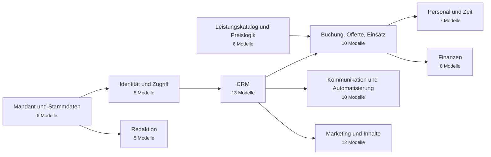

## Mandant und Stammdaten

Die `Organization` ist die Wurzel des Mandanten: nahezu jede Tabelle hängt über `organizationId` daran. Die Plattform ist heute einmandantig betrieben, das Schema aber bereits mehrmandantenfähig — eine nachträgliche Einführung dieser Spalte über fünfzig Tabellen wäre eine Migration, die man nicht zweimal machen will. `NumberSequence` erzeugt die lückenlosen Belegnummern innerhalb der jeweiligen Geschäftstransaktion.

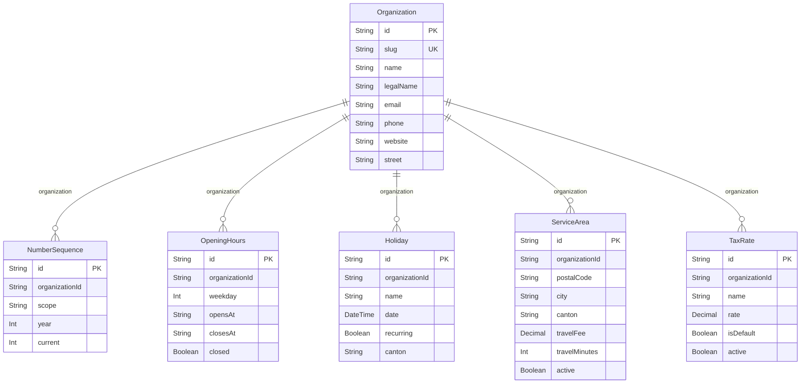

| Modell | Tabelle | Felder | Zweck |
| --- | --- | --- | --- |
| `Organization` | `organizations` | 86 | Mandant — Firmendaten, Bankverbindung, Erscheinungsbild. Wurzel fast aller Beziehungen. |
| `NumberSequence` | `number_sequences` | 6 | Fortlaufende, lückenlose Belegnummern (Schweizer Buchhaltungsanforderung). |
| `OpeningHours` | `opening_hours` | 7 | Öffnungszeiten je Wochentag; Grundlage der buchbaren Zeitfenster. |
| `Holiday` | `holidays` | 7 | Feiertage und Betriebsferien. Sperren Termine und zählen nicht als Abwesenheitstage. |
| `ServiceArea` | `service_areas` | 11 | Postleitzahlen im Einsatzgebiet, je mit Anfahrtspauschale und Fahrzeit. |
| `TaxRate` | `tax_rates` | 7 | Mehrwertsteuersätze. Seit 2024 gilt in der Schweiz 8.1 % als Normalsatz. |

## Identität und Zugriff

`User` trägt Anmeldung und Rolle; `Customer` und `Employee` sind die fachlichen Profile daneben. Diese Trennung erlaubt Gastbuchungen ohne Konto und Kundendatensätze, die erst später ein Login erhalten. `RefreshToken` speichert nur den SHA-256-Hash und eine Familien-ID — daran erkennt die Rotation die Wiederverwendung eines bereits verbrauchten Tokens. `AuditLog` und `Consent` sind die Nachweisschicht für das Schweizer DSG und die DSGVO.

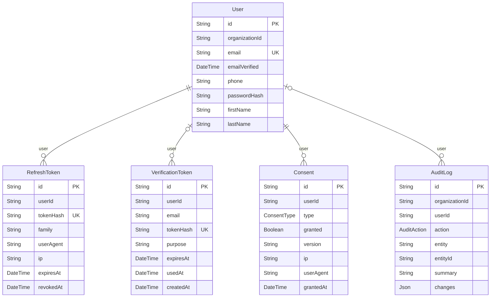

| Modell | Tabelle | Felder | Zweck |
| --- | --- | --- | --- |
| `User` | `users` | 44 | Benutzerkonto mit Rolle und Anmeldedaten. Passwörter als Argon2id-Hash. |
| `RefreshToken` | `refresh_tokens` | 10 | Rotierender Refresh-Token. Gespeichert wird nur der SHA-256-Hash plus Familien-ID zur Erkennung von Wiederverwendung. |
| `VerificationToken` | `verification_tokens` | 9 | Einmaltoken für E-Mail-Bestätigung, Passwortreset und Einladung. |
| `Consent` | `consents` | 9 | Nachweis erteilter und widerrufener Einwilligungen mit Zeitpunkt und IP. |
| `AuditLog` | `audit_logs` | 13 | Prüfprotokoll aller ändernden Vorgänge — wer, wann, was, vorher/nachher. |

## CRM

Der Weg einer Anfrage: `Lead` → `Customer` → `Property`. Adressen und Objekte sind eigene Tabellen, weil ein Geschäftskunde mehrere Liegenschaften hat und eine Rechnungsadresse selten die Einsatzadresse ist. `Activity` ist die gemeinsame Zeitachse über Kundschaft, Anfragen, Einsätze und Belege.

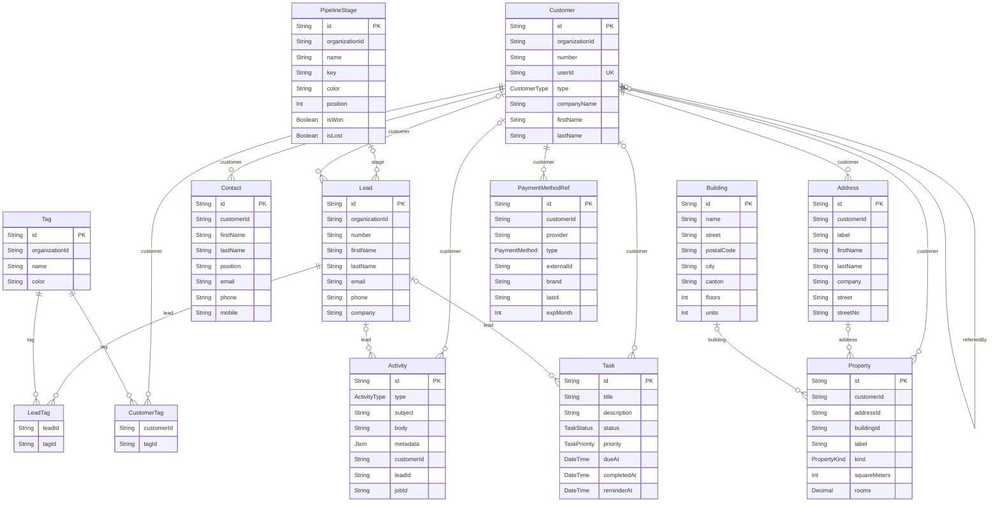

| Modell | Tabelle | Felder | Zweck |
| --- | --- | --- | --- |
| `Lead` | `leads` | 39 | Anfrage vor der Kundenbeziehung, mit Herkunft, Bewertung und Pipeline-Stufe. |
| `Customer` | `customers` | 54 | Kundendatensatz mit Konditionen, Umsatz und Zahlungsverhalten. |
| `Contact` | `contacts` | 13 | Ansprechperson bei Geschäftskundschaft. |
| `Address` | `addresses` | 25 | Adresse einer Kundschaft — Einsatz-, Rechnungs- oder Standardadresse. |
| `Building` | `buildings` | 17 | Liegenschaft mit mehreren Objekten, etwa eine Überbauung. |
| `Property` | `properties` | 30 | Konkretes Reinigungsobjekt: Fläche, Zimmer, Zugang, Schlüsseldepot. |
| `PipelineStage` | `pipeline_stages` | 10 | Stufe im Vertriebstrichter, frei benennbar. |
| `Tag` | `tags` | 7 | Frei vergebbares Etikett für Kundschaft und Anfragen. |
| `LeadTag` | `lead_tags` | 4 | Zuordnung Etikett ↔ Anfrage. |
| `CustomerTag` | `customer_tags` | 4 | Zuordnung Etikett ↔ Kundschaft. |
| `Activity` | `activities` | 22 | Verlaufseintrag: Notiz, Telefonat, E-Mail, Termin, Statuswechsel. |
| `Task` | `tasks` | 21 | Aufgabe mit Fälligkeit, Zuständigkeit und Erinnerung. |
| `PaymentMethodRef` | `payment_methods` | 12 | Hinterlegtes Zahlungsmittel — nur der Verweis beim Anbieter, nie die Kartendaten. |

## Leistungskatalog und Preislogik

Der Katalog bestimmt, was angeboten wird und was es kostet. `PriceRule` trägt die Bedingung als JSON und wird von `lib/pricing/engine.ts` ausgewertet — so lassen sich Wochenend- und Flächenzuschläge ohne Codeänderung ergänzen. Preise gelten immer serverseitig; der Browser rechnet nur mit, um sofort etwas anzeigen zu können.

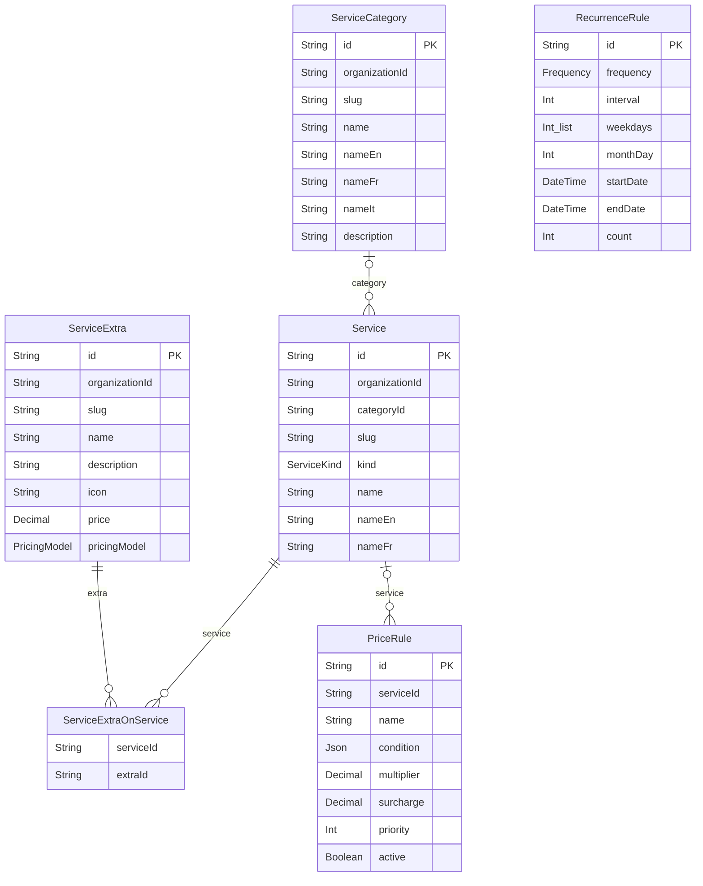

| Modell | Tabelle | Felder | Zweck |
| --- | --- | --- | --- |
| `ServiceCategory` | `service_categories` | 13 | Gruppierung des Leistungskatalogs für Website und Navigation. |
| `Service` | `services` | 42 | Angebotene Leistung mit Preismodell, Dauerkennzahlen und SEO-Angaben. |
| `ServiceExtra` | `service_extras` | 15 | Zubuchbare Zusatzleistung, etwa Backofen oder Balkon. |
| `ServiceExtraOnService` | `service_extras_on_services` | 4 | Welcher Zusatz ist zu welcher Leistung buchbar. |
| `PriceRule` | `price_rules` | 9 | Multiplikatoren und Zuschläge, die die Preis-Engine anwendet. |
| `RecurrenceRule` | `recurrence_rules` | 13 | Wiederholungsmuster einer Serienbuchung. |

## Buchung, Offerte, Einsatz

Die drei Formen eines Auftrags. `Booking` ist die Vereinbarung mit der Kundschaft, `Job` die Ausführung durch das Team — getrennt, weil eine wöchentliche Buchung zweiundfünfzig Einsätze erzeugt. Preise werden in der Buchung als Momentaufnahme festgehalten: ändert sich der Katalog, bleibt der vereinbarte Preis gültig.

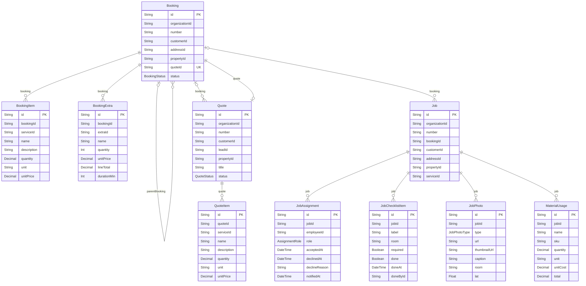

| Modell | Tabelle | Felder | Zweck |
| --- | --- | --- | --- |
| `Booking` | `bookings` | 61 | Vereinbarung mit der Kundschaft: Termin, Objekt, Leistungen und Preis als Momentaufnahme. |
| `BookingItem` | `booking_items` | 14 | Leistungsposition einer Buchung, mit Preis zum Buchungszeitpunkt. |
| `BookingExtra` | `booking_extras` | 10 | Gebuchte Zusatzleistung mit Menge und Preis. |
| `Quote` | `quotes` | 47 | Offerte mit Positionen, Gültigkeit, Magic-Link-Token und elektronischer Signatur. |
| `QuoteItem` | `quote_items` | 15 | Offertposition; optionale Positionen zählen nicht ins Total. |
| `Job` | `jobs` | 49 | Ausführung durch das Team: Termin, Zuteilung, Checkliste, Abschluss, Kosten. |
| `JobAssignment` | `job_assignments` | 11 | Zuteilung einer Person zu einem Einsatz, samt Zu- oder Absage. |
| `JobChecklistItem` | `job_checklist_items` | 11 | Prüfpunkt des Abnahmeprotokolls, mit Vermerk wer wann abgehakt hat. |
| `JobPhoto` | `job_photos` | 12 | Vorher-, Nachher- oder Schadensfoto mit Standort und Zeitpunkt. |
| `MaterialUsage` | `material_usages` | 11 | Verbrauchtes Material je Einsatz — Grundlage der Deckungsbeitragsrechnung. |

## Personal und Zeit

`TimeEntry` ist die Grundlage der Lohnabrechnung, `GpsEvent` belegt An- und Abfahrt bei Objekten ohne Ansprechperson. `Availability` und `Absence` speisen die Disposition: wer abwesend ist, erscheint gar nicht erst als Vorschlag.

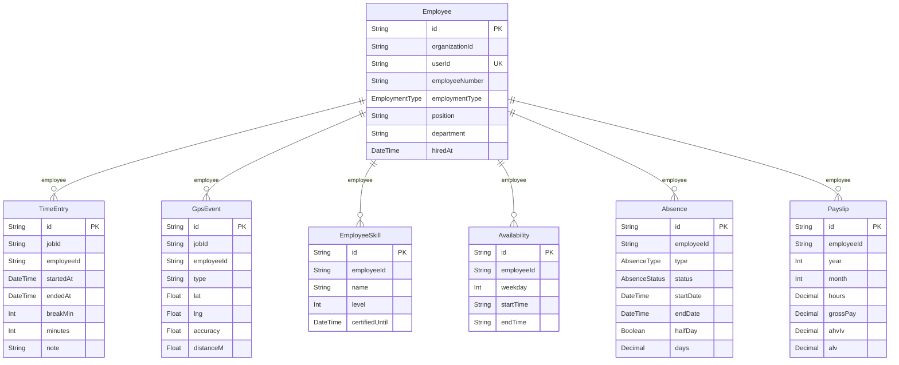

| Modell | Tabelle | Felder | Zweck |
| --- | --- | --- | --- |
| `Employee` | `employees` | 38 | Personalstammdaten inkl. Schweizer Angaben (AHV, Bewilligung, Pensum). |
| `EmployeeSkill` | `employee_skills` | 6 | Qualifikation mit Stufe und Zertifikatsablauf. |
| `Availability` | `availabilities` | 6 | Regelmässige Verfügbarkeit je Wochentag. |
| `Absence` | `absences` | 15 | Ferien, Krankheit, Militär und weitere Abwesenheiten mit Bewilligungsstand. |
| `Payslip` | `payslips` | 16 | Lohnabrechnung mit AHV/IV/EO, ALV, BVG und UVG. Erst sichtbar, wenn freigegeben. |
| `TimeEntry` | `time_entries` | 16 | Erfasste Arbeitszeit je Einsatz — Grundlage der Lohnverarbeitung. |
| `GpsEvent` | `gps_events` | 12 | An- und Abfahrt mit Koordinaten, als Nachweis bei Objekten ohne Ansprechperson. |

## Finanzen

Finanzbelege sind fortschreibend, nie überschreibend: eine ausgestellte `Invoice` wird nicht mehr geändert, Korrekturen laufen über `CreditNote`. Das verlangt die Aufbewahrungspflicht nach Art. 957a OR. `Payment.providerPaymentId` ist eindeutig — daran erkennt der Stripe-Webhook eine bereits gebuchte Zahlung und bleibt idempotent.

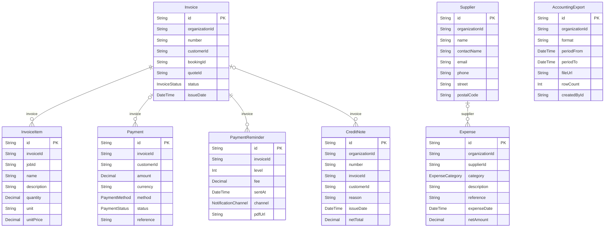

| Modell | Tabelle | Felder | Zweck |
| --- | --- | --- | --- |
| `Invoice` | `invoices` | 56 | Rechnung mit QR-Referenz und Empfänger-Momentaufnahme. Nach dem Ausstellen unveränderlich. |
| `InvoiceItem` | `invoice_items` | 16 | Rechnungsposition mit Netto-, MWST- und Bruttobetrag. |
| `Payment` | `payments` | 21 | Zahlungseingang. `providerPaymentId` ist eindeutig — daran bleibt der Webhook idempotent. |
| `PaymentReminder` | `payment_reminders` | 8 | Mahnstufe mit Versandzeitpunkt und Gebühr. |
| `CreditNote` | `credit_notes` | 17 | Gutschrift. Der einzige Weg, eine ausgestellte Rechnung zu korrigieren. |
| `Supplier` | `suppliers` | 19 | Lieferant für Material, Fahrzeuge und Dienstleistungen. |
| `Expense` | `expenses` | 23 | Ausgabe mit Beleg, Kategorie und Vorsteuerabzug. |
| `AccountingExport` | `accounting_exports` | 10 | Protokoll erzeugter Buchhaltungsexporte, damit Perioden nicht doppelt laufen. |

## Kommunikation und Automatisierung

Jeder ausgehende Versand wird protokolliert (`EmailLog`, `SmsLog`) — bei einer Reklamation muss belegbar sein, was wann an wen ging. `Automation` beschreibt Auslöser und Aktionen als Daten, damit sich Abläufe ohne Codeänderung anpassen lassen.

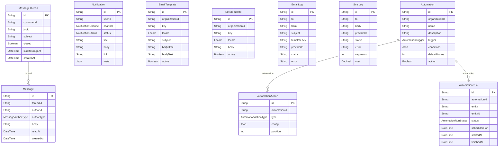

| Modell | Tabelle | Felder | Zweck |
| --- | --- | --- | --- |
| `MessageThread` | `message_threads` | 10 | Nachrichtenverlauf mit der Kundschaft, gebunden an Kundschaft oder Einsatz. |
| `Message` | `messages` | 10 | Einzelne Nachricht im Verlauf, mit Lesevermerk und Anhängen. |
| `Notification` | `notifications` | 13 | In-App-, E-Mail- oder SMS-Meldung an eine Person, mit Zustellstand. |
| `EmailTemplate` | `email_templates` | 11 | E-Mail-Vorlage je Sprache, mit Platzhaltern. |
| `SmsTemplate` | `sms_templates` | 7 | SMS-Vorlage je Sprache. |
| `EmailLog` | `email_logs` | 13 | Protokoll jedes E-Mail-Versands inkl. Öffnungen und Zustellfehlern. |
| `SmsLog` | `sms_logs` | 11 | Protokoll jedes SMS-Versands inkl. Kosten. |
| `Automation` | `automations` | 13 | Regel aus Auslöser und Aktionen, als Daten statt als Code. |
| `AutomationAction` | `automation_actions` | 6 | Einzelne Aktion einer Regel, mit Verzögerung und Reihenfolge. |
| `AutomationRun` | `automation_runs` | 12 | Ausführung einer Regel mit Ergebnis — macht Automatisierungen nachvollziehbar. |

## Marketing und Inhalte

Website-Inhalte und Vertriebsinstrumente. Bewertungen durchlaufen immer die Moderation, bevor sie öffentlich werden — veröffentlicht wird auch die kritische, aber erst nachdem der Betrieb sie gesehen und beantwortet hat.

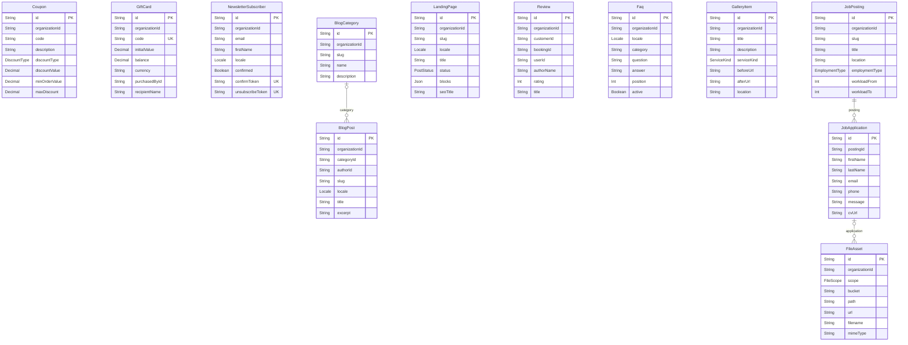

| Modell | Tabelle | Felder | Zweck |
| --- | --- | --- | --- |
| `Coupon` | `coupons` | 19 | Rabattcode mit Gültigkeit, Einlösegrenze und Mindestbestellwert. |
| `GiftCard` | `gift_cards` | 16 | Geschenkkarte mit Restguthaben. |
| `NewsletterSubscriber` | `newsletter_subscribers` | 12 | Newsletter-Anmeldung mit Double-Opt-in und Abmeldetoken. |
| `BlogCategory` | `blog_categories` | 7 | Rubrik des Blogs. |
| `BlogPost` | `blog_posts` | 22 | Blogbeitrag mit SEO-Angaben und Veröffentlichungsstand. |
| `LandingPage` | `landing_pages` | 13 | Kampagnenseite mit eigenem Inhalt und Nachverfolgung. |
| `Review` | `reviews` | 21 | Kundenbewertung mit Moderationsstand und öffentlicher Antwort. |
| `Faq` | `faqs` | 9 | Häufige Frage samt Antwort, nach Rubrik geordnet. |
| `GalleryItem` | `gallery_items` | 13 | Galerieeintrag, wahlweise als Vorher-Nachher-Paar. |
| `JobPosting` | `job_postings` | 20 | Stellenausschreibung mit Anforderungen und Pensum. |
| `JobApplication` | `job_applications` | 16 | Bewerbung mit Lebenslauf und Stand im Verfahren. |
| `FileAsset` | `file_assets` | 34 | Datei in Supabase Storage mit fachlicher Zuordnung und Sichtbarkeit. |

## Redaktion

Die Texte der öffentlichen Website. `ContentBlock` ist ein Schlüssel-Wert-Speicher; welche Schlüssel gültig sind und welcher Text gilt, solange nichts gepflegt wurde, steht als Register im Code (`lib/cms/registry.ts`). Daraus folgt, dass eine fehlende Zeile die Website nicht zerlegt — sie zeigt dann den Auslieferungstext. `SeoMeta` hängt bewusst an einer *Route* und nicht an einem Baustein: `noIndex` ist eine technische Schaltung, die eine Seite aus dem Suchindex wirft.

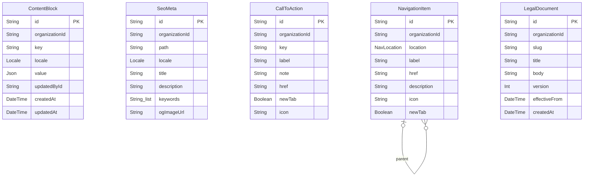

| Modell | Tabelle | Felder | Zweck |
| --- | --- | --- | --- |
| `ContentBlock` | `content_blocks` | 9 | Redaktionell pflegbarer Inhaltsbaustein der Website. |
| `SeoMeta` | `seo_meta` | 13 | Suchmaschinen-Angaben je Seitenpfad. |
| `CallToAction` | `calls_to_action` | 21 | – |
| `NavigationItem` | `navigation_items` | 16 | – |
| `LegalDocument` | `legal_documents` | 10 | Impressum, Datenschutzerklärung, AGB, Cookie-Hinweis. |

## Aufzählungstypen

PostgreSQL-`ENUM`-Typen statt Textspalten mit Prüfbedingung: die Datenbank
weist einen unbekannten Wert von sich aus zurück, und Prisma erzeugt daraus
exakte TypeScript-Typen.

| Typ | Werte |
| --- | --- |
| `Locale` | `DE`, `EN`, `FR`, `IT` |
| `UserRole` | `SUPER_ADMIN`, `ADMIN`, `MANAGER`, `EMPLOYEE`, `CUSTOMER` |
| `UserStatus` | `PENDING`, `ACTIVE`, `SUSPENDED`, `DISABLED` |
| `CustomerType` | `PRIVATE`, `BUSINESS` |
| `LeadStatus` | `NEW`, `CONTACTED`, `QUALIFIED`, `PROPOSAL`, `WON`, `LOST` |
| `LeadSource` | `WEBSITE`, `PHONE`, `EMAIL`, `REFERRAL`, `GOOGLE_ADS`, `META_ADS`, `SEO`, `WALK_IN`, `PARTNER`, `OTHER` |
| `PropertyKind` | `APARTMENT`, `HOUSE`, `OFFICE`, `COMMERCIAL`, `INDUSTRIAL`, `CONSTRUCTION_SITE`, `PRACTICE`, `RESTAURANT`, `SCHOOL`, `OTHER` |
| `ServiceKind` | `OFFICE_CLEANING`, `MOVE_OUT_CLEANING`, `RESIDENTIAL_CLEANING`, `WINDOW_CLEANING`, `CONSTRUCTION_CLEANING`, `BUILDING_MAINTENANCE`, `SPECIAL` |
| `PricingModel` | `PER_HOUR`, `PER_SQM`, `FLAT`, `PER_UNIT`, `ON_REQUEST` |
| `Frequency` | `ONCE`, `WEEKLY`, `BIWEEKLY`, `MONTHLY`, `QUARTERLY`, `SEMIANNUAL`, `ANNUAL`, `CUSTOM` |
| `BookingStatus` | `DRAFT`, `PENDING`, `CONFIRMED`, `IN_PROGRESS`, `COMPLETED`, `CANCELLED`, `NO_SHOW` |
| `QuoteStatus` | `DRAFT`, `SENT`, `VIEWED`, `ACCEPTED`, `REJECTED`, `EXPIRED`, `CONVERTED` |
| `JobStatus` | `UNASSIGNED`, `SCHEDULED`, `DISPATCHED`, `EN_ROUTE`, `IN_PROGRESS`, `ON_HOLD`, `COMPLETED`, `VERIFIED`, `CANCELLED` |
| `JobPhotoType` | `BEFORE`, `AFTER`, `DAMAGE`, `DOCUMENT`, `OTHER` |
| `AssignmentRole` | `LEAD`, `MEMBER`, `TRAINEE`, `SUPERVISOR` |
| `InvoiceStatus` | `DRAFT`, `ISSUED`, `SENT`, `PARTIALLY_PAID`, `PAID`, `OVERDUE`, `CANCELLED`, `WRITTEN_OFF` |
| `PaymentMethod` | `CARD`, `TWINT`, `BANK_TRANSFER`, `CASH`, `SEPA`, `GIFT_CARD`, `CREDIT_NOTE`, `OTHER` |
| `PaymentStatus` | `PENDING`, `PROCESSING`, `SUCCEEDED`, `FAILED`, `REFUNDED`, `PARTIALLY_REFUNDED`, `CANCELLED` |
| `ExpenseCategory` | `MATERIAL`, `EQUIPMENT`, `VEHICLE`, `FUEL`, `INSURANCE`, `RENT`, `SALARY`, `SOCIAL_SECURITY`, `MARKETING`, `SOFTWARE`, `TRAINING`, `TAXES`, `OTHER` |
| `AbsenceType` | `VACATION`, `SICK`, `ACCIDENT`, `MILITARY`, `MATERNITY`, `PATERNITY`, `UNPAID`, `TRAINING`, `PUBLIC_HOLIDAY`, `OTHER` |
| `AbsenceStatus` | `REQUESTED`, `APPROVED`, `REJECTED`, `CANCELLED` |
| `EmploymentType` | `FULL_TIME`, `PART_TIME`, `HOURLY`, `TEMPORARY`, `APPRENTICE`, `CONTRACTOR` |
| `ActivityType` | `NOTE`, `CALL`, `EMAIL`, `SMS`, `MEETING`, `TASK`, `STATUS_CHANGE`, `FILE_UPLOAD`, `SYSTEM` |
| `TaskPriority` | `LOW`, `NORMAL`, `HIGH`, `URGENT` |
| `TaskStatus` | `OPEN`, `IN_PROGRESS`, `DONE`, `CANCELLED` |
| `NotificationChannel` | `IN_APP`, `EMAIL`, `SMS`, `PUSH` |
| `NotificationStatus` | `QUEUED`, `SENT`, `DELIVERED`, `FAILED`, `READ` |
| `MessageAuthorType` | `CUSTOMER`, `STAFF`, `SYSTEM`, `AI` |
| `ReviewStatus` | `PENDING`, `PUBLISHED`, `REJECTED` |
| `DiscountType` | `PERCENT`, `FIXED` |
| `CouponStatus` | `ACTIVE`, `PAUSED`, `EXPIRED`, `DEPLETED` |
| `PostStatus` | `DRAFT`, `SCHEDULED`, `PUBLISHED`, `ARCHIVED` |
| `ApplicationStatus` | `RECEIVED`, `SCREENING`, `INTERVIEW`, `OFFER`, `HIRED`, `REJECTED`, `WITHDRAWN` |
| `AutomationTrigger` | `BOOKING_CREATED`, `BOOKING_CONFIRMED`, `BOOKING_REMINDER_24H`, `BOOKING_REMINDER_2H`, `BOOKING_COMPLETED`, `BOOKING_CANCELLED`, `QUOTE_SENT`, `QUOTE_ACCEPTED`, `QUOTE_EXPIRING`, `INVOICE_ISSUED`, `INVOICE_DUE_SOON`, `INVOICE_OVERDUE`, `JOB_ASSIGNED`, `JOB_COMPLETED`, `CUSTOMER_BIRTHDAY`, `REVIEW_REQUEST`, `LEAD_CREATED`, `LEAD_IDLE`, `TASK_DUE`, `RECURRING_BOOKING_GENERATE` |
| `AutomationActionType` | `SEND_EMAIL`, `SEND_SMS`, `CREATE_TASK`, `CREATE_NOTIFICATION`, `UPDATE_STATUS`, `WEBHOOK`, `AI_GENERATE` |
| `AutomationRunStatus` | `PENDING`, `RUNNING`, `SUCCESS`, `FAILED`, `SKIPPED` |
| `FileScope` | `BOOKING`, `QUOTE`, `INVOICE`, `JOB`, `CUSTOMER`, `EMPLOYEE`, `PROPERTY`, `BLOG`, `GALLERY`, `APPLICATION`, `EXPENSE`, `MESSAGE`, `OTHER` |
| `AuditAction` | `CREATE`, `UPDATE`, `DELETE`, `LOGIN`, `LOGIN_FAILED`, `LOGOUT`, `PASSWORD_RESET`, `PERMISSION_CHANGE`, `EXPORT`, `IMPORT`, `PAYMENT`, `ACCESS_DENIED` |
| `ConsentType` | `MARKETING_EMAIL`, `MARKETING_SMS`, `ANALYTICS`, `TERMS`, `PRIVACY`, `DATA_PROCESSING` |
| `CtaSlot` | `HEADER`, `HERO_PRIMARY`, `HERO_SECONDARY`, `SECTION_BANNER`, `FOOTER`, `MOBILE_BAR` |
| `CtaStyle` | `PRIMARY`, `SECONDARY`, `OUTLINE`, `GHOST`, `ACCENT`, `SUCCESS`, `CUSTOM` |
| `NavLocation` | `HEADER`, `HEADER_PANEL`, `FOOTER_SERVICES`, `FOOTER_COMPANY`, `FOOTER_LEGAL` |

## Migrationen

```bash
npm run db:migrate     # Entwicklung: Migration erzeugen und anwenden
npm run db:deploy      # Produktion: vorhandene Migrationen anwenden
npm run db:seed        # Schweizer Demodaten (idempotent)
npm run db:studio      # Prisma Studio
npm run erd            # diese Datei neu erzeugen
```

Die Erstmigration liegt in `prisma/migrations/`. Sie legt alle Aufzählungs-
typen, Tabellen, Indizes und Fremdschlüssel an; `npm run db:seed` füllt sie
anschliessend mit einem vollständigen Betrieb im Kanton Bern.
