# Datenmodell

> Diese Datei wird von `npm run erd` aus `prisma/schema.prisma` erzeugt. Die
> Diagramme sind damit nie älter als das Schema. Prosa und Bereichseinteilung
> stehen in `scripts/generate-erd.ts`.

**141 Modelle, 110 Aufzählungstypen, 2724 Felder.**
PostgreSQL 16+; alle Zeitstempel als `timestamptz` in UTC, Anzeige in Europe/Zurich.

## Vier Entscheidungen, die das ganze Schema prägen

**1. `Organization` als Mandantenwurzel.** Fast jede Tabelle trägt eine
`organizationId`. Die Plattform läuft heute einmandantig, aber diese Spalte
nachträglich über fünfzig Tabellen einzuziehen wäre eine Migration, die man
nicht zweimal machen will.

**2. Selektive Soft-Deletes.** `deletedAt` tragen nur die Tabellen, deren
Einträge man später noch braucht: Kundschaft, Buchungen, Offerten, Einsätze,
Rechnungen, Objekte. Eine gelöschte Benachrichtigung ist dagegen einfach weg.
Überall Soft-Deletes bedeutet, überall daran denken zu müssen — und irgendwo
vergisst man es.

**3. Finanzbelege sind fortschreibend.** Eine ausgestellte Rechnung wird nie
geändert oder gelöscht; Korrekturen entstehen als Gutschrift. Die
Belegnummern kommen aus `NumberSequence` und werden innerhalb derselben
Transaktion vergeben wie der Beleg — nur so bleibt die Folge lückenlos, wie
es Art. 957a OR verlangt.

**4. Momentaufnahmen statt Verweise bei Preisen und Adressen.** Buchungen,
Offerten und Rechnungen speichern Bezeichnung, Ansatz und Empfängeranschrift
als Kopie. Ändert sich der Katalog oder zieht die Kundschaft um, bleibt der
Beleg so lesbar, wie er ausgestellt wurde.

## Bereichsübersicht

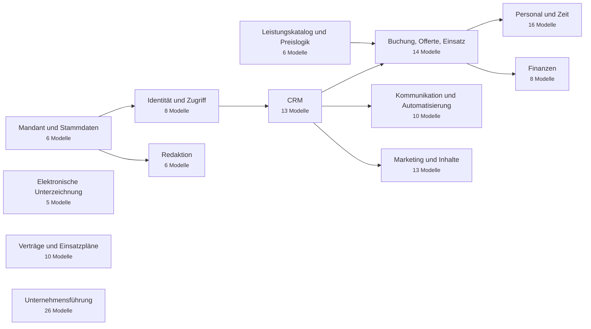
```mermaid
flowchart LR
  stammdaten["Mandant und Stammdaten<br/><small>6 Modelle</small>"]
  identitaet["Identität und Zugriff<br/><small>8 Modelle</small>"]
  signatur["Elektronische Unterzeichnung<br/><small>5 Modelle</small>"]
  crm["CRM<br/><small>13 Modelle</small>"]
  katalog["Leistungskatalog und Preislogik<br/><small>6 Modelle</small>"]
  auftrag["Buchung, Offerte, Einsatz<br/><small>14 Modelle</small>"]
  vertraege["Verträge und Einsatzpläne<br/><small>10 Modelle</small>"]
  personal["Personal und Zeit<br/><small>16 Modelle</small>"]
  finanzen["Finanzen<br/><small>8 Modelle</small>"]
  kommunikation["Kommunikation und Automatisierung<br/><small>10 Modelle</small>"]
  marketing["Marketing und Inhalte<br/><small>13 Modelle</small>"]
  redaktion["Redaktion<br/><small>6 Modelle</small>"]
  fuehrung["Unternehmensführung<br/><small>26 Modelle</small>"]
  stammdaten --> identitaet
  identitaet --> crm
  crm --> auftrag
  katalog --> auftrag
  auftrag --> personal
  auftrag --> finanzen
  crm --> kommunikation
  crm --> marketing
  stammdaten --> redaktion
```

## Mandant und Stammdaten

Die `Organization` ist die Wurzel des Mandanten: nahezu jede Tabelle hängt über `organizationId` daran. Die Plattform ist heute einmandantig betrieben, das Schema aber bereits mehrmandantenfähig — eine nachträgliche Einführung dieser Spalte über fünfzig Tabellen wäre eine Migration, die man nicht zweimal machen will. `NumberSequence` erzeugt die lückenlosen Belegnummern innerhalb der jeweiligen Geschäftstransaktion.

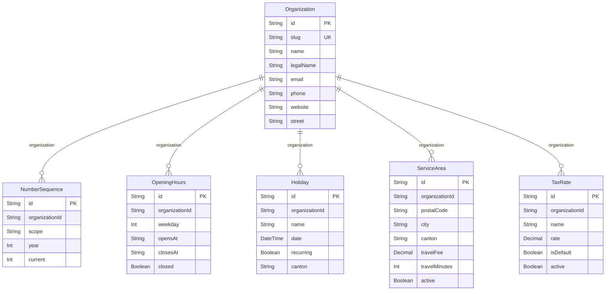
```mermaid
erDiagram
  Organization {
    String id PK
    String slug UK
    String name
    String legalName
    String email
    String phone
    String website
    String street
  }
  NumberSequence {
    String id PK
    String organizationId
    String scope
    Int year
    Int current
  }
  OpeningHours {
    String id PK
    String organizationId
    Int weekday
    String opensAt
    String closesAt
    Boolean closed
  }
  Holiday {
    String id PK
    String organizationId
    String name
    DateTime date
    Boolean recurring
    String canton
  }
  ServiceArea {
    String id PK
    String organizationId
    String postalCode
    String city
    String canton
    Decimal travelFee
    Int travelMinutes
    Boolean active
  }
  TaxRate {
    String id PK
    String organizationId
    String name
    Decimal rate
    Boolean isDefault
    Boolean active
  }
  Organization ||--o{ NumberSequence : "organization"
  Organization ||--o{ OpeningHours : "organization"
  Organization ||--o{ Holiday : "organization"
  Organization ||--o{ ServiceArea : "organization"
  Organization ||--o{ TaxRate : "organization"
```

| Modell | Tabelle | Felder | Zweck |
| --- | --- | --- | --- |
| `Organization` | `organizations` | 124 | Mandant — Firmendaten, Bankverbindung, Erscheinungsbild. Wurzel fast aller Beziehungen. |
| `NumberSequence` | `number_sequences` | 6 | Fortlaufende, lückenlose Belegnummern (Schweizer Buchhaltungsanforderung). |
| `OpeningHours` | `opening_hours` | 7 | Öffnungszeiten je Wochentag; Grundlage der buchbaren Zeitfenster. |
| `Holiday` | `holidays` | 7 | Feiertage und Betriebsferien. Sperren Termine und zählen nicht als Abwesenheitstage. |
| `ServiceArea` | `service_areas` | 11 | Postleitzahlen im Einsatzgebiet, je mit Anfahrtspauschale und Fahrzeit. |
| `TaxRate` | `tax_rates` | 7 | Mehrwertsteuersätze. Seit 2024 gilt in der Schweiz 8.1 % als Normalsatz. |

## Identität und Zugriff

`User` trägt Anmeldung und Rolle; `Customer` und `Employee` sind die fachlichen Profile daneben. Diese Trennung erlaubt Gastbuchungen ohne Konto und Kundendatensätze, die erst später ein Login erhalten. `RefreshToken` speichert nur den SHA-256-Hash und eine Familien-ID — daran erkennt die Rotation die Wiederverwendung eines bereits verbrauchten Tokens. `AuditLog` und `Consent` sind die Nachweisschicht für das Schweizer DSG und die DSGVO. `PublicAccessToken` ist die eine Stelle für Links, die ohne Anmeldung funktionieren — Offerte, Rechnung, später Signatur: nur der SHA-256-Hash liegt in der Datenbank, dazu Zweck, Ressource, Ablauf und Widerruf. `SecurityEvent` steht bewusst **neben** `AuditLog` und nicht darin: Das Prüfprotokoll sagt, wer welchen Datensatz geändert hat, der Sicherheitsstrom, was an Zugängen geschehen ist. Ein fehlgeschlagener Anmeldeversuch ändert keinen Datensatz, und Sicherheitsereignisse brauchen einen Bearbeitungszustand, den ein Protokolleintrag nicht kennt.

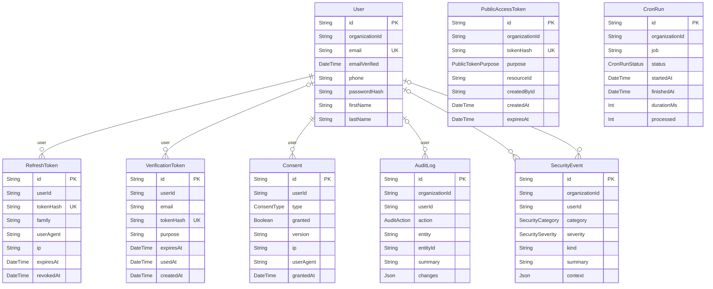
```mermaid
erDiagram
  User {
    String id PK
    String organizationId
    String email UK
    DateTime emailVerified
    String phone
    String passwordHash
    String firstName
    String lastName
  }
  RefreshToken {
    String id PK
    String userId
    String tokenHash UK
    String family
    String userAgent
    String ip
    DateTime expiresAt
    DateTime revokedAt
  }
  VerificationToken {
    String id PK
    String userId
    String email
    String tokenHash UK
    String purpose
    DateTime expiresAt
    DateTime usedAt
    DateTime createdAt
  }
  PublicAccessToken {
    String id PK
    String organizationId
    String tokenHash UK
    PublicTokenPurpose purpose
    String resourceId
    String createdById
    DateTime createdAt
    DateTime expiresAt
  }
  Consent {
    String id PK
    String userId
    ConsentType type
    Boolean granted
    String version
    String ip
    String userAgent
    DateTime grantedAt
  }
  AuditLog {
    String id PK
    String organizationId
    String userId
    AuditAction action
    String entity
    String entityId
    String summary
    Json changes
  }
  SecurityEvent {
    String id PK
    String organizationId
    String userId
    SecurityCategory category
    SecuritySeverity severity
    String kind
    String summary
    Json context
  }
  CronRun {
    String id PK
    String organizationId
    String job
    CronRunStatus status
    DateTime startedAt
    DateTime finishedAt
    Int durationMs
    Int processed
  }
  User ||--o{ RefreshToken : "user"
  User |o--o{ VerificationToken : "user"
  User ||--o{ Consent : "user"
  User |o--o{ AuditLog : "user"
  User |o--o{ SecurityEvent : "user"
  User |o--o{ SecurityEvent : "acknowledgedBy"
```

| Modell | Tabelle | Felder | Zweck |
| --- | --- | --- | --- |
| `User` | `users` | 59 | Benutzerkonto mit Rolle und Anmeldedaten. Passwörter als Argon2id-Hash. |
| `RefreshToken` | `refresh_tokens` | 10 | Rotierender Refresh-Token. Gespeichert wird nur der SHA-256-Hash plus Familien-ID zur Erkennung von Wiederverwendung. |
| `VerificationToken` | `verification_tokens` | 9 | Einmaltoken für E-Mail-Bestätigung, Passwortreset und Einladung. |
| `PublicAccessToken` | `public_access_tokens` | 15 | Ein Schluessel fuer genau eine Sache, ohne Anmeldung. |
| `Consent` | `consents` | 9 | Nachweis erteilter und widerrufener Einwilligungen mit Zeitpunkt und IP. |
| `AuditLog` | `audit_logs` | 13 | Prüfprotokoll aller ändernden Vorgänge — wer, wann, was, vorher/nachher. |
| `SecurityEvent` | `security_events` | 17 | Sicherheitsereignisse — der Strom, den das Sicherheitszentrum liest. |
| `CronRun` | `cron_runs` | 12 | Ein Lauf eines geplanten Auftrags (`/api/cron/hourly`, `/api/cron/daily`). |

## Elektronische Unterzeichnung

Ein `SignatureRequest` bindet sich an exakte Bytes (`originalDocumentHash`), nie an ein veränderliches Geschäftsobjekt; genau eine Quelle (Offerte, Einsatz oder Dokumentfassung), per CHECK erzwungen, `Restrict` in alle Richtungen. `SignatureParticipant` friert die Kontaktdaten ein und trägt nach dem Abschluss Zustimmung, Methode und technische Angaben. `SignatureEvent` ist das fachliche Protokoll — nur anhängen, in der Datenbank per Trigger erzwungen. `SignatureOtpChallenge` hält Bestätigungscodes als Argon2id über einen HMAC; der Hash ist kein Beweis und wird bereinigt. Alle Artefakte liegen in der Gate-2-Ablage (`FileAsset` scope SIGNATURE). `ceremonyMode` hält den *Hergang* fest — Link, Kundenkonto oder Übergabe vor Ort — und ist bewusst getrennt vom `assuranceLevel`, das den Zugangsweg beschreibt; keines steht für das andere ein. `DeviceHandoffSession` sperrt bei der Vor-Ort-Abnahme die Mitarbeitersitzung *dieses* Browsers (Bindung an `RefreshToken.family`, nicht an die Person, damit ein zweites Gerät weiterläuft); freigegeben wird sie ausschliesslich durch Passwortbestätigung, nie durch Ablauf. Keine qualifizierte Signatur; Entwurf in `docs/SIGNATUR_GATE4A.md`.

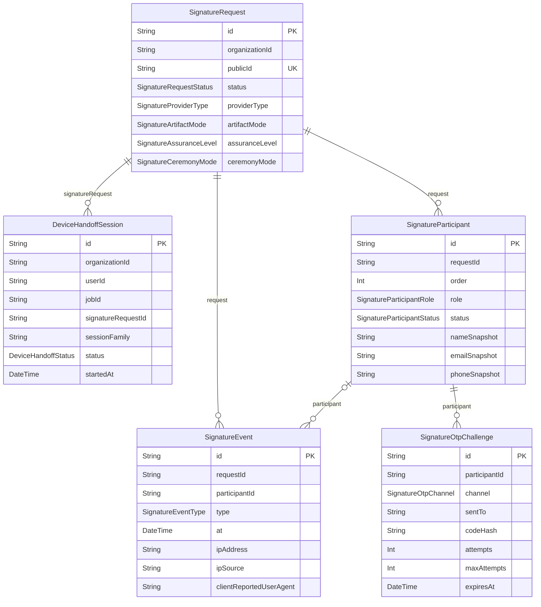
```mermaid
erDiagram
  SignatureRequest {
    String id PK
    String organizationId
    String publicId UK
    SignatureRequestStatus status
    SignatureProviderType providerType
    SignatureArtifactMode artifactMode
    SignatureAssuranceLevel assuranceLevel
    SignatureCeremonyMode ceremonyMode
  }
  DeviceHandoffSession {
    String id PK
    String organizationId
    String userId
    String jobId
    String signatureRequestId
    String sessionFamily
    DeviceHandoffStatus status
    DateTime startedAt
  }
  SignatureParticipant {
    String id PK
    String requestId
    Int order
    SignatureParticipantRole role
    SignatureParticipantStatus status
    String nameSnapshot
    String emailSnapshot
    String phoneSnapshot
  }
  SignatureEvent {
    String id PK
    String requestId
    String participantId
    SignatureEventType type
    DateTime at
    String ipAddress
    String ipSource
    String clientReportedUserAgent
  }
  SignatureOtpChallenge {
    String id PK
    String participantId
    SignatureOtpChannel channel
    String sentTo
    String codeHash
    Int attempts
    Int maxAttempts
    DateTime expiresAt
  }
  SignatureRequest ||--o{ DeviceHandoffSession : "signatureRequest"
  SignatureRequest ||--o{ SignatureParticipant : "request"
  SignatureRequest ||--o{ SignatureEvent : "request"
  SignatureParticipant |o--o{ SignatureEvent : "participant"
  SignatureParticipant ||--o{ SignatureOtpChallenge : "participant"
```

| Modell | Tabelle | Felder | Zweck |
| --- | --- | --- | --- |
| `SignatureRequest` | `signature_requests` | 54 | Ein Unterzeichnungsvorgang. |
| `SignatureParticipant` | `signature_participants` | 32 | Wer unterzeichnet — mit eingefrorenen Kontaktdaten. Ein spaeterer |
| `SignatureEvent` | `signature_events` | 12 | Fachliches Signaturprotokoll — **nur anhaengen**. |
| `SignatureOtpChallenge` | `signature_otp_challenges` | 14 | Ein zugestellter Bestaetigungscode. |
| `DeviceHandoffSession` | `device_handoff_sessions` | 14 | Die Geraeteuebergabe: Solange sie laeuft, haelt der Kunde das Geraet der |

## CRM

Der Weg einer Anfrage: `Lead` → `Customer` → `Property`. Adressen und Objekte sind eigene Tabellen, weil ein Geschäftskunde mehrere Liegenschaften hat und eine Rechnungsadresse selten die Einsatzadresse ist. `Activity` ist die gemeinsame Zeitachse über Kundschaft, Anfragen, Einsätze und Belege.

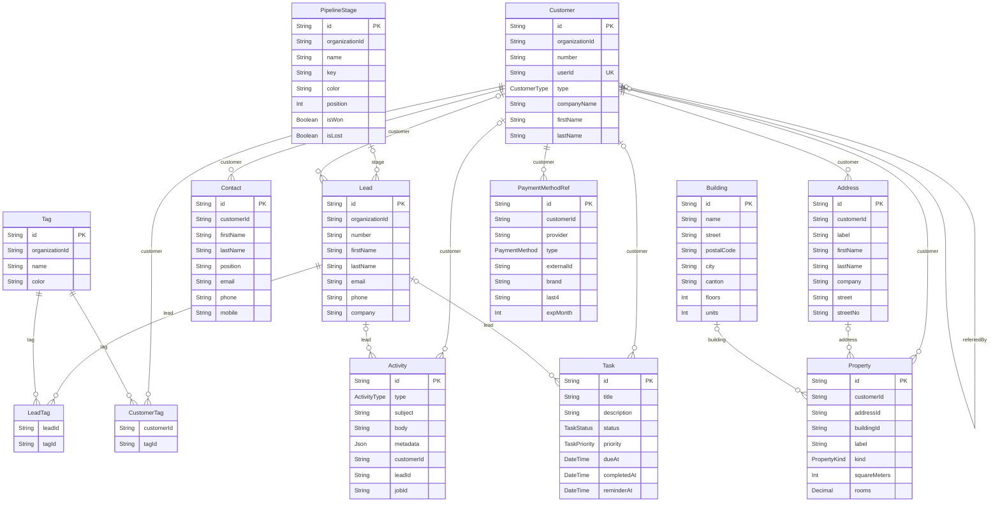
```mermaid
erDiagram
  PipelineStage {
    String id PK
    String organizationId
    String name
    String key
    String color
    Int position
    Boolean isWon
    Boolean isLost
  }
  Tag {
    String id PK
    String organizationId
    String name
    String color
  }
  Lead {
    String id PK
    String organizationId
    String number
    String firstName
    String lastName
    String email
    String phone
    String company
  }
  LeadTag {
    String leadId
    String tagId
  }
  Customer {
    String id PK
    String organizationId
    String number
    String userId UK
    CustomerType type
    String companyName
    String firstName
    String lastName
  }
  CustomerTag {
    String customerId
    String tagId
  }
  Contact {
    String id PK
    String customerId
    String firstName
    String lastName
    String position
    String email
    String phone
    String mobile
  }
  Address {
    String id PK
    String customerId
    String label
    String firstName
    String lastName
    String company
    String street
    String streetNo
  }
  Building {
    String id PK
    String name
    String street
    String postalCode
    String city
    String canton
    Int floors
    Int units
  }
  Property {
    String id PK
    String customerId
    String addressId
    String buildingId
    String label
    PropertyKind kind
    Int squareMeters
    Decimal rooms
  }
  PaymentMethodRef {
    String id PK
    String customerId
    String provider
    PaymentMethod type
    String externalId
    String brand
    String last4
    Int expMonth
  }
  Activity {
    String id PK
    ActivityType type
    String subject
    String body
    Json metadata
    String customerId
    String leadId
    String jobId
  }
  Task {
    String id PK
    String title
    String description
    TaskStatus status
    TaskPriority priority
    DateTime dueAt
    DateTime completedAt
    DateTime reminderAt
  }
  PipelineStage |o--o{ Lead : "stage"
  Customer |o--o{ Lead : "customer"
  Lead ||--o{ LeadTag : "lead"
  Tag ||--o{ LeadTag : "tag"
  Customer |o--o{ Customer : "referredBy"
  Customer ||--o{ CustomerTag : "customer"
  Tag ||--o{ CustomerTag : "tag"
  Customer ||--o{ Contact : "customer"
  Customer ||--o{ Address : "customer"
  Customer ||--o{ Property : "customer"
  Address |o--o{ Property : "address"
  Building |o--o{ Property : "building"
  Customer ||--o{ PaymentMethodRef : "customer"
  Customer |o--o{ Activity : "customer"
  Lead |o--o{ Activity : "lead"
  Customer |o--o{ Task : "customer"
  Lead |o--o{ Task : "lead"
```

| Modell | Tabelle | Felder | Zweck |
| --- | --- | --- | --- |
| `Lead` | `leads` | 39 | Anfrage vor der Kundenbeziehung, mit Herkunft, Bewertung und Pipeline-Stufe. |
| `Customer` | `customers` | 59 | Kundendatensatz mit Konditionen, Umsatz und Zahlungsverhalten. |
| `Contact` | `contacts` | 13 | Ansprechperson bei Geschäftskundschaft. |
| `Address` | `addresses` | 25 | Adresse einer Kundschaft — Einsatz-, Rechnungs- oder Standardadresse. |
| `Building` | `buildings` | 18 | Liegenschaft mit mehreren Objekten, etwa eine Überbauung. |
| `Property` | `properties` | 33 | Konkretes Reinigungsobjekt: Fläche, Zimmer, Zugang, Schlüsseldepot. |
| `PipelineStage` | `pipeline_stages` | 10 | Stufe im Vertriebstrichter, frei benennbar. |
| `Tag` | `tags` | 7 | Frei vergebbares Etikett für Kundschaft und Anfragen. |
| `LeadTag` | `lead_tags` | 4 | Zuordnung Etikett ↔ Anfrage. |
| `CustomerTag` | `customer_tags` | 4 | Zuordnung Etikett ↔ Kundschaft. |
| `Activity` | `activities` | 24 | Verlaufseintrag: Notiz, Telefonat, E-Mail, Termin, Statuswechsel. |
| `Task` | `tasks` | 26 | Aufgabe mit Fälligkeit, Zuständigkeit und Erinnerung. |
| `PaymentMethodRef` | `payment_methods` | 12 | Hinterlegtes Zahlungsmittel — nur der Verweis beim Anbieter, nie die Kartendaten. |

## Leistungskatalog und Preislogik

Der Katalog bestimmt, was angeboten wird und was es kostet. `PriceRule` trägt die Bedingung als JSON und wird von `lib/pricing/engine.ts` ausgewertet — so lassen sich Wochenend- und Flächenzuschläge ohne Codeänderung ergänzen. Preise gelten immer serverseitig; der Browser rechnet nur mit, um sofort etwas anzeigen zu können.

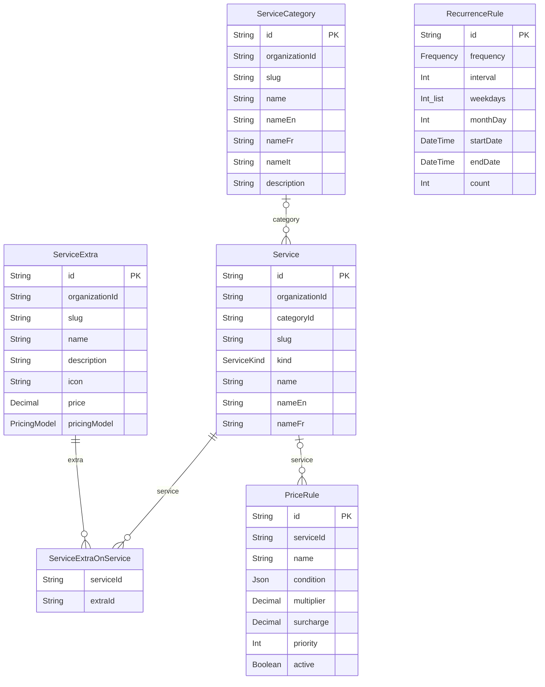
```mermaid
erDiagram
  ServiceCategory {
    String id PK
    String organizationId
    String slug
    String name
    String nameEn
    String nameFr
    String nameIt
    String description
  }
  Service {
    String id PK
    String organizationId
    String categoryId
    String slug
    ServiceKind kind
    String name
    String nameEn
    String nameFr
  }
  ServiceExtra {
    String id PK
    String organizationId
    String slug
    String name
    String description
    String icon
    Decimal price
    PricingModel pricingModel
  }
  ServiceExtraOnService {
    String serviceId
    String extraId
  }
  PriceRule {
    String id PK
    String serviceId
    String name
    Json condition
    Decimal multiplier
    Decimal surcharge
    Int priority
    Boolean active
  }
  RecurrenceRule {
    String id PK
    Frequency frequency
    Int interval
    Int_list weekdays
    Int monthDay
    DateTime startDate
    DateTime endDate
    Int count
  }
  ServiceCategory |o--o{ Service : "category"
  Service ||--o{ ServiceExtraOnService : "service"
  ServiceExtra ||--o{ ServiceExtraOnService : "extra"
  Service |o--o{ PriceRule : "service"
```

| Modell | Tabelle | Felder | Zweck |
| --- | --- | --- | --- |
| `ServiceCategory` | `service_categories` | 13 | Gruppierung des Leistungskatalogs für Website und Navigation. |
| `Service` | `services` | 43 | Angebotene Leistung mit Preismodell, Dauerkennzahlen und SEO-Angaben. |
| `ServiceExtra` | `service_extras` | 15 | Zubuchbare Zusatzleistung, etwa Backofen oder Balkon. |
| `ServiceExtraOnService` | `service_extras_on_services` | 4 | Welcher Zusatz ist zu welcher Leistung buchbar. |
| `PriceRule` | `price_rules` | 9 | Multiplikatoren und Zuschläge, die die Preis-Engine anwendet. |
| `RecurrenceRule` | `recurrence_rules` | 13 | Wiederholungsmuster einer Serienbuchung. |

## Buchung, Offerte, Einsatz

Die drei Formen eines Auftrags. `Booking` ist die Vereinbarung mit der Kundschaft, `Job` die Ausführung durch das Team — getrennt, weil eine wöchentliche Buchung zweiundfünfzig Einsätze erzeugt. Preise werden in der Buchung als Momentaufnahme festgehalten: ändert sich der Katalog, bleibt der vereinbarte Preis gültig.

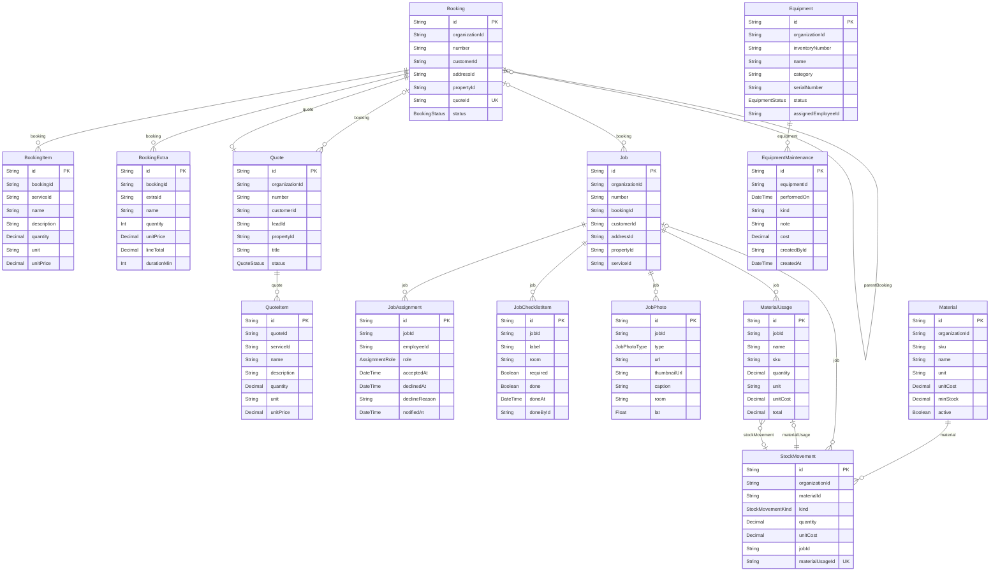
```mermaid
erDiagram
  Booking {
    String id PK
    String organizationId
    String number
    String customerId
    String addressId
    String propertyId
    String quoteId UK
    BookingStatus status
  }
  BookingItem {
    String id PK
    String bookingId
    String serviceId
    String name
    String description
    Decimal quantity
    String unit
    Decimal unitPrice
  }
  BookingExtra {
    String id PK
    String bookingId
    String extraId
    String name
    Int quantity
    Decimal unitPrice
    Decimal lineTotal
    Int durationMin
  }
  Quote {
    String id PK
    String organizationId
    String number
    String customerId
    String leadId
    String propertyId
    String title
    QuoteStatus status
  }
  QuoteItem {
    String id PK
    String quoteId
    String serviceId
    String name
    String description
    Decimal quantity
    String unit
    Decimal unitPrice
  }
  Job {
    String id PK
    String organizationId
    String number
    String bookingId
    String customerId
    String addressId
    String propertyId
    String serviceId
  }
  JobAssignment {
    String id PK
    String jobId
    String employeeId
    AssignmentRole role
    DateTime acceptedAt
    DateTime declinedAt
    String declineReason
    DateTime notifiedAt
  }
  JobChecklistItem {
    String id PK
    String jobId
    String label
    String room
    Boolean required
    Boolean done
    DateTime doneAt
    String doneById
  }
  JobPhoto {
    String id PK
    String jobId
    JobPhotoType type
    String url
    String thumbnailUrl
    String caption
    String room
    Float lat
  }
  MaterialUsage {
    String id PK
    String jobId
    String name
    String sku
    Decimal quantity
    String unit
    Decimal unitCost
    Decimal total
  }
  Material {
    String id PK
    String organizationId
    String sku
    String name
    String unit
    Decimal unitCost
    Decimal minStock
    Boolean active
  }
  StockMovement {
    String id PK
    String organizationId
    String materialId
    StockMovementKind kind
    Decimal quantity
    Decimal unitCost
    String jobId
    String materialUsageId UK
  }
  Equipment {
    String id PK
    String organizationId
    String inventoryNumber
    String name
    String category
    String serialNumber
    EquipmentStatus status
    String assignedEmployeeId
  }
  EquipmentMaintenance {
    String id PK
    String equipmentId
    DateTime performedOn
    String kind
    String note
    Decimal cost
    String createdById
    DateTime createdAt
  }
  Quote |o--|| Booking : "quote"
  Booking |o--o{ Booking : "parentBooking"
  Booking ||--o{ BookingItem : "booking"
  Booking ||--o{ BookingExtra : "booking"
  Booking |o--o{ Quote : "booking"
  Quote ||--o{ QuoteItem : "quote"
  Booking |o--o{ Job : "booking"
  Job ||--o{ JobAssignment : "job"
  Job ||--o{ JobChecklistItem : "job"
  Job ||--o{ JobPhoto : "job"
  Job ||--o{ MaterialUsage : "job"
  StockMovement |o--o{ MaterialUsage : "stockMovement"
  Material ||--o{ StockMovement : "material"
  Job |o--o{ StockMovement : "job"
  MaterialUsage |o--|| StockMovement : "materialUsage"
  Equipment ||--o{ EquipmentMaintenance : "equipment"
```

| Modell | Tabelle | Felder | Zweck |
| --- | --- | --- | --- |
| `Booking` | `bookings` | 61 | Vereinbarung mit der Kundschaft: Termin, Objekt, Leistungen und Preis als Momentaufnahme. |
| `BookingItem` | `booking_items` | 14 | Leistungsposition einer Buchung, mit Preis zum Buchungszeitpunkt. |
| `BookingExtra` | `booking_extras` | 10 | Gebuchte Zusatzleistung mit Menge und Preis. |
| `Quote` | `quotes` | 49 | Offerte mit Positionen, Gültigkeit, Magic-Link-Token und elektronischer Signatur. |
| `QuoteItem` | `quote_items` | 15 | Offertposition; optionale Positionen zählen nicht ins Total. |
| `Job` | `jobs` | 63 | Ausführung durch das Team: Termin, Zuteilung, Checkliste, Abschluss, Kosten. |
| `JobAssignment` | `job_assignments` | 11 | Zuteilung einer Person zu einem Einsatz, samt Zu- oder Absage. |
| `JobChecklistItem` | `job_checklist_items` | 11 | Prüfpunkt des Abnahmeprotokolls, mit Vermerk wer wann abgehakt hat. |
| `JobPhoto` | `job_photos` | 12 | Vorher-, Nachher- oder Schadensfoto mit Standort und Zeitpunkt. |
| `MaterialUsage` | `material_usages` | 12 | Verbrauchtes Material je Einsatz — Grundlage der Deckungsbeitragsrechnung. |
| `Material` | `materials` | 13 | Verbrauchsmaterial mit Bestand. Der Bestand ist die **Summe der |
| `StockMovement` | `stock_movements` | 16 | Eine Lagerbewegung — **nur anfügen** (Trigger `stock_movements_nur_anfuegen`). |
| `Equipment` | `equipment` | 20 | Gerät (Maschine, Staubsauger, Hochdruckreiniger) mit Zuteilung und Wartung. |
| `EquipmentMaintenance` | `equipment_maintenances` | 9 | Eine durchgeführte Wartung — Beleg, nicht änderbar (Trigger). |

## Verträge und Einsatzpläne

Der betriebliche Ursprung wiederkehrender Leistungen: angenommene Offerte → `Contract` → `ContractVersion` → `ContractService` → `ServiceSchedule` → `Job`. Der Vertragskopf trägt die Identität und den Lebenslauf, die **Version** alle kaufmännischen Konditionen — ein laufender Vertrag wird nie umgeschrieben, sondern abgelöst. Leistungen und Pläne hängen deshalb an der Version und werden beim Versionieren kopiert. Jeder erzeugte Einsatz trägt `contractId`, `contractVersionId` und `serviceScheduleId`, damit später beantwortbar bleibt, unter welchen Konditionen er erbracht wurde. `@@unique([serviceScheduleId, scheduleDate])` ist die Doppelsperre des Planers: Derselbe Serientermin kann keinen zweiten Einsatz erzeugen, auch bei gleichzeitigen Läufen nicht. `QualityInspection` misst die Zusage der Fassung (`targetQualityScore`) und hält den Massstab als Schnappschuss fest — eine Begehung, die nach einer Vertragsänderung anders ausfiele, wäre kein Beleg.

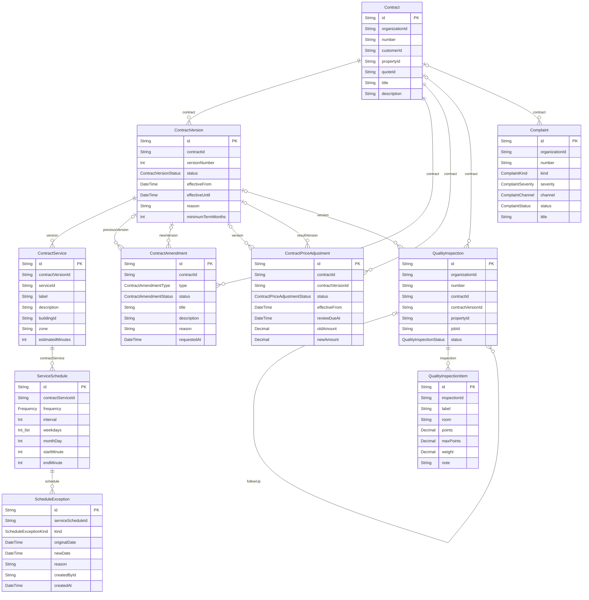
```mermaid
erDiagram
  Contract {
    String id PK
    String organizationId
    String number
    String customerId
    String propertyId
    String quoteId
    String title
    String description
  }
  ContractVersion {
    String id PK
    String contractId
    Int versionNumber
    ContractVersionStatus status
    DateTime effectiveFrom
    DateTime effectiveUntil
    String reason
    Int minimumTermMonths
  }
  ContractService {
    String id PK
    String contractVersionId
    String serviceId
    String label
    String description
    String buildingId
    String zone
    Int estimatedMinutes
  }
  ServiceSchedule {
    String id PK
    String contractServiceId
    Frequency frequency
    Int interval
    Int_list weekdays
    Int monthDay
    Int startMinute
    Int endMinute
  }
  ScheduleException {
    String id PK
    String serviceScheduleId
    ScheduleExceptionKind kind
    DateTime originalDate
    DateTime newDate
    String reason
    String createdById
    DateTime createdAt
  }
  ContractAmendment {
    String id PK
    String contractId
    ContractAmendmentType type
    ContractAmendmentStatus status
    String title
    String description
    String reason
    DateTime requestedAt
  }
  ContractPriceAdjustment {
    String id PK
    String contractId
    String contractVersionId
    ContractPriceAdjustmentStatus status
    DateTime effectiveFrom
    DateTime reviewDueAt
    Decimal oldAmount
    Decimal newAmount
  }
  QualityInspection {
    String id PK
    String organizationId
    String number
    String contractId
    String contractVersionId
    String propertyId
    String jobId
    QualityInspectionStatus status
  }
  QualityInspectionItem {
    String id PK
    String inspectionId
    String label
    String room
    Decimal points
    Decimal maxPoints
    Decimal weight
    String note
  }
  Complaint {
    String id PK
    String organizationId
    String number
    ComplaintKind kind
    ComplaintSeverity severity
    ComplaintChannel channel
    ComplaintStatus status
    String title
  }
  Contract ||--o{ ContractVersion : "contract"
  ContractVersion ||--o{ ContractService : "version"
  ContractService ||--o{ ServiceSchedule : "contractService"
  ServiceSchedule ||--o{ ScheduleException : "schedule"
  Contract ||--o{ ContractAmendment : "contract"
  ContractVersion |o--o{ ContractAmendment : "previousVersion"
  ContractVersion |o--o{ ContractAmendment : "newVersion"
  Contract ||--o{ ContractPriceAdjustment : "contract"
  ContractVersion |o--o{ ContractPriceAdjustment : "version"
  ContractVersion |o--o{ ContractPriceAdjustment : "resultVersion"
  Contract |o--o{ QualityInspection : "contract"
  ContractVersion |o--o{ QualityInspection : "version"
  QualityInspection |o--|| QualityInspection : "followUpOf"
  QualityInspection |o--o{ QualityInspection : "followUp"
  QualityInspection ||--o{ QualityInspectionItem : "inspection"
  Contract |o--o{ Complaint : "contract"
```

| Modell | Tabelle | Felder | Zweck |
| --- | --- | --- | --- |
| `Contract` | `contracts` | 44 | Der Vertragskopf — Identität, Beteiligte, Lebenslauf. |
| `ContractVersion` | `contract_versions` | 44 | Eine Fassung der kaufmännischen Vereinbarung. |
| `ContractService` | `contract_services` | 21 | Eine vereinbarte Leistung innerhalb einer Vertragsversion. |
| `ServiceSchedule` | `service_schedules` | 19 | Der Einsatzplan einer Vertragsleistung — die Serie, aus der Einsätze |
| `ScheduleException` | `schedule_exceptions` | 9 | Eine Abweichung von der Serie an einem bestimmten Tag. |
| `ContractAmendment` | `contract_amendments` | 22 | Eine nachvollziehbare Vertragsänderung. |
| `ContractPriceAdjustment` | `contract_price_adjustments` | 25 | Eine geplante oder vollzogene Preisanpassung. |
| `QualityInspection` | `quality_inspections` | 32 | Eine Qualitätskontrolle vor Ort (Wave 11). |
| `Complaint` | `complaints` | 35 | Reklamation oder Vorfall mit Reaktionsfrist. |
| `QualityInspectionItem` | `quality_inspection_items` | 12 | Eine Einzelbewertung innerhalb einer Begehung. |

## Personal und Zeit

`TimeEntry` ist die Grundlage der Lohnabrechnung, `GpsEvent` belegt An- und Abfahrt bei Objekten ohne Ansprechperson. `Availability` und `Absence` speisen die Disposition: wer abwesend ist, erscheint gar nicht erst als Vorschlag.


```mermaid
erDiagram
  TimeEntry {
    String id PK
    String jobId
    String employeeId
    DateTime startedAt
    DateTime endedAt
    Int breakMin
    Int minutes
    String note
  }
  GpsEvent {
    String id PK
    String jobId
    String employeeId
    String type
    Float lat
    Float lng
    Float accuracy
    Float distanceM
  }
  Employee {
    String id PK
    String organizationId
    String userId UK
    String employeeNumber
    EmploymentType employmentType
    String position
    String department
    DateTime hiredAt
  }
  SalaryRecord {
    String id PK
    String employeeId
    DateTime validFrom
    Decimal hourlyRate
    Decimal monthlySalary
    Int workloadPct
    String reason
    String changedById
  }
  EmployeeSkill {
    String id PK
    String employeeId
    String name
    Int level
    DateTime certifiedUntil
  }
  Availability {
    String id PK
    String employeeId
    Int weekday
    String startTime
    String endTime
  }
  Absence {
    String id PK
    String employeeId
    AbsenceType type
    AbsenceStatus status
    DateTime startDate
    DateTime endDate
    Boolean halfDay
    Decimal days
  }
  PayrollSetting {
    String id PK
    String organizationId
    Int year
    Decimal ahvIvEo
    Decimal alv
    Decimal alvGrenzeJahr
    Decimal alvUeberGrenze
    Decimal uvgNbu
  }
  Payslip {
    String id PK
    String employeeId
    Int year
    Int month
    Decimal hours
    Decimal grossPay
    Decimal ahvIv
    Decimal alv
  }
  PayrollRate {
    String id PK
    String organizationId
    PayrollRateCode code
    DateTime validFrom
    DateTime validUntil
    Decimal employeePct
    Decimal employerPct
    Decimal thresholdMin
  }
  EmployeePayrollProfile {
    String id PK
    String employeeId UK
    ThirteenthSalaryMode thirteenthMode
    Int thirteenthPayoutMonth
    Boolean vacationPayInWage
    Decimal holidayPayPct
    String note
    String updatedById
  }
  PayrollItem {
    String id PK
    String organizationId
    String employeeId
    Int year
    Int month
    PayrollItemType type
    String label
    Decimal quantity
  }
  PayslipLine {
    String id PK
    String payslipId
    Int position
    PayslipLineType type
    PayslipLineKind kind
    String label
    Decimal quantity
    Decimal rate
  }
  WithholdingTaxProfile {
    String id PK
    String organizationId
    String employeeId
    DateTime validFrom
    DateTime validUntil
    String canton
    String tariffCode
    Boolean churchTax
  }
  WithholdingTaxRate {
    String id PK
    String organizationId
    String canton
    Int year
    String tariffCode
    Decimal incomeFrom
    Decimal incomeTo
    Decimal ratePct
  }
  SalaryCertificate {
    String id PK
    String organizationId
    String employeeId
    Int year
    Int version
    SalaryCertificateStatus status
    DateTime periodFrom
    DateTime periodTo
  }
  Employee ||--o{ TimeEntry : "employee"
  Employee ||--o{ GpsEvent : "employee"
  EmployeePayrollProfile |o--o{ Employee : "payrollProfile"
  Employee ||--o{ SalaryRecord : "employee"
  Employee ||--o{ EmployeeSkill : "employee"
  Employee ||--o{ Availability : "employee"
  Employee ||--o{ Absence : "employee"
  Employee ||--o{ Payslip : "employee"
  Employee ||--|| EmployeePayrollProfile : "employee"
  Employee ||--o{ PayrollItem : "employee"
  Payslip |o--o{ PayrollItem : "payslip"
  Payslip ||--o{ PayslipLine : "payslip"
  Employee ||--o{ WithholdingTaxProfile : "employee"
  Employee ||--o{ SalaryCertificate : "employee"
```

| Modell | Tabelle | Felder | Zweck |
| --- | --- | --- | --- |
| `Employee` | `employees` | 53 | Personalstammdaten inkl. Schweizer Angaben (AHV, Bewilligung, Pensum). |
| `EmployeeSkill` | `employee_skills` | 6 | Qualifikation mit Stufe und Zertifikatsablauf. |
| `SalaryRecord` | `salary_records` | 10 | Lohnhistorie: jede Änderung von Ansatz, Monatslohn oder Pensum als eigene |
| `Availability` | `availabilities` | 6 | Regelmässige Verfügbarkeit je Wochentag. |
| `Absence` | `absences` | 15 | Ferien, Krankheit, Militär und weitere Abwesenheiten mit Bewilligungsstand. |
| `Payslip` | `payslips` | 36 | – |
| `PayslipLine` | `payslip_lines` | 13 | Eine Zeile der Abrechnung — Momentaufnahme, unveränderlich nach dem Veröffentlichen. |
| `PayrollSetting` | `payroll_settings` | 18 | Lohnabrechnung mit AHV/IV/EO, ALV, BVG und UVG. Erst sichtbar, wenn freigegeben. |
| `PayrollRate` | `payroll_rates` | 20 | Eine Version eines Beitragssatzes mit Gültigkeitszeitraum. |
| `EmployeePayrollProfile` | `employee_payroll_profiles` | 11 | Lohnbezogene Vereinbarungen einer Person — nur über die Lohnschnittstelle |
| `PayrollItem` | `payroll_items` | 21 | – |
| `WithholdingTaxProfile` | `withholding_tax_profiles` | 15 | Quellensteuerpflicht einer Person — mit Gültigkeitszeitraum. |
| `WithholdingTaxRate` | `withholding_tax_rates` | 15 | Eine Zeile eines Quellensteuertarifs — **nur aus einer Quelle eingelesen, |
| `SalaryCertificate` | `salary_certificates` | 19 | Aufstellung für den Lohnausweis eines Jahres — aus veröffentlichten |
| `TimeEntry` | `time_entries` | 16 | Erfasste Arbeitszeit je Einsatz — Grundlage der Lohnverarbeitung. |
| `GpsEvent` | `gps_events` | 12 | An- und Abfahrt mit Koordinaten, als Nachweis bei Objekten ohne Ansprechperson. |

## Finanzen

Finanzbelege sind fortschreibend, nie überschreibend: eine ausgestellte `Invoice` wird nicht mehr geändert, Korrekturen laufen über `CreditNote`. Das verlangt die Aufbewahrungspflicht nach Art. 957a OR. `Payment.providerPaymentId` ist eindeutig — daran erkennt der Stripe-Webhook eine bereits gebuchte Zahlung und bleibt idempotent.

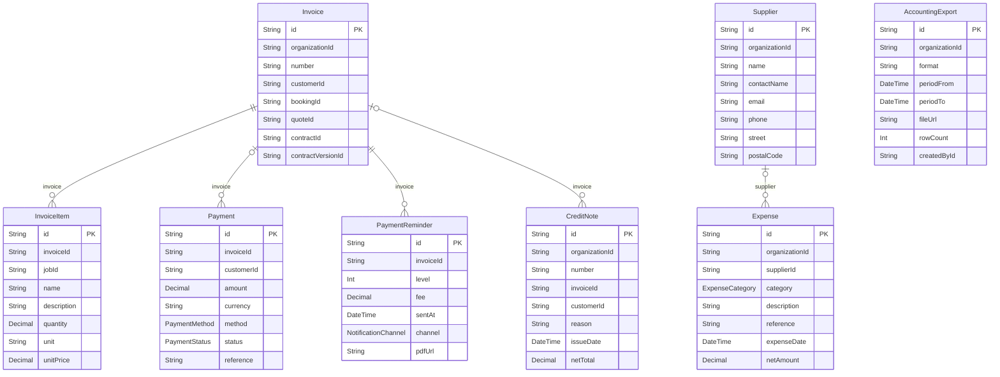
```mermaid
erDiagram
  Invoice {
    String id PK
    String organizationId
    String number
    String customerId
    String bookingId
    String quoteId
    String contractId
    String contractVersionId
  }
  InvoiceItem {
    String id PK
    String invoiceId
    String jobId
    String name
    String description
    Decimal quantity
    String unit
    Decimal unitPrice
  }
  Payment {
    String id PK
    String invoiceId
    String customerId
    Decimal amount
    String currency
    PaymentMethod method
    PaymentStatus status
    String reference
  }
  PaymentReminder {
    String id PK
    String invoiceId
    Int level
    Decimal fee
    DateTime sentAt
    NotificationChannel channel
    String pdfUrl
  }
  CreditNote {
    String id PK
    String organizationId
    String number
    String invoiceId
    String customerId
    String reason
    DateTime issueDate
    Decimal netTotal
  }
  Supplier {
    String id PK
    String organizationId
    String name
    String contactName
    String email
    String phone
    String street
    String postalCode
  }
  Expense {
    String id PK
    String organizationId
    String supplierId
    ExpenseCategory category
    String description
    String reference
    DateTime expenseDate
    Decimal netAmount
  }
  AccountingExport {
    String id PK
    String organizationId
    String format
    DateTime periodFrom
    DateTime periodTo
    String fileUrl
    Int rowCount
    String createdById
  }
  Invoice ||--o{ InvoiceItem : "invoice"
  Invoice |o--o{ Payment : "invoice"
  Invoice ||--o{ PaymentReminder : "invoice"
  Invoice |o--o{ CreditNote : "invoice"
  Supplier |o--o{ Expense : "supplier"
```

| Modell | Tabelle | Felder | Zweck |
| --- | --- | --- | --- |
| `Invoice` | `invoices` | 62 | Rechnung mit QR-Referenz und Empfänger-Momentaufnahme. Nach dem Ausstellen unveränderlich. |
| `InvoiceItem` | `invoice_items` | 16 | Rechnungsposition mit Netto-, MWST- und Bruttobetrag. |
| `Payment` | `payments` | 21 | Zahlungseingang. `providerPaymentId` ist eindeutig — daran bleibt der Webhook idempotent. |
| `PaymentReminder` | `payment_reminders` | 8 | Mahnstufe mit Versandzeitpunkt und Gebühr. |
| `CreditNote` | `credit_notes` | 17 | Gutschrift. Der einzige Weg, eine ausgestellte Rechnung zu korrigieren. |
| `Supplier` | `suppliers` | 21 | Lieferant für Material, Fahrzeuge und Dienstleistungen. |
| `Expense` | `expenses` | 23 | Ausgabe mit Beleg, Kategorie und Vorsteuerabzug. |
| `AccountingExport` | `accounting_exports` | 10 | Protokoll erzeugter Buchhaltungsexporte, damit Perioden nicht doppelt laufen. |

## Kommunikation und Automatisierung

Jeder ausgehende Versand wird protokolliert (`EmailLog`, `SmsLog`) — bei einer Reklamation muss belegbar sein, was wann an wen ging. `Automation` beschreibt Auslöser und Aktionen als Daten, damit sich Abläufe ohne Codeänderung anpassen lassen.

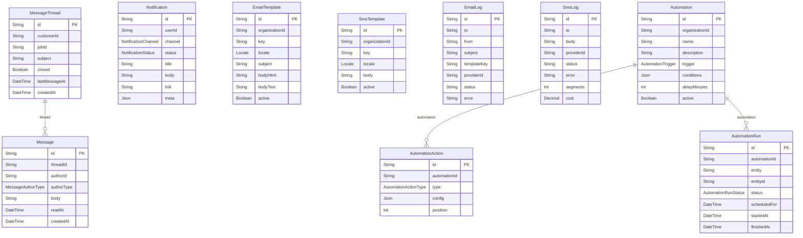
```mermaid
erDiagram
  MessageThread {
    String id PK
    String customerId
    String jobId
    String subject
    Boolean closed
    DateTime lastMessageAt
    DateTime createdAt
  }
  Message {
    String id PK
    String threadId
    String authorId
    MessageAuthorType authorType
    String body
    DateTime readAt
    DateTime createdAt
  }
  Notification {
    String id PK
    String userId
    NotificationChannel channel
    NotificationStatus status
    String title
    String body
    String link
    Json meta
  }
  EmailTemplate {
    String id PK
    String organizationId
    String key
    Locale locale
    String subject
    String bodyHtml
    String bodyText
    Boolean active
  }
  SmsTemplate {
    String id PK
    String organizationId
    String key
    Locale locale
    String body
    Boolean active
  }
  EmailLog {
    String id PK
    String to
    String from
    String subject
    String templateKey
    String providerId
    String status
    String error
  }
  SmsLog {
    String id PK
    String to
    String body
    String providerId
    String status
    String error
    Int segments
    Decimal cost
  }
  Automation {
    String id PK
    String organizationId
    String name
    String description
    AutomationTrigger trigger
    Json conditions
    Int delayMinutes
    Boolean active
  }
  AutomationAction {
    String id PK
    String automationId
    AutomationActionType type
    Json config
    Int position
  }
  AutomationRun {
    String id PK
    String automationId
    String entity
    String entityId
    AutomationRunStatus status
    DateTime scheduledFor
    DateTime startedAt
    DateTime finishedAt
  }
  MessageThread ||--o{ Message : "thread"
  Automation ||--o{ AutomationAction : "automation"
  Automation ||--o{ AutomationRun : "automation"
```

| Modell | Tabelle | Felder | Zweck |
| --- | --- | --- | --- |
| `MessageThread` | `message_threads` | 10 | Nachrichtenverlauf mit der Kundschaft, gebunden an Kundschaft oder Einsatz. |
| `Message` | `messages` | 10 | Einzelne Nachricht im Verlauf, mit Lesevermerk und Anhängen. |
| `Notification` | `notifications` | 13 | In-App-, E-Mail- oder SMS-Meldung an eine Person, mit Zustellstand. |
| `EmailTemplate` | `email_templates` | 11 | E-Mail-Vorlage je Sprache, mit Platzhaltern. |
| `SmsTemplate` | `sms_templates` | 7 | SMS-Vorlage je Sprache. |
| `EmailLog` | `email_logs` | 13 | Protokoll jedes E-Mail-Versands inkl. Öffnungen und Zustellfehlern. |
| `SmsLog` | `sms_logs` | 11 | Protokoll jedes SMS-Versands inkl. Kosten. |
| `Automation` | `automations` | 13 | Regel aus Auslöser und Aktionen, als Daten statt als Code. |
| `AutomationAction` | `automation_actions` | 6 | Einzelne Aktion einer Regel, mit Verzögerung und Reihenfolge. |
| `AutomationRun` | `automation_runs` | 13 | Ausführung einer Regel mit Ergebnis — macht Automatisierungen nachvollziehbar. |

## Marketing und Inhalte

Website-Inhalte und Vertriebsinstrumente. Bewertungen durchlaufen immer die Moderation, bevor sie öffentlich werden — veröffentlicht wird auch die kritische, aber erst nachdem der Betrieb sie gesehen und beantwortet hat.

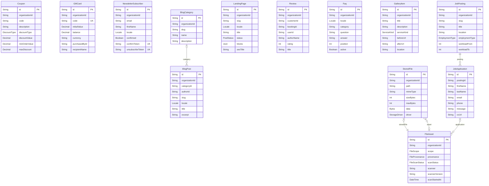
```mermaid
erDiagram
  Coupon {
    String id PK
    String organizationId
    String code
    String description
    DiscountType discountType
    Decimal discountValue
    Decimal minOrderValue
    Decimal maxDiscount
  }
  GiftCard {
    String id PK
    String organizationId
    String code UK
    Decimal initialValue
    Decimal balance
    String currency
    String purchasedById
    String recipientName
  }
  NewsletterSubscriber {
    String id PK
    String organizationId
    String email
    String firstName
    Locale locale
    Boolean confirmed
    String confirmToken UK
    String unsubscribeToken UK
  }
  BlogCategory {
    String id PK
    String organizationId
    String slug
    String name
    String description
  }
  BlogPost {
    String id PK
    String organizationId
    String categoryId
    String authorId
    String slug
    Locale locale
    String title
    String excerpt
  }
  StoredFile {
    String id PK
    String organizationId
    String path
    String mimeType
    Int sizeBytes
    Int maxBytes
    Bytes data
    StorageDriver driver
  }
  LandingPage {
    String id PK
    String organizationId
    String slug
    Locale locale
    String title
    PostStatus status
    Json blocks
    String seoTitle
  }
  Review {
    String id PK
    String organizationId
    String customerId
    String bookingId
    String userId
    String authorName
    Int rating
    String title
  }
  Faq {
    String id PK
    String organizationId
    Locale locale
    String category
    String question
    String answer
    Int position
    Boolean active
  }
  GalleryItem {
    String id PK
    String organizationId
    String title
    String description
    ServiceKind serviceKind
    String beforeUrl
    String afterUrl
    String location
  }
  JobPosting {
    String id PK
    String organizationId
    String slug
    String title
    String location
    EmploymentType employmentType
    Int workloadFrom
    Int workloadTo
  }
  JobApplication {
    String id PK
    String postingId
    String firstName
    String lastName
    String email
    String phone
    String message
    String cvUrl
  }
  FileAsset {
    String id PK
    String organizationId
    FileScope scope
    FileProvenance provenance
    FileScanStatus scanStatus
    String scanner
    String scannerVersion
    DateTime scanStartedAt
  }
  BlogCategory |o--o{ BlogPost : "category"
  FileAsset |o--o{ StoredFile : "asset"
  JobPosting ||--o{ JobApplication : "posting"
  StoredFile |o--|| FileAsset : "storedFile"
  JobApplication |o--o{ FileAsset : "application"
```

| Modell | Tabelle | Felder | Zweck |
| --- | --- | --- | --- |
| `Coupon` | `coupons` | 19 | Rabattcode mit Gültigkeit, Einlösegrenze und Mindestbestellwert. |
| `GiftCard` | `gift_cards` | 16 | Geschenkkarte mit Restguthaben. |
| `NewsletterSubscriber` | `newsletter_subscribers` | 12 | Newsletter-Anmeldung mit Double-Opt-in und Abmeldetoken. |
| `BlogCategory` | `blog_categories` | 7 | Rubrik des Blogs. |
| `BlogPost` | `blog_posts` | 22 | Blogbeitrag mit SEO-Angaben und Veröffentlichungsstand. |
| `LandingPage` | `landing_pages` | 13 | Kampagnenseite mit eigenem Inhalt und Nachverfolgung. |
| `Review` | `reviews` | 22 | Kundenbewertung mit Moderationsstand und öffentlicher Antwort. |
| `Faq` | `faqs` | 9 | Häufige Frage samt Antwort, nach Rubrik geordnet. |
| `GalleryItem` | `gallery_items` | 13 | Galerieeintrag, wahlweise als Vorher-Nachher-Paar. |
| `JobPosting` | `job_postings` | 20 | Stellenausschreibung mit Anforderungen und Pensum. |
| `JobApplication` | `job_applications` | 16 | Bewerbung mit Lebenslauf und Stand im Verfahren. |
| `FileAsset` | `file_assets` | 67 | Datei in Supabase Storage mit fachlicher Zuordnung und Sichtbarkeit. |
| `StoredFile` | `stored_files` | 16 | Eingebauter Dateispeicher — die Rückfallebene, wenn kein externer |

## Redaktion

Die Texte der öffentlichen Website. `ContentBlock` ist ein Schlüssel-Wert-Speicher; welche Schlüssel gültig sind und welcher Text gilt, solange nichts gepflegt wurde, steht als Register im Code (`lib/cms/registry.ts`). Daraus folgt, dass eine fehlende Zeile die Website nicht zerlegt — sie zeigt dann den Auslieferungstext. `SeoMeta` hängt bewusst an einer *Route* und nicht an einem Baustein: `noIndex` ist eine technische Schaltung, die eine Seite aus dem Suchindex wirft.

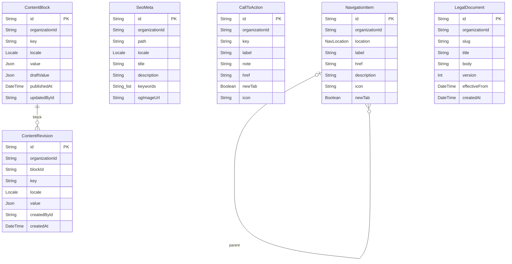
```mermaid
erDiagram
  ContentBlock {
    String id PK
    String organizationId
    String key
    Locale locale
    Json value
    Json draftValue
    DateTime publishedAt
    String updatedById
  }
  ContentRevision {
    String id PK
    String organizationId
    String blockId
    String key
    Locale locale
    Json value
    String createdById
    DateTime createdAt
  }
  SeoMeta {
    String id PK
    String organizationId
    String path
    Locale locale
    String title
    String description
    String_list keywords
    String ogImageUrl
  }
  CallToAction {
    String id PK
    String organizationId
    String key
    String label
    String note
    String href
    Boolean newTab
    String icon
  }
  NavigationItem {
    String id PK
    String organizationId
    NavLocation location
    String label
    String href
    String description
    String icon
    Boolean newTab
  }
  LegalDocument {
    String id PK
    String organizationId
    String slug
    String title
    String body
    Int version
    DateTime effectiveFrom
    DateTime createdAt
  }
  ContentBlock ||--o{ ContentRevision : "block"
  NavigationItem |o--o{ NavigationItem : "parent"
```

| Modell | Tabelle | Felder | Zweck |
| --- | --- | --- | --- |
| `ContentBlock` | `content_blocks` | 12 | Redaktionell pflegbarer Inhaltsbaustein der Website. |
| `ContentRevision` | `content_revisions` | 10 | Frühere Fassung eines Textbausteins. |
| `SeoMeta` | `seo_meta` | 13 | Suchmaschinen-Angaben je Seitenpfad. |
| `CallToAction` | `calls_to_action` | 21 | – |
| `NavigationItem` | `navigation_items` | 16 | – |
| `LegalDocument` | `legal_documents` | 10 | Impressum, Datenschutzerklärung, AGB, Cookie-Hinweis. |

## Unternehmensführung

Kennzahlen, Ziele, Finanzplanung, Risiko und Qualität, Wissen und Berichte. Der wichtigste Entscheid: `KpiSnapshot` speichert den Verlauf, statt ihn bei jedem Aufruf neu zu rechnen — eine live gerechnete Kurve schreibt die Vergangenheit um, sobald eine Buchung storniert oder eine Gutschrift gebucht wird. Strategie, Ziel und Initiative sind *ein* Modell (`Objective`) mit Selbstbezug; die Roadmap ist nur eine Ansicht davon. Massnahmen (`CorrectiveAction`) und Sitzungspendenzen laufen über `Task`, damit es nur eine Pendenzenliste gibt. `ManagedDocument` trägt die Sichtbarkeit als Spalte, die in der Prisma-Abfrage wirkt — `EMPLOYEE_PRIVATE` heisst Geschäftsleitung und betroffene Person.


```mermaid
erDiagram
  KpiDefinition {
    String id PK
    String organizationId
    String key
    String label
    String description
    String group
    KpiUnit unit
    KpiDirection direction
  }
  KpiTarget {
    String id PK
    String definitionId
    KpiPeriod period
    DateTime periodStart
    Decimal targetValue
    String note
    DateTime createdAt
  }
  KpiSnapshot {
    String id PK
    String organizationId
    String definitionId
    KpiPeriod period
    DateTime periodStart
    DateTime periodEnd
    Decimal value
    Decimal targetValue
  }
  HealthSnapshot {
    String id PK
    String organizationId
    DateTime takenOn
    Int score
    Int scoreDelta
    Json components
    String topRisk
    DateTime createdAt
  }
  Objective {
    String id PK
    String organizationId
    ObjectiveHorizon horizon
    ObjectiveLevel level
    ObjectiveStatus status
    String title
    String description
    String department
  }
  KeyResult {
    String id PK
    String objectiveId
    String title
    String kpiDefinitionId
    KpiPeriod kpiPeriod
    KpiUnit unit
    KpiDirection direction
    Decimal startValue
  }
  KeyResultCheckin {
    String id PK
    String keyResultId
    Decimal value
    String comment
    Boolean automatic
    String authorId
    DateTime recordedAt
  }
  BudgetPeriod {
    String id PK
    String organizationId
    String name
    Int fiscalYear
    DateTime startsOn
    DateTime endsOn
    BudgetStatus status
    DateTime approvedAt
  }
  BudgetLine {
    String id PK
    String periodId
    ExpenseCategory category
    String label
    Decimal plannedAmount
    Decimal revisedAmount
    Decimal_list monthlyPlan
    String note
  }
  Investment {
    String id PK
    String organizationId
    String name
    ExpenseCategory category
    InvestmentStatus status
    String description
    String supplierId
    Decimal purchaseAmount
  }
  Scenario {
    String id PK
    String organizationId
    String name
    ScenarioKind kind
    Int fiscalYear
    Int horizonMonths
    String description
    Decimal openingCash
  }
  ScenarioAssumption {
    String id PK
    String scenarioId
    String key
    String label
    Decimal value
    KpiUnit unit
    Decimal monthlyChangePct
    String note
  }
  RiskEntry {
    String id PK
    String organizationId
    String title
    String description
    RiskCategory category
    RiskStatus status
    Int probability
    Int impact
  }
  ControlEntry {
    String id PK
    String organizationId
    ControlKind kind
    ControlStatus status
    String reference
    String title
    String description
    String evidenceNote
  }
  CorrectiveAction {
    String id PK
    String organizationId
    ActionKind kind
    String title
    String rootCause
    String description
    String riskId
    String controlId
  }
  ManagedDocument {
    String id PK
    String organizationId
    String title
    DocumentCategory category
    DocumentVisibility visibility
    String description
    String_list tags
    String subjectEmployeeId
  }
  DocumentVersion {
    String id PK
    String documentId
    Int version
    String fileAssetId
    String changeNote
    String uploadedById
    DateTime createdAt
  }
  KnowledgeArticle {
    String id PK
    String organizationId
    String slug
    String title
    String summary
    String body
    String category
    String_list tags
  }
  Competitor {
    String id PK
    String organizationId
    String name
    String website
    String region
    String_list services
    Decimal priceFrom
    Decimal priceTo
  }
  MarketInsight {
    String id PK
    String organizationId
    InsightKind kind
    String title
    String body
    String sourceUrl
    String sourceName
    DateTime observedOn
  }
  AnalysisBoard {
    String id PK
    String organizationId
    AnalysisKind kind
    String title
    DateTime preparedOn
    String summary
    String supersededById UK
    Int reviewIntervalDays
  }
  AnalysisEntry {
    String id PK
    String boardId
    AnalysisBucket bucket
    String title
    String detail
    Int weight
    Int sortOrder
  }
  Meeting {
    String id PK
    String organizationId
    String title
    DateTime heldAt
    String location
    String agenda
    String minutes
    String decisions
  }
  MeetingParticipant {
    String id PK
    String meetingId
    String userId
    Boolean attended
  }
  ReportSchedule {
    String id PK
    String organizationId
    String name
    ReportKind kind
    ReportCadence cadence
    ReportFormat format
    Int runOnDay
    String_list recipients
  }
  ReportRun {
    String id PK
    String scheduleId
    String organizationId
    ReportKind kind
    ReportFormat format
    DateTime periodStart
    DateTime periodEnd
    String fileAssetId
  }
  KpiDefinition ||--o{ KpiTarget : "definition"
  KpiDefinition ||--o{ KpiSnapshot : "definition"
  Objective |o--o{ Objective : "parent"
  Objective ||--o{ KeyResult : "objective"
  KpiDefinition |o--o{ KeyResult : "definition"
  KeyResult ||--o{ KeyResultCheckin : "keyResult"
  BudgetPeriod ||--o{ BudgetLine : "period"
  Scenario ||--o{ ScenarioAssumption : "scenario"
  RiskEntry |o--o{ CorrectiveAction : "risk"
  ControlEntry |o--o{ CorrectiveAction : "control"
  DocumentVersion |o--|| ManagedDocument : "currentVersion"
  ManagedDocument ||--o{ DocumentVersion : "document"
  ManagedDocument |o--o{ DocumentVersion : "current"
  AnalysisBoard |o--|| AnalysisBoard : "supersededBy"
  AnalysisBoard |o--o{ AnalysisBoard : "supersedes"
  AnalysisBoard ||--o{ AnalysisEntry : "board"
  Objective |o--o{ Meeting : "objective"
  Meeting ||--o{ MeetingParticipant : "meeting"
  ReportSchedule |o--o{ ReportRun : "schedule"
```

| Modell | Tabelle | Felder | Zweck |
| --- | --- | --- | --- |
| `KpiDefinition` | `kpi_definitions` | 21 | Definition einer Kennzahl. |
| `KpiTarget` | `kpi_targets` | 8 | Zielwert für eine bestimmte Periode. |
| `KpiSnapshot` | `kpi_snapshots` | 15 | Festgeschriebener Kennzahlwert einer abgeschlossenen Periode. |
| `HealthSnapshot` | `health_snapshots` | 9 | Gesundheitswert der Firma zu einem Stichtag. |
| `Objective` | `objectives` | 33 | – |
| `KeyResult` | `key_results` | 18 | Messbares Ergebnis eines Ziels. |
| `KeyResultCheckin` | `key_result_checkins` | 9 | Eintrag im Verlauf eines Key Results. |
| `BudgetPeriod` | `budget_periods` | 14 | Budgetperiode — in der Regel ein Geschäftsjahr. |
| `BudgetLine` | `budget_lines` | 12 | Budgetzeile. |
| `Investment` | `investments` | 28 | Investition — zugleich das Anlagenverzeichnis. |
| `Scenario` | `scenarios` | 16 | Geschäftsszenario. |
| `ScenarioAssumption` | `scenario_assumptions` | 10 | Eine Annahme eines Szenarios. |
| `RiskEntry` | `risk_entries` | 28 | Risikoeintrag. |
| `ControlEntry` | `control_entries` | 20 | – |
| `CorrectiveAction` | `corrective_actions` | 23 | Massnahme (CAPA). |
| `ManagedDocument` | `managed_documents` | 23 | Dokument in der Ablage. |
| `DocumentVersion` | `document_versions` | 11 | – |
| `KnowledgeArticle` | `knowledge_articles` | 21 | Wissensartikel — Abläufe, Schulungsunterlagen, Richtlinien, FAQ. |
| `Competitor` | `competitors` | 22 | Wettbewerber. |
| `MarketInsight` | `market_insights` | 16 | Marktbeobachtung — eine Feststellung mit Quelle und Verfallsdatum. |
| `AnalysisBoard` | `analysis_boards` | 16 | Analysetafel mit Stichtag. |
| `AnalysisEntry` | `analysis_entries` | 8 | – |
| `Meeting` | `meetings` | 19 | Sitzung. |
| `MeetingParticipant` | `meeting_participants` | 6 | – |
| `ReportSchedule` | `report_schedules` | 15 | Zeitplan eines wiederkehrenden Berichts. |
| `ReportRun` | `report_runs` | 16 | Ein erzeugter Bericht. |

## Aufzählungstypen

PostgreSQL-`ENUM`-Typen statt Textspalten mit Prüfbedingung: die Datenbank
weist einen unbekannten Wert von sich aus zurück, und Prisma erzeugt daraus
exakte TypeScript-Typen.

| Typ | Werte |
| --- | --- |
| `Locale` | `DE`, `EN`, `FR`, `IT` |
| `UserRole` | `SUPER_ADMIN`, `ADMIN`, `MANAGER`, `EMPLOYEE`, `CUSTOMER` |
| `UserStatus` | `PENDING`, `ACTIVE`, `SUSPENDED`, `DISABLED` |
| `CustomerType` | `PRIVATE`, `BUSINESS` |
| `LeadStatus` | `NEW`, `CONTACTED`, `QUALIFIED`, `PROPOSAL`, `WON`, `LOST` |
| `LeadSource` | `WEBSITE`, `PHONE`, `EMAIL`, `REFERRAL`, `GOOGLE_ADS`, `META_ADS`, `SEO`, `WALK_IN`, `PARTNER`, `OTHER` |
| `PropertyKind` | `APARTMENT`, `HOUSE`, `OFFICE`, `COMMERCIAL`, `INDUSTRIAL`, `CONSTRUCTION_SITE`, `PRACTICE`, `RESTAURANT`, `SCHOOL`, `OTHER` |
| `ServiceKind` | `OFFICE_CLEANING`, `MOVE_OUT_CLEANING`, `RESIDENTIAL_CLEANING`, `WINDOW_CLEANING`, `CONSTRUCTION_CLEANING`, `BUILDING_MAINTENANCE`, `SPECIAL` |
| `PricingModel` | `PER_HOUR`, `PER_SQM`, `FLAT`, `PER_UNIT`, `ON_REQUEST` |
| `Frequency` | `ONCE`, `WEEKLY`, `BIWEEKLY`, `MONTHLY`, `QUARTERLY`, `SEMIANNUAL`, `ANNUAL`, `CUSTOM` |
| `BookingStatus` | `DRAFT`, `PENDING`, `CONFIRMED`, `IN_PROGRESS`, `COMPLETED`, `CANCELLED`, `NO_SHOW` |
| `QuoteStatus` | `DRAFT`, `SENT`, `VIEWED`, `ACCEPTED`, `REJECTED`, `EXPIRED`, `CONVERTED` |
| `JobStatus` | `UNASSIGNED`, `SCHEDULED`, `DISPATCHED`, `EN_ROUTE`, `IN_PROGRESS`, `ON_HOLD`, `COMPLETED`, `VERIFIED`, `CANCELLED` |
| `JobPhotoType` | `BEFORE`, `AFTER`, `DAMAGE`, `DOCUMENT`, `OTHER` |
| `AssignmentRole` | `LEAD`, `MEMBER`, `TRAINEE`, `SUPERVISOR` |
| `InvoiceStatus` | `DRAFT`, `ISSUED`, `SENT`, `PARTIALLY_PAID`, `PAID`, `OVERDUE`, `CANCELLED`, `WRITTEN_OFF` |
| `PaymentMethod` | `CARD`, `TWINT`, `BANK_TRANSFER`, `CASH`, `SEPA`, `GIFT_CARD`, `CREDIT_NOTE`, `OTHER` |
| `PaymentStatus` | `PENDING`, `PROCESSING`, `SUCCEEDED`, `FAILED`, `REFUNDED`, `PARTIALLY_REFUNDED`, `CANCELLED` |
| `ExpenseCategory` | `MATERIAL`, `EQUIPMENT`, `VEHICLE`, `FUEL`, `INSURANCE`, `RENT`, `SALARY`, `SOCIAL_SECURITY`, `MARKETING`, `SOFTWARE`, `TRAINING`, `TAXES`, `OTHER` |
| `AbsenceType` | `VACATION`, `SICK`, `ACCIDENT`, `MILITARY`, `MATERNITY`, `PATERNITY`, `UNPAID`, `TRAINING`, `PUBLIC_HOLIDAY`, `OTHER` |
| `AbsenceStatus` | `REQUESTED`, `APPROVED`, `REJECTED`, `CANCELLED` |
| `EmploymentType` | `FULL_TIME`, `PART_TIME`, `HOURLY`, `TEMPORARY`, `APPRENTICE`, `CONTRACTOR` |
| `ActivityType` | `NOTE`, `CALL`, `EMAIL`, `SMS`, `MEETING`, `TASK`, `STATUS_CHANGE`, `FILE_UPLOAD`, `SYSTEM` |
| `TaskPriority` | `LOW`, `NORMAL`, `HIGH`, `URGENT` |
| `TaskStatus` | `OPEN`, `IN_PROGRESS`, `DONE`, `CANCELLED` |
| `NotificationChannel` | `IN_APP`, `EMAIL`, `SMS`, `PUSH` |
| `NotificationStatus` | `QUEUED`, `SENT`, `DELIVERED`, `FAILED`, `READ` |
| `MessageAuthorType` | `CUSTOMER`, `STAFF`, `SYSTEM`, `AI` |
| `ReviewStatus` | `PENDING`, `PUBLISHED`, `REJECTED` |
| `DiscountType` | `PERCENT`, `FIXED` |
| `CouponStatus` | `ACTIVE`, `PAUSED`, `EXPIRED`, `DEPLETED` |
| `PostStatus` | `DRAFT`, `SCHEDULED`, `PUBLISHED`, `ARCHIVED` |
| `ApplicationStatus` | `RECEIVED`, `SCREENING`, `INTERVIEW`, `OFFER`, `HIRED`, `REJECTED`, `WITHDRAWN` |
| `AutomationTrigger` | `BOOKING_CREATED`, `BOOKING_CONFIRMED`, `BOOKING_REMINDER_24H`, `BOOKING_REMINDER_2H`, `BOOKING_COMPLETED`, `BOOKING_CANCELLED`, `QUOTE_SENT`, `QUOTE_ACCEPTED`, `QUOTE_EXPIRING`, `INVOICE_ISSUED`, `INVOICE_DUE_SOON`, `INVOICE_OVERDUE`, `JOB_ASSIGNED`, `JOB_COMPLETED`, `CUSTOMER_BIRTHDAY`, `REVIEW_REQUEST`, `LEAD_CREATED`, `LEAD_IDLE`, `TASK_DUE`, `RECURRING_BOOKING_GENERATE` |
| `AutomationActionType` | `SEND_EMAIL`, `SEND_SMS`, `CREATE_TASK`, `CREATE_NOTIFICATION`, `UPDATE_STATUS`, `WEBHOOK`, `AI_GENERATE` |
| `AutomationRunStatus` | `PENDING`, `RUNNING`, `SUCCESS`, `FAILED`, `SKIPPED` |
| `FileScope` | `BOOKING`, `QUOTE`, `INVOICE`, `JOB`, `CUSTOMER`, `EMPLOYEE`, `PROPERTY`, `BLOG`, `GALLERY`, `APPLICATION`, `EXPENSE`, `MESSAGE`, `OTHER`, `OBJECTIVE`, `INVESTMENT`, `RISK`, `CONTROL`, `DOCUMENT`, `ARTICLE`, `MEETING`, `REPORT`, `SIGNATURE`, `PAYROLL` |
| `AuditAction` | `CREATE`, `UPDATE`, `DELETE`, `LOGIN`, `LOGIN_FAILED`, `LOGOUT`, `PASSWORD_RESET`, `PERMISSION_CHANGE`, `EXPORT`, `IMPORT`, `PAYMENT`, `ACCESS_DENIED` |
| `ConsentType` | `MARKETING_EMAIL`, `MARKETING_SMS`, `ANALYTICS`, `TERMS`, `PRIVACY`, `DATA_PROCESSING` |
| `PublicTokenPurpose` | `QUOTE_VIEW`, `QUOTE_RESPOND`, `INVOICE_VIEW`, `INVOICE_PAY`, `BOOKING_MANAGE`, `DOCUMENT_VIEW`, `SIGNATURE_ACCESS`, `SIGNATURE_OTP`, `SIGNATURE_RESULT_VIEW` |
| `SecuritySeverity` | `INFO`, `WARNING`, `CRITICAL` |
| `SecurityCategory` | `AUTHENTICATION`, `SESSION`, `ACCESS`, `PUBLIC_LINK`, `FILE`, `SYSTEM` |
| `CronRunStatus` | `RUNNING`, `SUCCESS`, `PARTIAL`, `FAILED` |
| `PayrollRateCode` | `AHV_IV_EO`, `ALV`, `ALV_SOLIDARITY`, `UVG_NBU`, `UVG_BU`, `KTG`, `FAK`, `VK`, `BVG` |
| `PayrollVerification` | `UNGEPRUEFT`, `GEPRUEFT` |
| `ThirteenthSalaryMode` | `NONE`, `ANNUAL`, `PRO_RATA`, `MONTHLY` |
| `PayrollItemType` | `OVERTIME`, `ALLOWANCE`, `FAMILY_ALLOWANCE`, `EXPENSE`, `CORRECTION`, `NET_CORRECTION`, `DEDUCTION`, `WITHHOLDING_TAX_MANUAL` |
| `PayslipLineType` | `BASE`, `UNPAID_LEAVE`, `OVERTIME`, `ALLOWANCE`, `FAMILY_ALLOWANCE`, `VACATION_PAY`, `HOLIDAY_PAY`, `THIRTEENTH`, `CORRECTION`, `EXPENSE`, `NET_CORRECTION`, `AHV_IV_EO`, `ALV`, `BVG`, `UVG_NBU`, `KTG`, `WITHHOLDING_TAX`, `DEDUCTION`, `EMPLOYER` |
| `PayslipLineKind` | `EARNING`, `PAYMENT`, `DEDUCTION`, `EMPLOYER` |
| `SalaryCertificateStatus` | `DRAFT`, `FINAL` |
| `StorageDriver` | `LOCAL`, `SUPABASE` |
| `FileProvenance` | `USER_UPLOAD`, `SYSTEM_GENERATED`, `TRUSTED_IMPORT`, `LEGACY_UNSCANNED` |
| `FileScanStatus` | `PENDING`, `SCANNING`, `CLEAN`, `INFECTED`, `ERROR`, `QUARANTINED` |
| `SignatureProviderType` | `INTERNAL_EVIDENCE`, `QUALIFIED_EXTERNAL` |
| `SignatureArtifactMode` | `EMBEDDED_VISUAL`, `DETACHED_EVIDENCE` |
| `SignatureAssuranceLevel` | `LINK_ONLY`, `LINK_PLUS_EMAIL_CODE`, `LINK_PLUS_SMS_CODE` |
| `SignatureCeremonyMode` | `REMOTE_LINK`, `AUTHENTICATED_CUSTOMER`, `IN_PERSON_HANDOFF` |
| `DeviceHandoffStatus` | `ACTIVE`, `RELEASED` |
| `SignatureRequestStatus` | `DRAFT`, `PENDING`, `FINALIZING`, `COMPLETED`, `DECLINED`, `EXPIRED`, `CANCELLED` |
| `SignatureParticipantRole` | `SIGNER`, `CC` |
| `SignatureParticipantStatus` | `PENDING`, `VIEWED`, `VERIFIED`, `SIGNED`, `DECLINED` |
| `SignatureMethod` | `DRAWN`, `TYPED` |
| `SignatureEventType` | `REQUEST_CREATED`, `LINK_ISSUED`, `LINK_EXCHANGED`, `DOCUMENT_VIEWED`, `OTP_REQUESTED`, `OTP_VERIFIED`, `OTP_FAILED`, `CONSENT_ACCEPTED`, `SIGNATURE_SUBMITTED`, `FINALIZATION_STARTED`, `INTEGRITY_FAILED`, `SIGNED`, `DECLINED`, `CANCELLED`, `EXPIRED`, `ARTIFACT_CREATED`, `REQUEST_COMPLETED`, `RESULT_LINK_ISSUED`, `RESULT_VIEWED` |
| `SignatureOtpChannel` | `EMAIL`, `SMS` |
| `CtaSlot` | `HEADER`, `HERO_PRIMARY`, `HERO_SECONDARY`, `SECTION_BANNER`, `FOOTER`, `MOBILE_BAR` |
| `CtaStyle` | `PRIMARY`, `SECONDARY`, `OUTLINE`, `GHOST`, `ACCENT`, `SUCCESS`, `CUSTOM` |
| `NavLocation` | `HEADER`, `HEADER_PANEL`, `FOOTER_SERVICES`, `FOOTER_COMPANY`, `FOOTER_LEGAL` |
| `KpiUnit` | `CURRENCY`, `PERCENT`, `COUNT`, `DAYS`, `HOURS`, `RATIO` |
| `KpiDirection` | `UP_IS_GOOD`, `DOWN_IS_GOOD` |
| `KpiPeriod` | `DAY`, `WEEK`, `MONTH`, `QUARTER`, `YEAR` |
| `KpiSource` | `DERIVED`, `MANUAL` |
| `ObjectiveHorizon` | `STRATEGY`, `OBJECTIVE`, `INITIATIVE` |
| `ObjectiveLevel` | `COMPANY`, `DEPARTMENT`, `PERSONAL` |
| `ObjectiveStatus` | `DRAFT`, `ACTIVE`, `AT_RISK`, `ACHIEVED`, `MISSED`, `CANCELLED` |
| `BudgetStatus` | `DRAFT`, `APPROVED`, `CLOSED` |
| `InvestmentStatus` | `PLANNED`, `APPROVED`, `ORDERED`, `ACTIVE`, `DISPOSED`, `CANCELLED` |
| `DepreciationMethod` | `NONE`, `STRAIGHT_LINE`, `DECLINING` |
| `ScenarioKind` | `BEST`, `EXPECTED`, `WORST` |
| `RiskCategory` | `FINANCIAL`, `OPERATIONAL`, `PERSONNEL`, `LEGAL`, `DATA_PROTECTION`, `IT_SECURITY`, `REPUTATION`, `MARKET`, `ENVIRONMENT` |
| `RiskStatus` | `IDENTIFIED`, `ASSESSED`, `MITIGATING`, `ACCEPTED`, `CLOSED` |
| `ControlKind` | `SOP`, `QUALITY_STANDARD`, `COMPLIANCE`, `CONTINUITY` |
| `ControlStatus` | `DRAFT`, `ACTIVE`, `DUE`, `NON_COMPLIANT`, `RETIRED` |
| `ActionKind` | `CORRECTIVE`, `PREVENTIVE`, `IMPROVEMENT` |
| `DocumentCategory` | `BUSINESS_PLAN`, `CONTRACT`, `INSURANCE`, `EMPLOYEE`, `CERTIFICATE`, `LICENSE`, `SUPPLIER`, `TAX`, `LEGAL`, `POLICY`, `OTHER` |
| `DocumentVisibility` | `MANAGEMENT`, `OPERATIONS`, `STAFF`, `EMPLOYEE_PRIVATE` |
| `ArticleStatus` | `DRAFT`, `PUBLISHED`, `ARCHIVED` |
| `InsightKind` | `INDUSTRY`, `CUSTOMER`, `COMPETITOR`, `TECHNOLOGY`, `ECONOMY`, `LEGAL`, `ENVIRONMENT` |
| `AnalysisKind` | `SWOT`, `PESTEL` |
| `AnalysisBucket` | `STRENGTH`, `WEAKNESS`, `OPPORTUNITY`, `THREAT`, `POLITICAL`, `ECONOMIC`, `SOCIAL`, `TECHNOLOGICAL`, `ENVIRONMENTAL`, `LEGAL` |
| `ReportKind` | `BUSINESS_PERFORMANCE`, `FINANCIAL`, `MARKETING`, `SALES`, `EMPLOYEE`, `CUSTOMER`, `QUARTERLY_REVIEW` |
| `ReportCadence` | `WEEKLY`, `MONTHLY`, `QUARTERLY`, `YEARLY` |
| `ReportFormat` | `PDF`, `XLSX`, `DOCX` |
| `ContractStatus` | `DRAFT`, `IN_REVIEW`, `OFFERED`, `ACTIVE`, `PAUSED`, `NOTICE_GIVEN`, `ENDED`, `CANCELLED` |
| `ContractRenewalType` | `NONE`, `AUTOMATIC`, `MANUAL` |
| `ContractBillingCycle` | `PER_VISIT`, `MONTHLY`, `QUARTERLY`, `SEMIANNUAL`, `ANNUAL` |
| `ContractPricingModel` | `FIXED_PERIOD`, `FIXED_PER_VISIT`, `HOURLY`, `UNIT_BASED`, `CUSTOM` |
| `ContractVersionStatus` | `DRAFT`, `ACTIVE`, `SUPERSEDED`, `DISCARDED` |
| `ContractAmendmentType` | `SCOPE`, `PRICE`, `FREQUENCY`, `TERM`, `SLA`, `PAYMENT_TERMS`, `INDEXATION`, `OTHER` |
| `ContractAmendmentStatus` | `DRAFT`, `REVIEW`, `APPROVED`, `EFFECTIVE`, `REJECTED` |
| `ContractPriceAdjustmentStatus` | `PLANNED`, `APPROVED`, `APPLIED`, `REJECTED` |
| `ScheduleHolidayHandling` | `IGNORE`, `SKIP`, `MOVE_BEFORE`, `MOVE_AFTER` |
| `ScheduleExceptionKind` | `SKIP`, `MOVE`, `EXTRA` |
| `QualityInspectionStatus` | `DRAFT`, `COMPLETED`, `CANCELLED` |
| `QualityOutcome` | `BESTANDEN`, `KNAPP`, `NICHT_BESTANDEN`, `OHNE_ZIEL` |
| `ComplaintKind` | `COMPLAINT`, `INCIDENT`, `DAMAGE` |
| `ComplaintSeverity` | `LOW`, `MEDIUM`, `HIGH`, `CRITICAL` |
| `ComplaintStatus` | `OPEN`, `ACKNOWLEDGED`, `IN_PROGRESS`, `RESOLVED`, `CLOSED`, `REJECTED` |
| `ComplaintChannel` | `PHONE`, `EMAIL`, `PORTAL`, `ON_SITE`, `OTHER` |
| `StockMovementKind` | `RECEIPT`, `ISSUE`, `RETURN`, `ADJUSTMENT` |
| `EquipmentStatus` | `AVAILABLE`, `IN_USE`, `MAINTENANCE`, `RETIRED` |

## Migrationen

```bash
npm run db:migrate     # Entwicklung: Migration erzeugen und anwenden
npm run db:deploy      # Produktion: vorhandene Migrationen anwenden
npm run db:seed        # Schweizer Demodaten (idempotent)
npm run db:studio      # Prisma Studio
npm run erd            # diese Datei neu erzeugen
```

Die Erstmigration liegt in `prisma/migrations/`. Sie legt alle Aufzählungs-
typen, Tabellen, Indizes und Fremdschlüssel an; `npm run db:seed` füllt sie
anschliessend mit einem vollständigen Betrieb im Kanton Bern.
